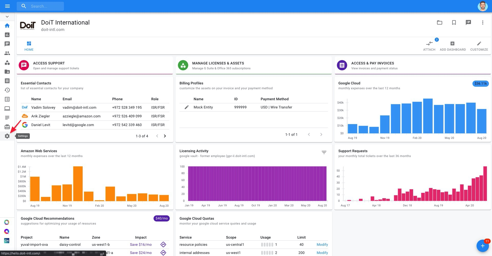
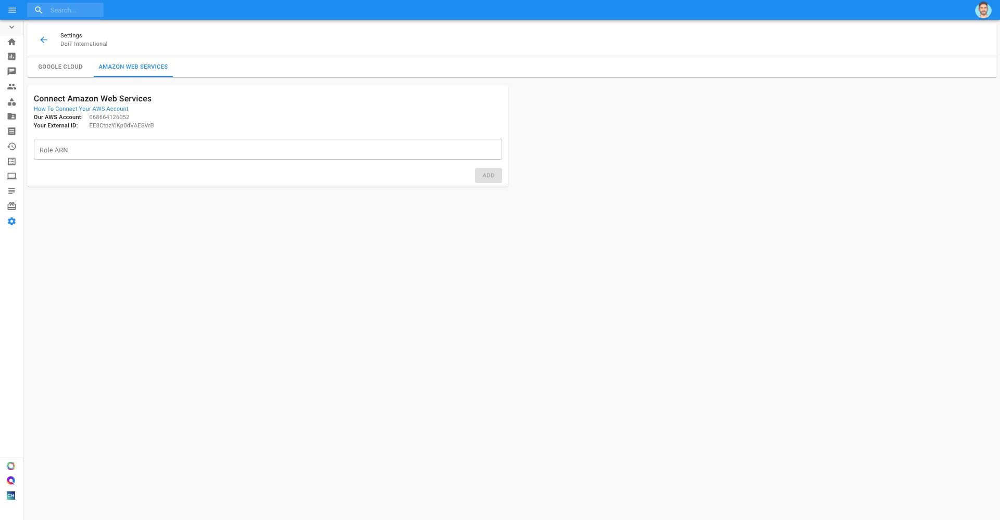
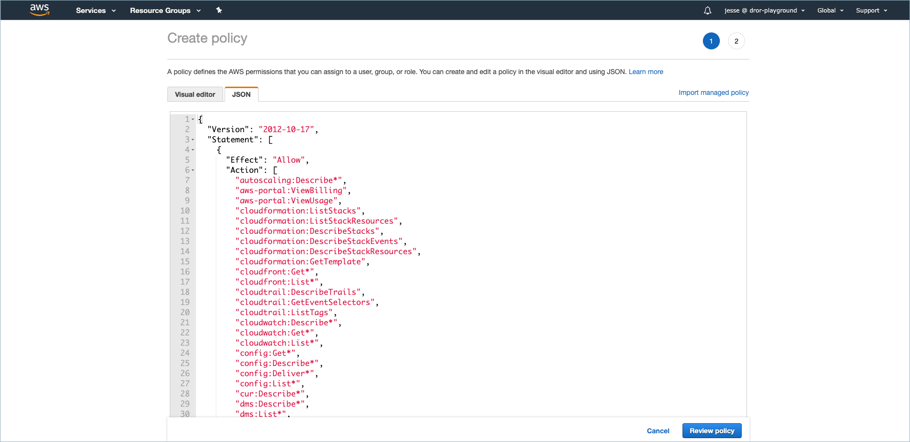
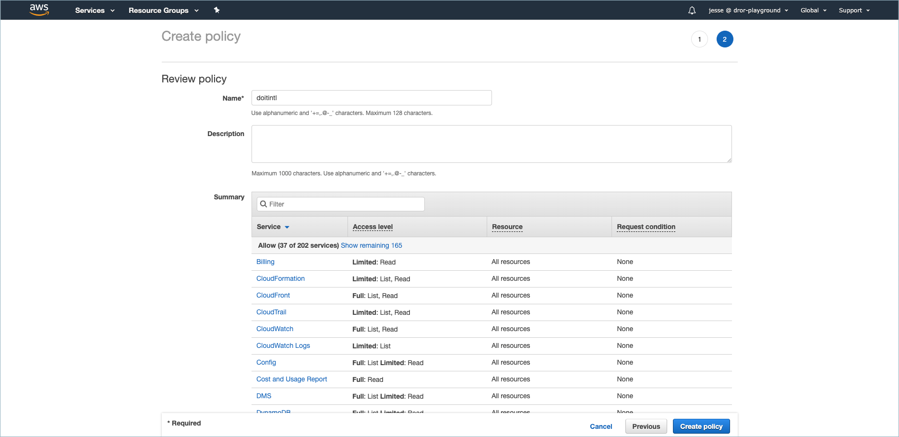
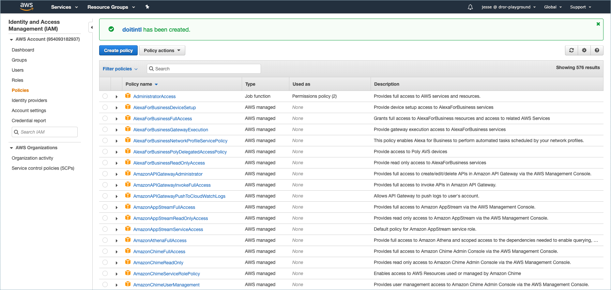
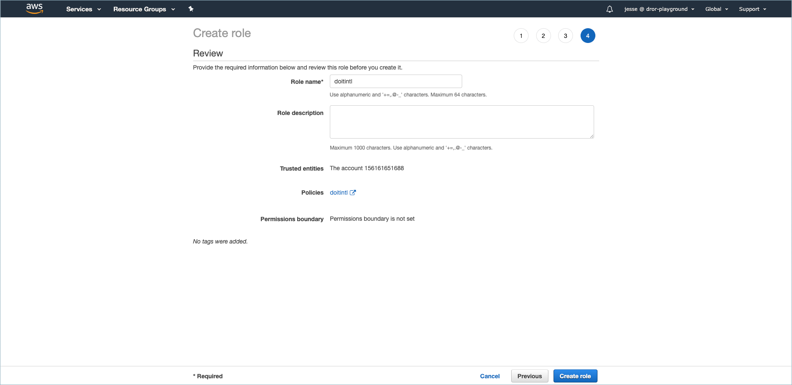
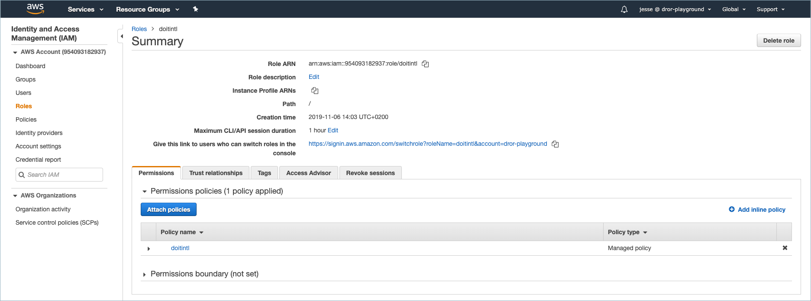
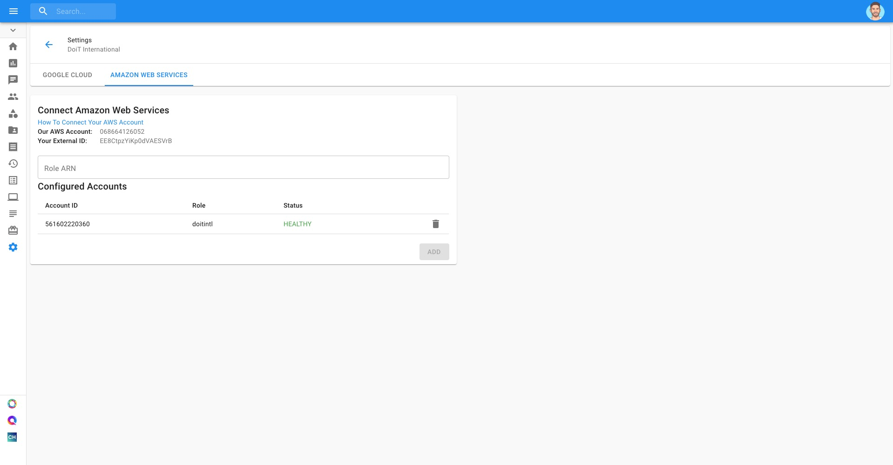

# Connect Your AWS IAM Role

By connecting your AWS account/s, you will unlock additional functionalities such as proactive resource quota monitoring and more.

In order to connect your AWS account\(s\) to the Cloud Management Platform, you will need to create an AWS IAM Role and attach an IAM Policy to it. Once you create a role, you'll need to add the Role ARN to the Cloud Management Platform. 


Looking for instructions on [how to set up CloudHealth IAM role](https://help.cloudhealthtech.com/quickstart/linked-account)? 



Required Permission**: Manage Settings**


## Get AWS Account \# and External ID 

Start with you logging into the [Cloud Management Platform](https://app.doit-intl.com), and navigate to the Settings page via the gear icon in your lefthand navigation panel. 

Switch to the Amazon Web Services tab, and note the "AWS Account" and "External ID", as you'll need them for the next steps. 

### Creating an AWS IAM Role

In a separate tab, open the AWS Management Console. Next, go to 'Security, Identity, & Compliance &gt; IAM', or type 'IAM' in the 'Find Services' search bar and click on 'Roles', located on the left-hand side of the page.

Then choose 'Create Role'. 

Enter the AWS Account ID and External ID you've noted in the previous step. You might need to check the 'Options' checkbox for the External ID field to show up.

Click on 'Create policy', which will open a separate tab where you'll be creating the policy. 

Switch to the "JSON" tab and copy-paste the list of required permissions as a JSON file from [here](https://storage.googleapis.com/hello-static-assets/cloudhealth/cloud-accounts-iam-policy.json). After the JSON is pasted, click on 'Review policy'.

Give the policy a name \(i.e., 'doitintl'\) and click on 'Create policy'.

The policy has been created successfully.  

Revert back to your original tab where the workflow first began, and refresh the page. Your newly created policy will appear in the list \(type the policy name in the search bar\). Select it and you may skip to Step \#4. 

Give the Role a name \(i.e., 'doitintl'\) and click on 'Create role'.

The role has been created successfully. 

After you have created the role, click on the role name which brings you to the summary page. 

## Add IAM Role to the Cloud Management Platform 

The final step is to copy-paste the Role ARN to the Cloud Management Platform and click 'Add'. If the status of your AWS account within the Cloud Management Platform appears as 'Healthy', it means the role was added successfully.

