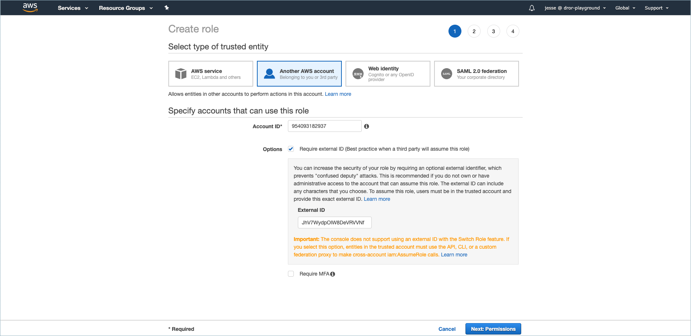
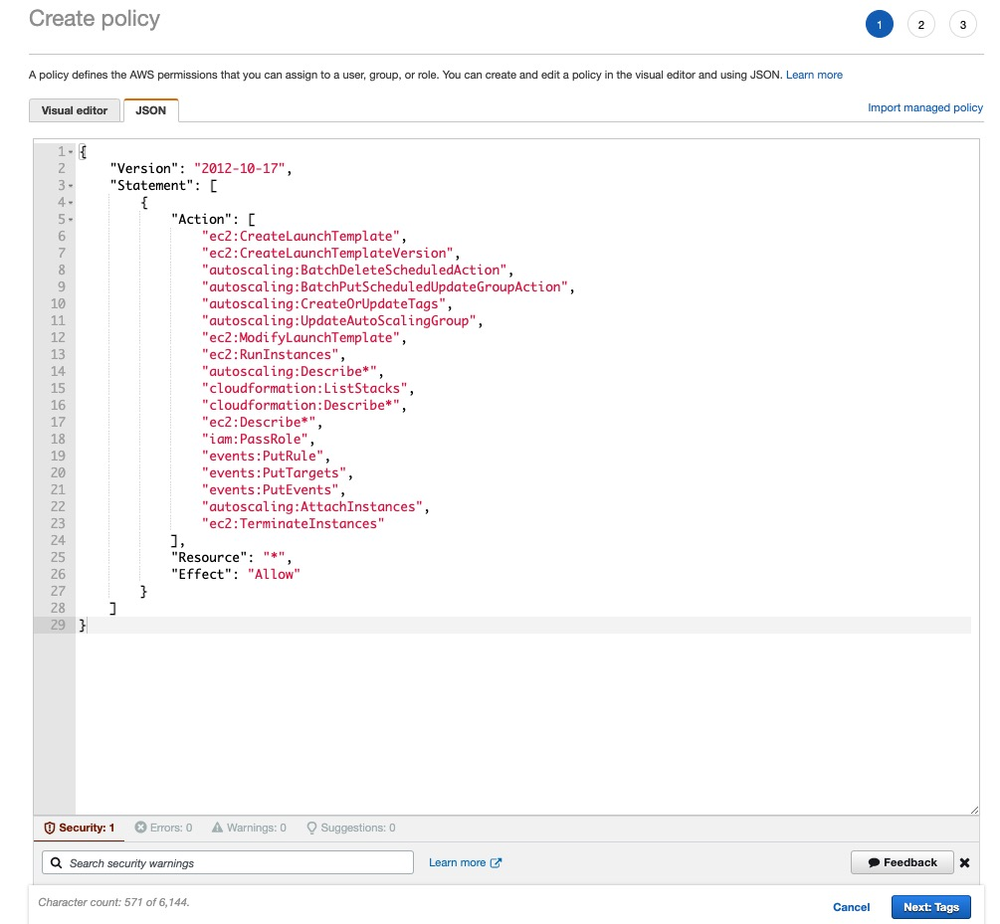
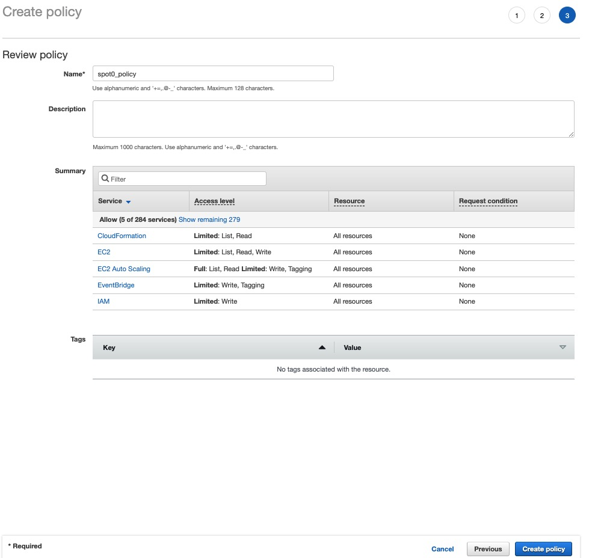
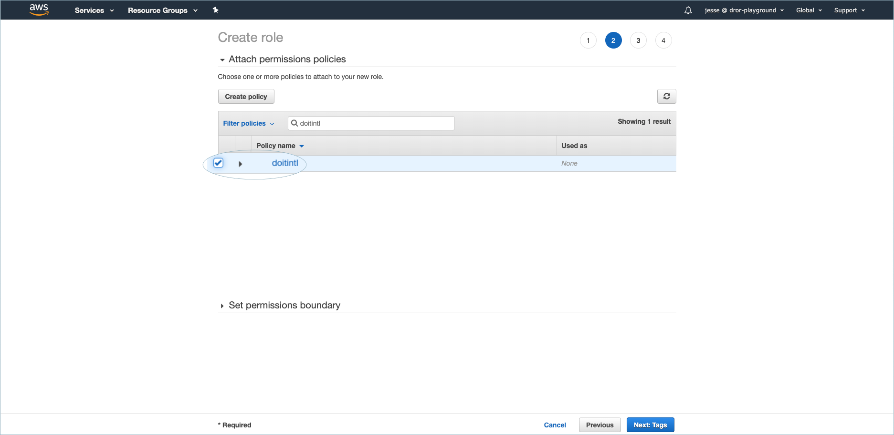

# Link your AWS Account

By linking your AWS account/s, you will unlock additional functionalities such as proactive resource quota monitoring and more.

In order to link your AWS account\(s\) to the Cloud Management Platform, you will need to create an AWS IAM Role and attach IAM Policies to it. The policies you need to attach depend on the feature\(s\) you'd like to enable.

In this article, we will go over how to create an IAM role with the required policies 1\) automatically via CloudFormation and 2\) manually.


Looking for instructions on [how to set up CloudHealth IAM role](https://help.cloudhealthtech.com/quickstart/linked-account)? 



Required Permission**: Manage Settings**


Both the automatic and manual set up process start with you logging into the [Cloud Management Platform](https://app.doit-intl.com), and navigating to the Settings page via the gear icon in your lefthand navigation panel. 

Then switch to the Amazon Web Services tab, and click on the "Link Account" button.


## Automatically Link AWS Account

Select the "**Create a role automatically**" radio button, then check the boxes next to the features you'd like to enable for this AWS account. 

To explore what AWS policies each feature requires, click the "**v**" button to the left of the feature name to uncollapse the list of policies.


There are two options for creating the role with this method:

1. Creating a stack in CloudFormation
2. Copy + Pasting a command in CloudShell

### Option 1: Create stack in CloudFormation

After selecting the features, click on "**Link Account**". This will open AWS CloudFormation in a new tab, so you can create a stack template that'll generate the role with the requisite permissions. Before opening CloudFormation, you will be asked to confirm the action again by clicking "**Link Account**".


A preconfigured stack template like the one below will appear in your CloudFormation tab. 

Review the details, then under "Capabilities" mark the _‘I acknowledge that AWS CloudFormation might create IAM resources with custom names’_ checkbox. Finally, click on the **‘Create stack**’ button.


Within approximately 30 seconds of creating the stack, the Settings page in CMP will update, showing your linked AWS account with a "**Healthy**" status next to it if the link attempt was successful. 

### Option 2: Create role via CLI

If you prefer to run the commands yourself in AWS CloudShell, click on the "**Prefer CLI?**" button instead. A pop-up will appear with the commands you should run to generate the role with the requisite policies for the features you selected. After running the command, it may take up to 30 seconds for the account to link to the CMP.


Within approximately 30 seconds of running the command, the Settings page in CMP will update, showing your linked AWS account with a "**Healthy**" status next to it if the link attempt was successful.

## Manually Link AWS Account

Select the "**Create a role manually**" radio button, then note the listed "AWS Account" and "External ID", as you'll need them for a later step.


### Creating an AWS IAM Role

In a separate tab, open the AWS Management Console. Next, go to 'Security, Identity, & Compliance &gt; IAM', or type 'IAM' in the 'Find Services' search bar and click on 'Roles', located on the left-hand side of the page.

Then choose 'Create Role'. 


Enter the AWS Account ID and External ID you've noted in the previous step. You might need to check the 'Options' checkbox for the External ID field to show up.



This will take you to a page where you can select built-in policies and/or create a new one.

Currently, there are three features you can enable for a linked AWS account: **Core**, [**Quotas**](https://help.doit-intl.com/amazon-web-services/add-your-amazon-web-services-iam-role#quota-monitoring), ****and ****[**SpotScaling**](https://help.doit-intl.com/amazon-web-services/add-your-amazon-web-services-iam-role#spot-scaling)\*\*\*\*

**Core** permissions are for a minimum set of read-only permissions we need as a foundation for many CMP features. As such, it is checked by default.

For Core, you need to add three built-in policies to your role:

* SecurityAudit
* Billing
* AWSSavingsPlansReadOnlyAccess

To add permissions for other features, you'll need to create a new policy. If you wish to enable this feature, click "**Create policy**".


### Creating new policies

#### **Spot Scaling**

A new tab will open for you to create the policy. Switch to the "JSON" tab and copy-paste the following list of required permissions as a JSON file:

```text
{
    "Version": "2012-10-17",
    "Statement": [
        {
            "Action": [
                "ec2:Describe*",
                "ec2:CreateLaunchTemplate",
                "ec2:CreateLaunchTemplateVersion",
                "ec2:ModifyLaunchTemplate",
                "ec2:RunInstances",
                "ec2:TerminateInstances",
                "ec2:CreateTags",
                "ec2:DeleteTags",
                "ec2:CreateLaunchTemplateVersion",
                "ec2:CancelSpotInstanceRequests",
                "autoscaling:CreateOrUpdateTags",
                "autoscaling:UpdateAutoScalingGroup",
                "autoscaling:Describe*",
                "autoscaling:AttachInstances",
                "autoscaling:BatchDeleteScheduledAction",
                "autoscaling:BatchPutScheduledUpdateGroupAction",
                "cloudformation:ListStacks",
                "cloudformation:Describe*",
                "iam:PassRole",
                "events:PutRule",
                "events:PutTargets",
                "events:PutEvents"
            ],
            "Resource": "*",
            "Effect": "Allow"
        }
    ]
}
```




After the JSON for the new policy you want to create is pasted, click "**Next: Tags**". If you aren't adding tags to this role, then you may proceed by clicking on "**Next: Review**".

Finally, give your policy an identifiable name, like "spotscaling\_policy", and a description if necessary. Then click on "**Create Policy**".



#### [Quota Monitoring](aws-quotas.md)

A new tab will open for you to create the policy. Switch to the "JSON" tab and copy-paste the following list of required permissions as a JSON file:

```text
{
  "Version": "2012-10-17",
  "Statement": [
    {
      "Effect": "Allow",
      "Action": [
        "support:DescribeTrustedAdvisorCheckSummaries",
        "support:DescribeTrustedAdvisorCheckRefreshStatuses",
        "support:DescribeTrustedAdvisorChecks",
        "support:DescribeSeverityLevels",
        "support:RefreshTrustedAdvisorCheck",
        "support:DescribeSupportLevel",
        "support:DescribeCommunications",
        "support:DescribeServices",
        "support:DescribeIssueTypes",
        "support:DescribeTrustedAdvisorCheckResult",
        "trustedadvisor:DescribeNotificationPreferences",
        "trustedadvisor:DescribeCheckRefreshStatuses",
        "trustedadvisor:DescribeCheckItems",
        "trustedadvisor:DescribeAccount",
        "trustedadvisor:DescribeAccountAccess",
        "trustedadvisor:DescribeChecks",
        "trustedadvisor:DescribeCheckSummaries"
      ],
      "Resource": "*"
    }
  ]
}
```

After the JSON for the new policy you want to create is pasted, click "**Next: Tags**". If you aren't adding tags to this role, then you may proceed by clicking on "**Next: Review**" 


Give your policy an identifiable name, like "doit\_intl\_quotas" in the case of the Quota Monitoring feature, and a description if necessary. Then click on "**Create Policy**".


If the policy was successfully created, you'll be taken to the IAM Policies page and see a success message at the top like the following:


### Select all policies and confirm role

Once any custom policies \(if necessary\) have been created, revert back to your original tab where the workflow first began, and click the Refresh icon towards the top-right of the policies box. Any newly-created policies will now appear in the search list.

Select all created policies for the features you want to enable in addition to the three built-in policies required for Core features, then click "**Next: Tags**".

If you aren't adding tags to this role, then you may proceed by clicking on "**Next: Review**" from the "Add Tags" page.



Give the Role an identifiable name \(ex. 'doit-intl-cmp-role'\), review the selected policies, and click on "**Create role**". 


If the role was created successfully, you'll be taken back to the main Roles page and see your Role in the list.

After you have created the role, click on the role name to bring you to its summary page. Copy the value next to "**Role ARN**"


Finally, copy and paste the Role ARN to the Cloud Management Platform and click 'Add'. 

If the status of your AWS account within the Cloud Management Platform appears as 'Healthy', it means the role was added successfully.


## Editing Linked Accounts

### Unlinking an account

If you want to unlink an account, click on the "Unlink" button in the row corresponding to the account.


### Modifying feature access

#### Adding a feature

If, after linking your AWS account, you'd like to update your role with additional permissions for a new feature, click on the "Edit" button in the row corresponding to the account.


Then, check the box of any new feature\(s\) you'd like to add permissions for.


There are two options for updating your role:

1. [Creating a stack in CloudFormation](add-your-amazon-web-services-iam-role.md#option-1-create-stack-in-cloudformation)
2. [Copy + Pasting a command in CloudShell](add-your-amazon-web-services-iam-role.md#option-2-create-role-via-cli)

Both methods are detailed above \(and hyperlinked\) in the section on linking your AWS account automatically. 

The flows are essentially the same as described above, except instead of creating a new role you are simply updating a role you've already created.

#### Removing a feature

To remove a feature that a linked account has access to, go to the IAM page in the AWS console. Then, detach the policy or policies associated with the feature in that linked account's role.

