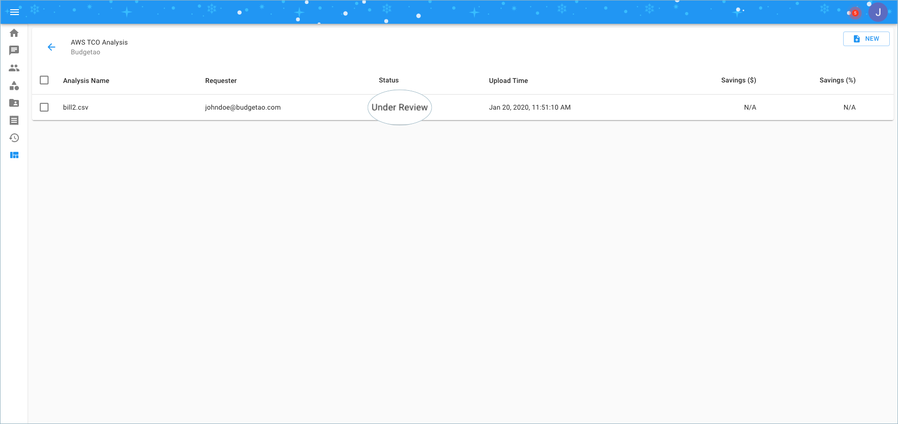
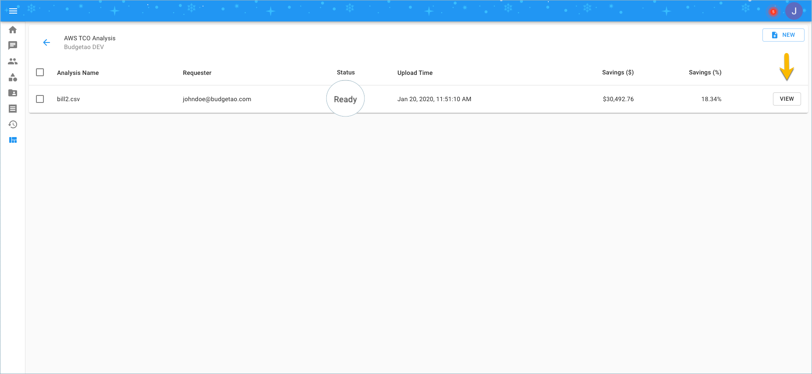
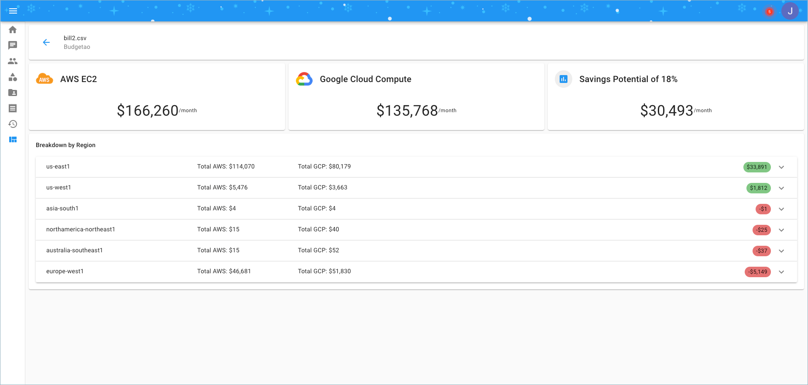

# AWS Migration TCO Analysis

As a DoiT International customer, you can compare the Total Cost of Ownership \(TCO\) of your AWS assets vs. Google Cloud, directly from the Cloud Management Platform using your AWS invoice data in CSV format.

First, you must download your AWS invoice for a given month from your AWS Management Console by going to _Billing &gt; Bills &gt; Select month &gt; Download CSV_.

To upload the CSV file to the Cloud Management Platform and start the analysis, please click on the 'AWS TCO Analysis' icon. Then, click on 'New' at the top-right hand side of the page to start.

Browse and select the CSV invoice you want to upload by clicking on the 'Select AWS Billing Report' button.

Once the billing report is uploaded, the Cloud Management Platform will begin to analyze the uploaded invoice for comparing the overall cost to that of Google Cloud. After a few minutes, the status of your analysis will switch to 'Under Review'. At this time, a dedicated DoiT International Account Manager will inspect the analysis for the accuracy before it will be released for your access. 

Once the verification is complete, an email notification will be sent to you and the report will become accessible for users in your organization. You will also notice the status has changed from 'Under Review' to 'Ready', and some basic comparison information will appear as well.

Click on 'View' to see the full analysis. You can also browse each region by clicking the 'Expand' button at the right of each regional section.

Some important notes about your report:

* The report compares the direct cost of EC2 with Google Compute Engine. Your AWS invoice may contain other resources as well such as RDS, Data Transfer or others. At this time, these resources are ignored for the comparison report.
* If you have purchased AWS Reserved Instances with Full or Partial Upfront, the report will "normalize" the cost of these instances to on-demand pricing for both AWS and Google Cloud.
* For the 1Y or 3Y Upfront Reserved Instances with No Upfront, we will automatically calculate the price with Google Committed Use Discounts accordingly.
* Attached EBS volumes are not taken into account. If your AWS instances have Instance based storage, they are calculated into the Google Cloud costs.
* AWS Spot Instances are calculated as Google Cloud Preemptible instances. Please note, Google Cloud Preemptible instances can run up to 24 hours or less.

