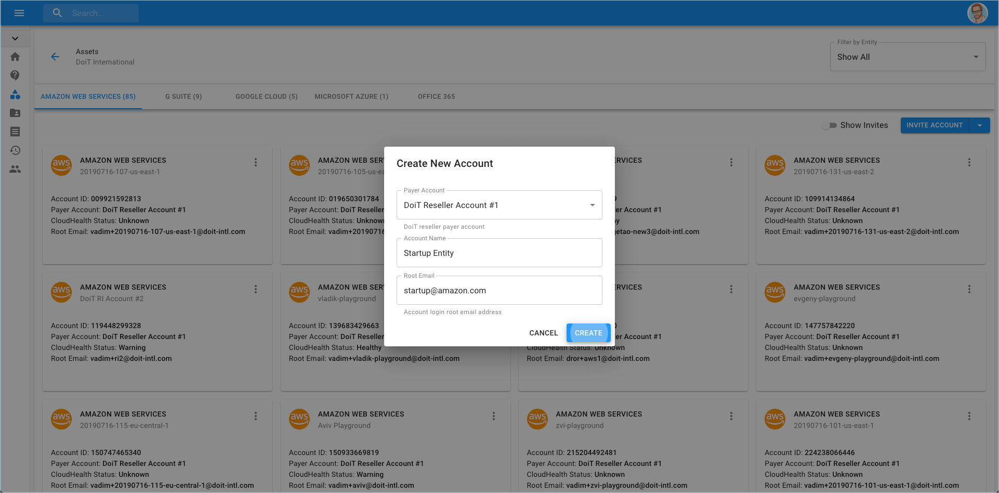
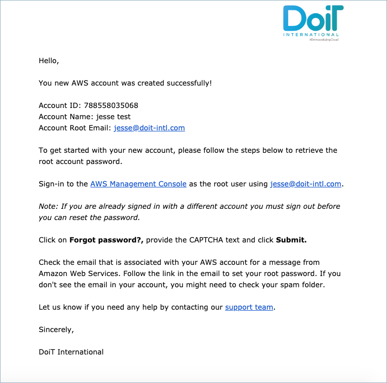

# Create An AWS Account

As a customer, you can create a new AWS account directly from the Cloud Management Platform.


Please note you must be assigned access to the specific Billing Profile under which the domain is managed in order to create a new account.


Access the 'Create AWS Account' from the menu on the left-hand side of the page and clicking on Assets.

On the right-hand side of the page, click the bottom facing arrow and choosing 'Create Account'.

Choose the Billing Profile to which you're creating the account for while choosing the name of the account to which the _root email_ is associated with.

Click 'Create' and a popup will appear that the account was created successfully. 

As listed in the popup, an email is sent out for further instructions, here is an example.

The following video shows you how to create an AWS Account.



If you require further assistance please contact our support team at [support.doit-intl.com](https://support.doit-intl.com)

