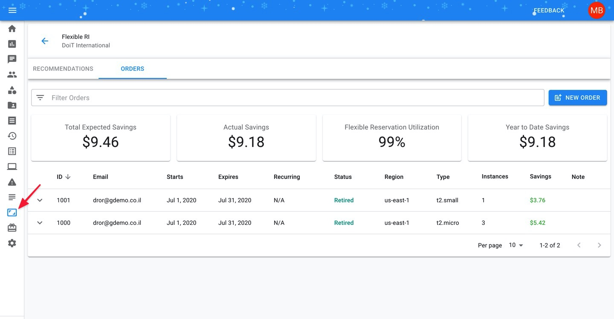
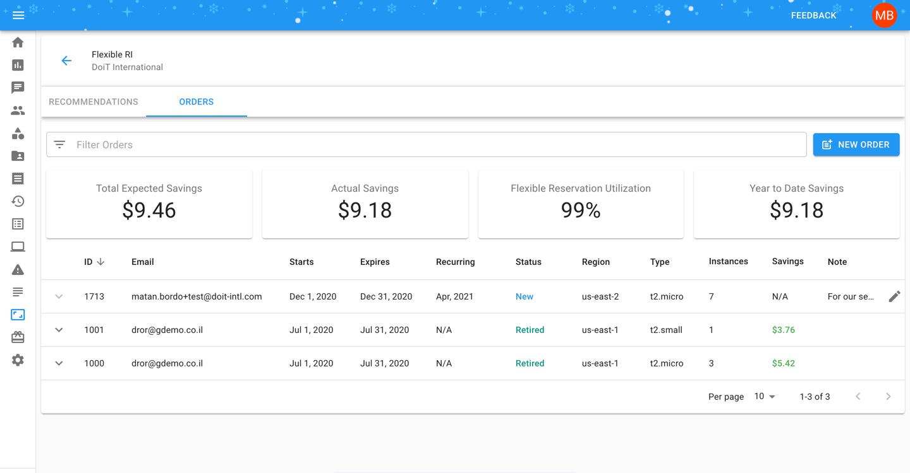
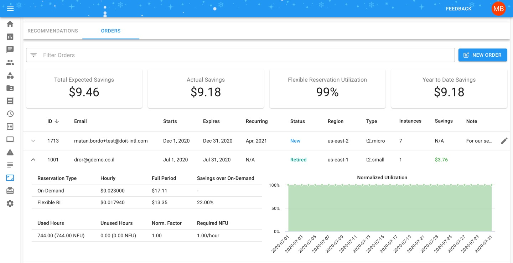

# Flexible Reservations

### Overview

Flexible Reserved Instances provide you with up to a 22% discount over on-demand EC2 pricing while allowing you to commit to instances in one-month intervals.

DoiT International has developed a proprietary technology to provide our customers with month-to-month discounts based on the reserved instances in your AWS environment. In order to get the benefits of Flexible RIs, your AWS account/s should be consolidated with DoiT International as your channel reseller.

_Please note that new orders and editing previous orders can only be generated up to the 25th day of the month. After this timeframe, each order will become **Pending** for internal review and processing by our team._


Required Permissions: **Flexible RI Admin**


### How-To Purchase Flexible Reservations

To begin, click the 'Flexible RIs' icon on the left-hand side of the page. Once you're at the Flexible Reserved Instances page, click on 'New Order', located on the right-hand side of the page.

Complete your Flexible Reserved Instances order by providing the following information: 

| Field | Description |
| :--- | :--- |
| Account | AWS account for this order |
| Region | AWS region for this order |
| Instance | note, only instances not associated with existing reservations or saving plans are shown |
| Qty | how many instances of the selected "Instance Type" the order should include |
| Recurring | For orders with a recurring basis, select the last month you want this order to go  |
| Notes | Use notes to give more context to your order such as PO numbers, workload names, etc. |

Click "Submit" and your order will be created and become visible in the list:

### Monitoring Flexible Reservations

At the top of the Flex RI page, you'll see four Flex RI Reporting metrics that give you a high-level overview of your Flex RI purchases:

* **Total Expected Savings** - the maximum amount you could have saved
* **Actual Savings** - the amount you actually saved
* **Flexible Reservation Utilization** - how well you are utilizing your Flexible Reserved Instances.
* **Year to Date Savings** - the aggregate $ amount saved across all your Flex RI purchases, from the beginning of the current year.


Note: The first three metrics are based on what is shown in the table, meaning taking into account any filters you've set on your orders. The last metric takes _every_ Flex RI order into account when calculating the number.


To view information on a specific order, click on the arrow next to an active or retired order to expand your order and view details further. 

You can see the difference between the on-demand price per hour vs. the Flex RI, and further inspecting the utilization graph for additional details of your Flexible RI reservation.

### Viewing Flexible Reserved Instances in your Monthly Invoice

For each order of Flexible Reservations, you'll see one or both of the following lines on your monthly invoice:

* Flexible RI \#ID Savings
* Flexible RI \#ID Underutilization

The "Flexible RI Savings" will state the amount you have saved due to the purchase of Flexible Reservation/s for a given month.

The optional "Flexible RI Underutilization" will state the amount deducted from the cost of the reservation if the underlying instance wasn't utilized 100% of the time during the month.

View the bite-sized video below for a closer look at purchasing and viewing your Flex RIs.



