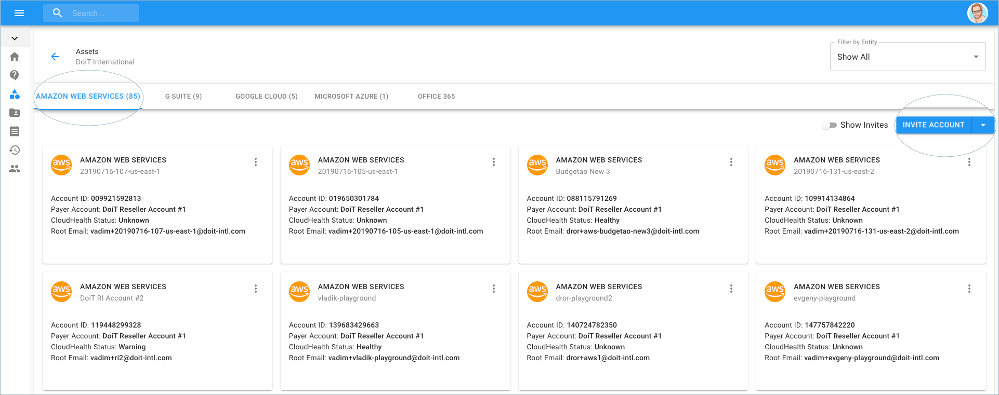
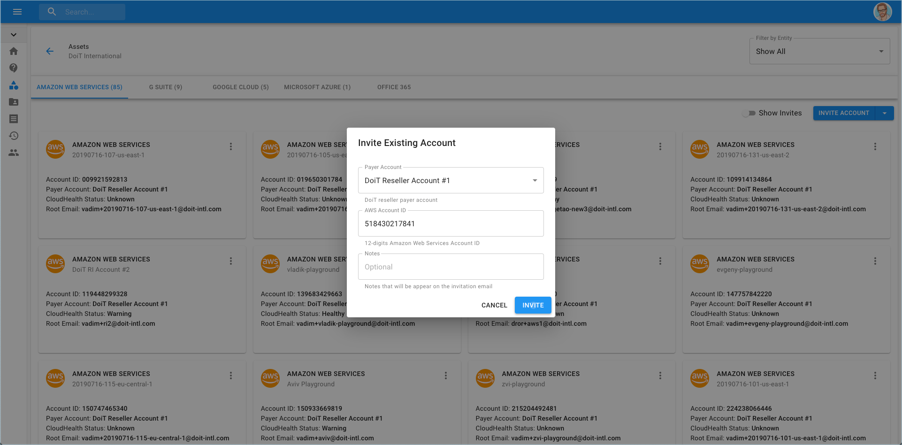
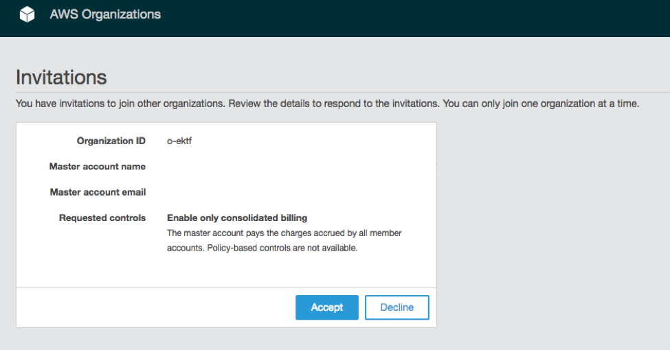
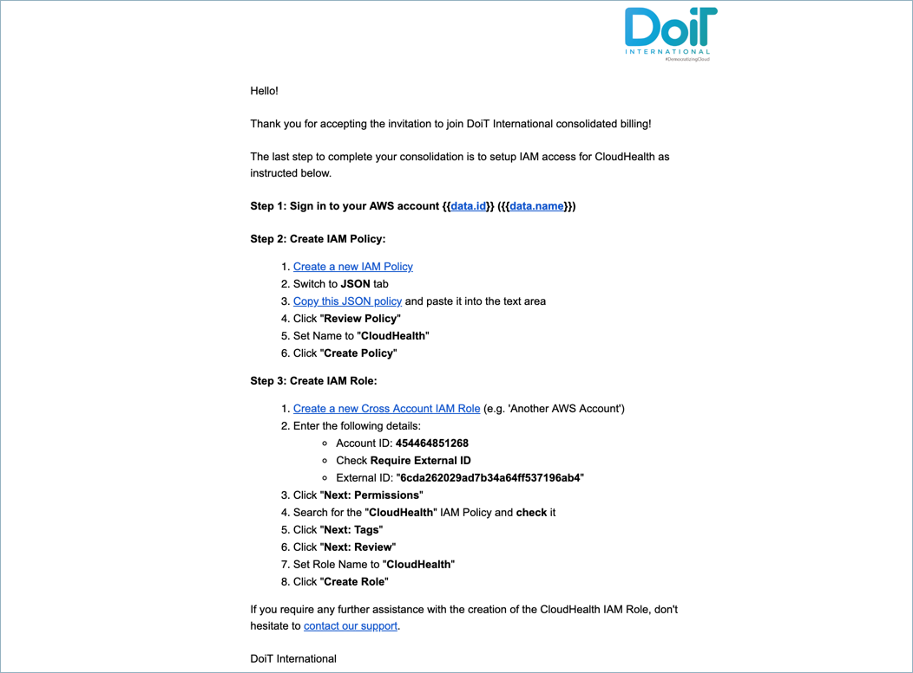

# Invite Existing AWS Account

You can add existing AWS accounts to DoiT International's consolidated billing using the Cloud Management Platform.


Required Permission**: Asset Manager**



Please note that you must be assigned access to the specific Billing Profile under which the domain is managed in order to invite an existing account.


Start with you logging into the [Cloud Management Platform](https://app.doit-intl.com), and select the 'Invite AWS Account' from the menu on the left-hand side of the page and clicking on Assets.

Once you're at the Assets page, go to the right-hand side of the page and click on '**Invite Account**'.

Choose the Billing Profile to which you'd like to have the existing AWS account now be a part of. Enter the 12-digit AWS Account ID and any optional notes before clicking 'Invite'.

An email will be sent on behalf of AWS.

If within five minutes you haven't received the above email, please re-enter your AWS Account ID in the DoiT Cloud Management Platform and invite once again. 

To complete the process, sign in to the [AWS Organizations Console](https://console.aws.amazon.com/organizations/). On the Invitations page in the console, you can see your open invitations to join organizations. Finally, click the "Accept" button to accept the invitation.

Afterward, you will be redirected to the **Organization overview** page with details about the organization that your account is now a member of. You can view the organization's ID and the owner's email address.

### Multiple Accounts Under a Master Organization

In the event that you have multiple accounts under a Master account / organization, you will get an error trying to accept the invitation.

In order to successfully accept the invitation, you must remove each linked AWS account from your master account.


Note: This will prompt you to input payment details for each linked account if you didn't do so while initially creating them.


For each account you must:

1. "Leave" the Organization \(no new invites will appear before you do this\)
2. Accept the invite from DoiT International in each linked account

### Completing IAM Access for CloudHealth

After signing in to the AWS Console and accepting the invitation, a final email will be sent instructing how to complete the IAM access for CloudHealth.

