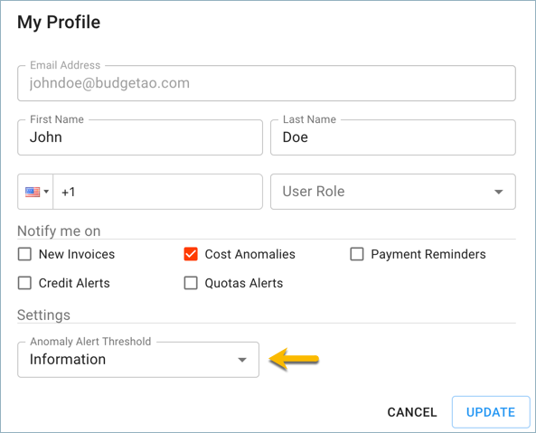
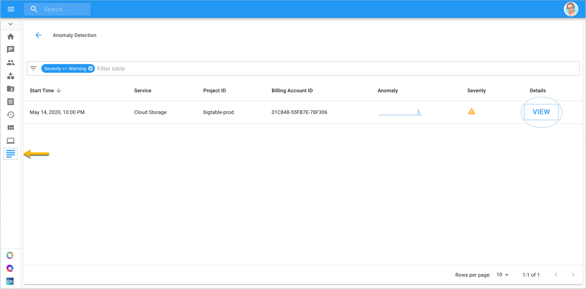

# View Cost Anomalies

Cloud cost anomaly detection offers end-to-end monitoring of spikes in your Google Cloud or Amazon Web Services billing, seamlessly, across all your projects and services.

At the core of our cost anomaly detection service is our machine-learning algorithm. It works by monitoring billing data and analyzing the trend of spending in your environment. In addition, the machine learning model identifies billing patterns across many customers, forecasting your cloud spending, and constantly improving itself to provide even more accurate results.

Essentially, billing records that don’t align with your anticipated spending behavior are identified for its deviation from the established patterns. You can also get insights into which resources are causing the anomalies and take corrective actions. Our anomaly detection engine is always running, however, you can opt to get email notifications, to get near-real-time email alerts on detected anomalies. 

### Manage anomaly notifications

To manage your notifications, click your profile icon in the upper-right corner of the page header, then select 'Profile'**.**

By default, the threshold for email alerts is set to 'Warning', however, you can overwrite it to reduce the number of emails you receive overtime.

We are also storing all detected cost anomalies under the 'Cost Anomalies' page to filter/search events and zoom in on a specifically detected anomaly. Once located, you can click on 'View' to inspect the details of a detected anomaly.

### View anomalies

In the Profile dialog, you will find the 'Cost Anomalies' notification setting. Once you enable notifications on Cost Anomalies, you will be prompted to choose the threshold of the alerts you're interested in receiving from us:

Below you can see an example of a detected anomaly and the spike as shown in the chart. We will also display the top three SKUs, in terms of cost, that relate to the spike. That way you can better understand what is driving the detected anomaly with minimal effort.

### Investigate anomalies further

If you'd like to dive deeper into an anomaly, click on "**Investigate**" to launch a pre-configured Cloud Analytics Report. This lets you to zoom in on a specific anomaly and determine whether any action is needed.

### Fine-tune alerts with direct feedback

To further assist with the learning of our machine-learning model, and reduce the number of false alerts, you can provide feedback for any type of alert, and mark it thumbs-up or thumbs-down.

### Anomalies Widget

View the bite-sized video below for a closer look at Anomaly Detection.



