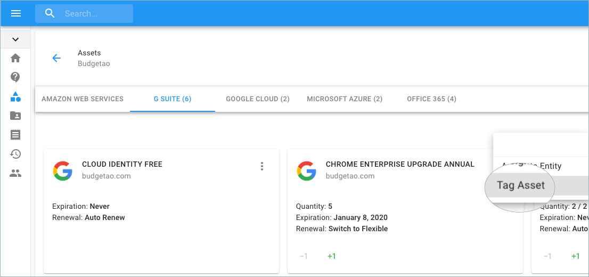
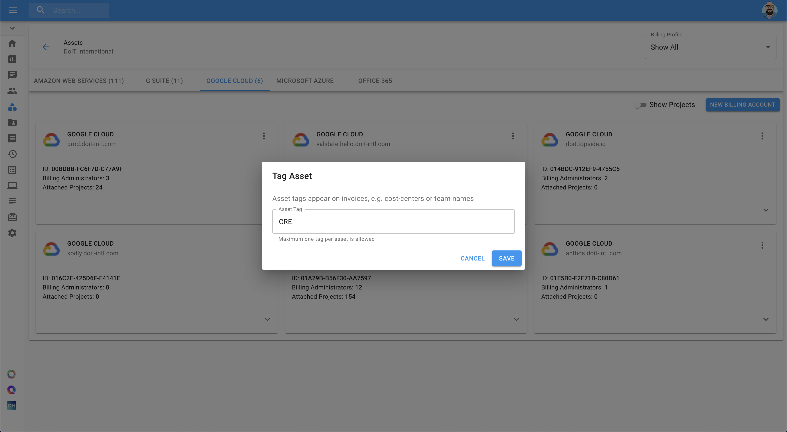
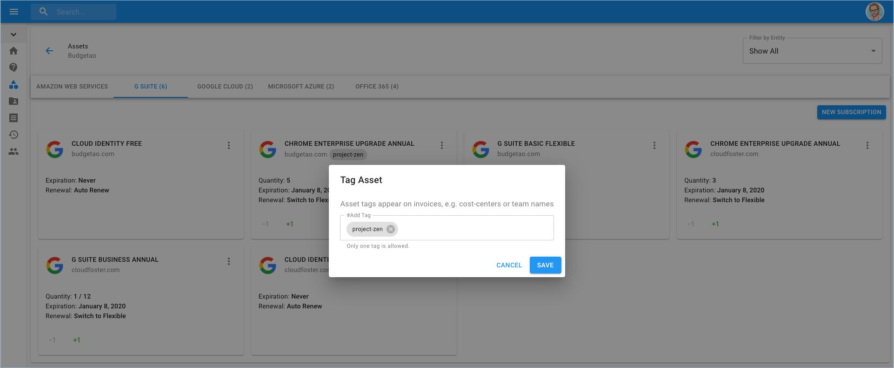

# Tag Assets

You can tag an asset for classification purposes. Tags will appear on invoices so you will be able to identify invoice items easier. The best practice is to tag assets with a team name, cost center, location, or anything else. To add tags to assets, see the following instructions. 


Required Role**: Admin**


Access Assets from the menu on the left-hand side of the page and clicking on Assets.

Once you're at the Assets page, switch to the relevant asset, locate the three-dots icon, and click on 'Tag Asset'.

You may add any term or keyword you like, yet only one tag is allowed per asset. Once you choose the tag, click 'Save'.

The tag will be saved and can be reused for other assets as well.

