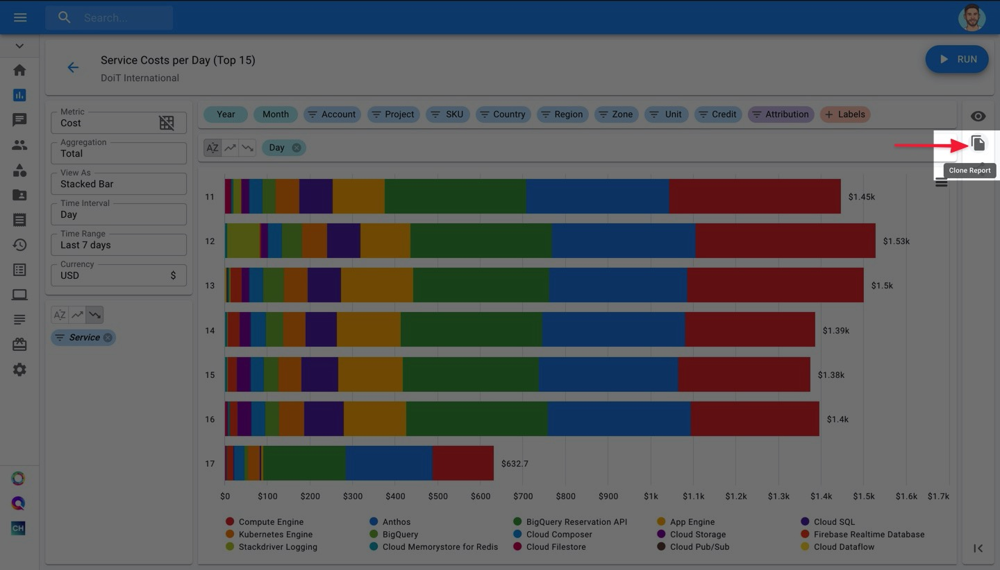
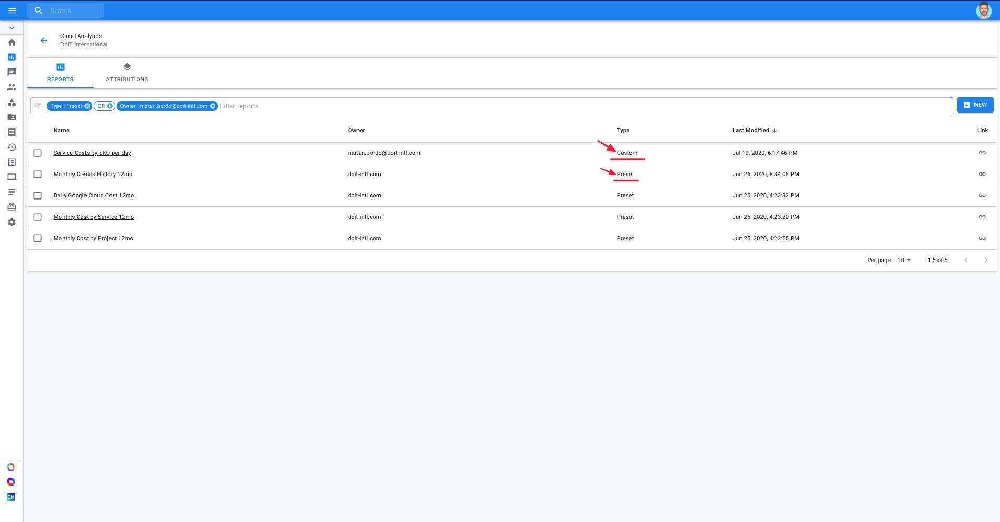
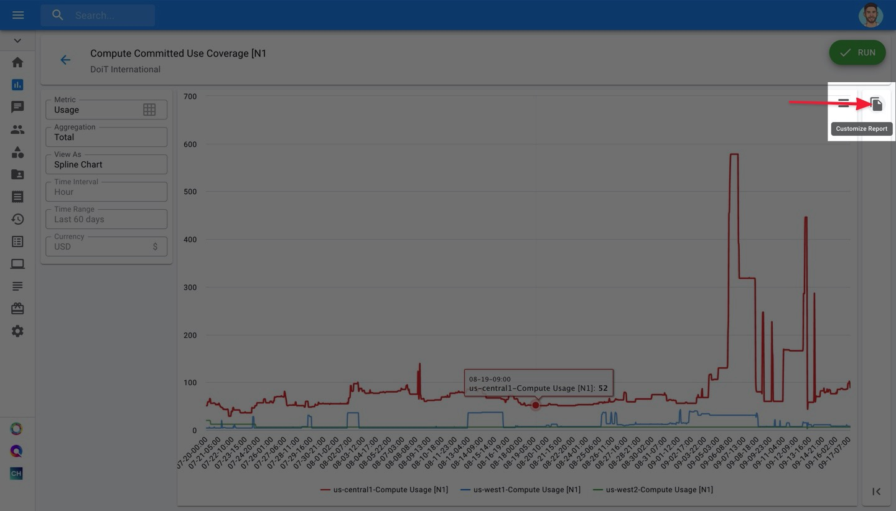

# Cloning and/or Customizing Cloud Reports

For cases in which you'll want to create a copy of an existing Cloud Report, you have the option to either:

* Clone the report
* Customize the report

Let's go over the differences, and how to perform each action.

### Clone Reports

The "Clone" function is available for all Cloud Reports, whether you created it or a colleague did. When you clone a report, you create a new version of it and can make whatever changes you'd like without affecting the report the cloned version is based on.

To clone a report, open a report and click on the "Clone" button at the right-hand sidebar of your Cloud Reports screen.

Finally, a new report will appear with the name "A copy of \[Original Report Name\]". From there, edit the report's name and make your modifications.

### 

### Customize Reports

The "Customize" function is available for Preset Reports only. These are built-in reports you have access to right away before creating any reports yourself. This function allows you to create a copy of a Preset Report and make modifications on top of it. 

To identify a Preset Report, look under the "Type" column for the word "Preset". 

Then click on the "Customize" button on the right-hand sidebar of your Cloud Reports screen.

Finally, a new report will appear with the name "A copy of \[Original Preset Report Name\]". From there, edit the report's name and make your modifications.

