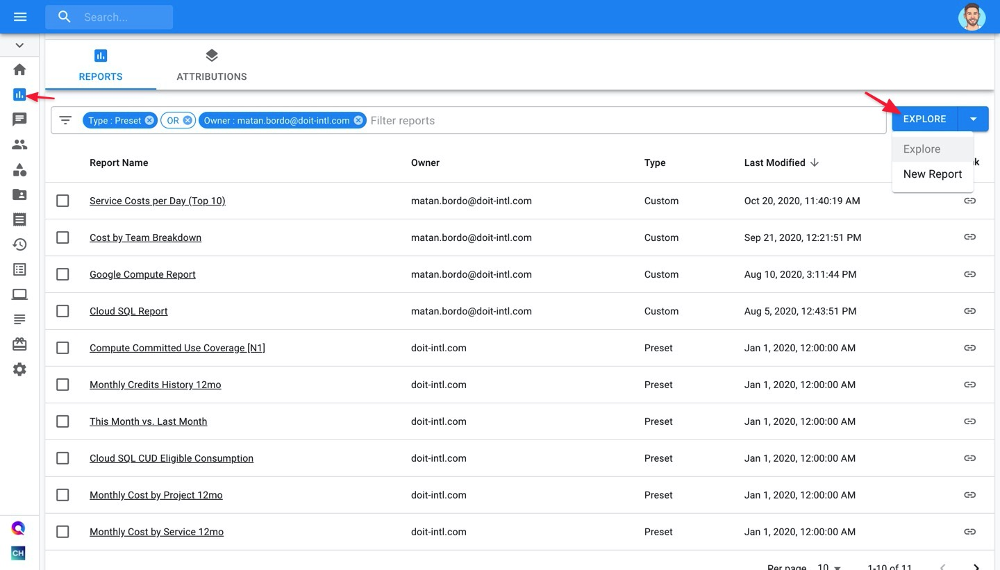
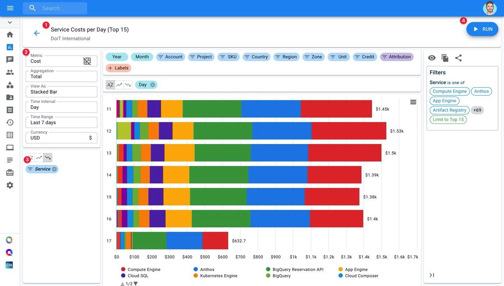

# Create Cloud Analytics Reports

**Cloud Analytics Reports** give you instant visibility into your Google Cloud or AWS costs without having to spend agonizing hours scanning through vendor's bills. Using Cloud Analytics Reports, you'll be able to slice and dice your cloud spend and shine a light on cost & performance optimization opportunities for your organization.


Required Permissions: **Cloud Analytics**



Please connect your [Google Cloud Organization](https://app.gitbook.com/@doitintl/s/cmp/google-cloud/connect-google-cloud-service-account) or [Amazon Web Services](https://app.gitbook.com/@doitintl/s/cmp/amazon-web-services/add-your-amazon-web-services-iam-role) to the Cloud Management Platform to get all available features.


### Accessing Cloud Reports

To access your Cloud Reports, click on the "Cloud Analytics" icon on the left-hand side of the page.

 By default, CMP provided several preset reports to start with, such as:

* Google Cloud Monthly Credits History 12mo
* Daily Google Cloud Cost 12mo
* Monthly Google Cloud Cost by Service 12mo
* Monthly Google Cloud Cost by Project 12mo
* Google Cloud CloudSQL Hourly Cost 60d
* Trending Up Google Cloud Costs

Click on the "Explore" button on the top-right part of the Cloud Analytics page to begin working on a new ad-hoc Cloud Report. Reports created this way will not be automatically saved _unless_ you give it a name.

If you'd like your report to be automatically saved regardless of whether you give it a name, click on the dropdown arrow next to "Explore" and select "New Report" instead.

### Set up your Cloud Report

By default, your report will be in "View Mode". This is a read-only view of your report, where you'll only be able to adjust the Metric, Aggregation, and Chart Type options.

To edit your report, click on the pencil icon on the right-hand sidebar. This will switch you to "Edit Mode" so you can start setting up your report.

Conversely, if you are in Edit Mode, you can switch to View mode by clicking on the eye icon that will appear in place of the pencil icon.

There are four steps to setting up your cloud report:

1. Give your Cloud Report a meaningful name.
2. Drag fields to the "Dimensions" and "Breakout Dimensions" sections.
3. Determine  **a\)** which metric you'd like to measure your selected dimensions by  **b\)** how you'd like to visualize and display aggregations in your report **c\)** the time interval & range for your report.
4. Generate the report by clicking on the "Run" button.

After a few seconds, your report will appear, ready for your analysis.

## FAQ

### When are the metric amounts \(Cost, Usage, etc\) for a day counted as "final"? 

You can consider numbers “final” for 3 days after the date. With that in mind, there is really no SLA for this and numbers can change any time if there are corrections or delays that needs to be applied.

### Are the reports back-filled/updated, and at what frequency? 

Cloud Analytics data and reports are updated hourly.

### What timezone are Cloud Analytics Reports based on?

Data coming from Google Cloud is based on Pacific time and Data coming from AWS is based on Coordinated Universal Time \(UTC\)

## Watch

View the bite-sized video below for a closer look at creating and exploring Cloud Reports:



