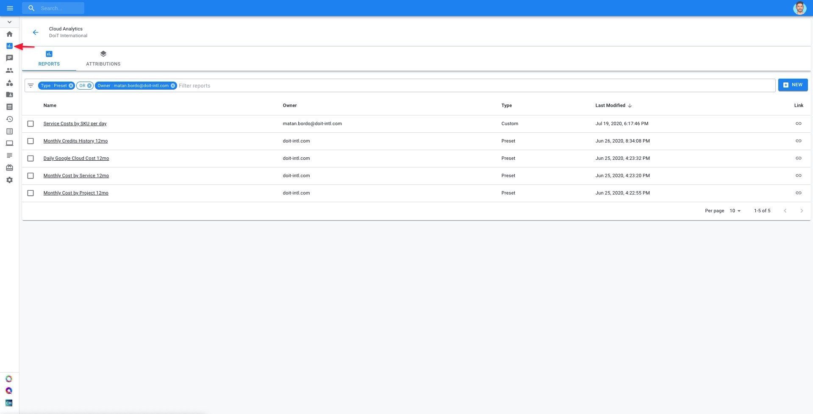

# Creating a Cloud Report

**Cloud Reports** give you instant visibility into your Google Cloud costs without having to spend agonizing hours scanning through Google Cloud bills. Using Cloud Reports, you'll be able to slice and dice your cloud spend and shine a light on cost & performance optimization opportunities for your organization.

**Prerequisites:**

At a minimum, to create, edit, and share Cloud Reports, you will need to satisfy the following requirements:

* [Connect your Google Cloud Organization](https://help.doit-intl.com/hc/en-us/articles/360048197072-Connect-Google-Cloud-Service-Account) to CMP.
* You must have the "Cloud Analytics" CMP permission granted.

### Accessing Cloud Reports

To access your Cloud Reports, click on the "Cloud Analytics" icon on the left-hand side of the page.

 By default, you will have several preset reports to start with:

* Monthly Credits History 12mo
* Daily Google Cloud Cost 12mo
* Monthly Cost by Service 12mo
* Monthly Cost by Project 12mo
* CloudSQL Hourly Cost 60d

Click on the "+New" button on the top-right part of the Cloud Analytics page to begin working on a new Cloud Report.

### 

### Set up your Cloud Report

By default, your report will be in "View Mode". This is a read-only view of your report, where you'll only be able to adjust the Metric, Aggregation, and Chart Type options.

To edit your report, click on the pencil icon on the right-hand sidebar. This will switch you to "Edit Mode" so you can start setting up your report.

Conversely, if you are in Edit Mode, you can switch to View Mode by clicking on the eye icon that will appear in place of the pencil icon.

There are four steps to setting up your cloud report:

1. Give your Cloud Report a meaningful name.
2. Drag fields to the "Dimensions" and "Breakout Dimensions" sections.
3. Determine **a\)** which metric you'd like to measure your selected dimensions by, **b\)** how you'd like to visualize and display aggregations in your report, and **c\)** the time interval & range for your report.
4. Generate the report by clicking on the "Run" button.

After a few seconds, your report will appear, ready for your analysis.

