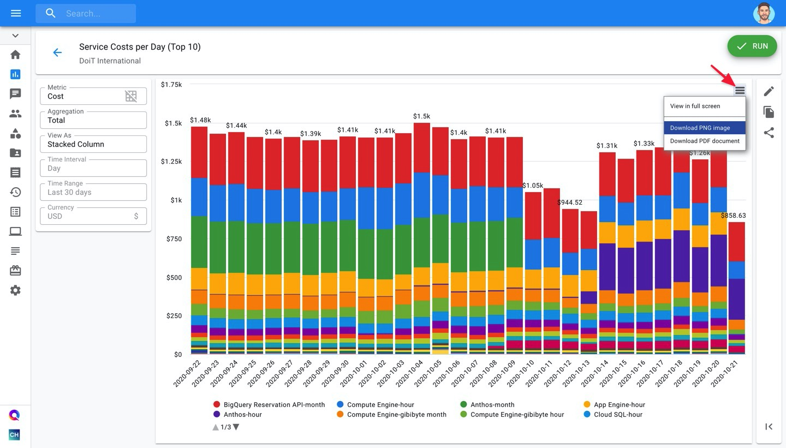
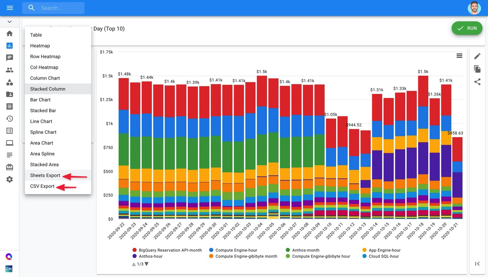
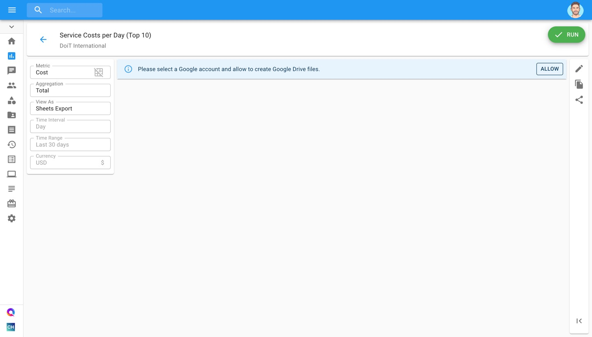
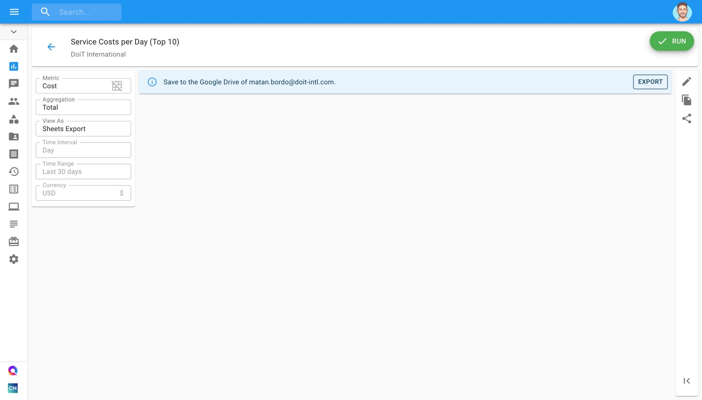
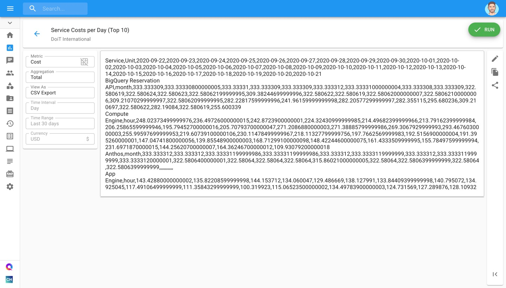

# Export Cloud Analytics Reports

You have four options when exporting your Cloud Reports:

* Export as PNG
* Export as PDF
* Export to CSV
* Export to Google Sheets


Required Permissions: **Cloud Analytics**


### Exporting to PNG or PDF

To access your export options, click on the hamburger menu at the top-right corner of your Cloud Report.

Finally, once you click on an option, a download will begin and you will receive your exported report after a few seconds.

### Exporting to CSV or Google Sheets

To export to Google Sheets or CSV, click on the "View As" dropdown and select either the "Sheets Export" or "CSV Export" options, respectively.

#### Export to Google Sheets

If this is your first time exporting a Cloud Report to Google Sheets, you will be asked to give CMP permission to create Google Drive files.

Once you've selected your email account, click on "Export" to view your Cloud Report in Google Sheets.

#### 

#### CSV Export

After selecting the "CSV Export" option, a textbox will appear with your report's information ready to be copied by you.

