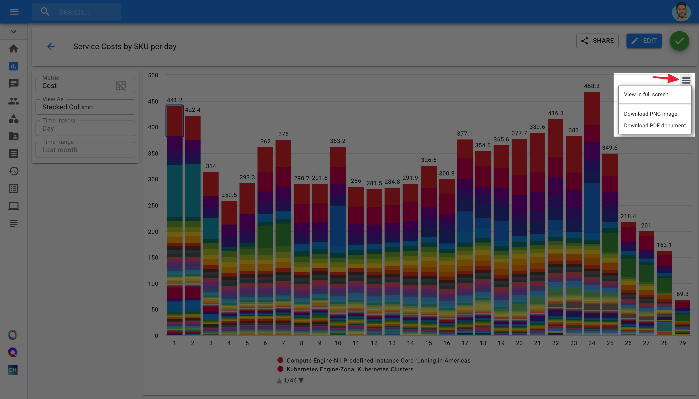

# Exporting Cloud Reports

Before discussing how to share a Cloud Report, let's briefly review roles and permissions. 

**Required Permissions**

* In order for anyone to see a report that you're sharing, they must have been granted the "Cloud Analytics" CMP Permission.

#### Roles

* _Viewer_: Sees the report in "read-only" mode. Can only modify "Metric" and the chart type. 
* _Editor_: Can modify all settings of a Cloud Report, and share the report with others.

#### Exporting Reports

You have two options when exporting your Cloud Reports:

* Export as PNG
* Export as PDF

To access your export options, click on the hamburger menu at the top-right corner of your Cloud Report.

Finally, once you click on an option, a download will begin and you will receive your exported report after a few seconds.  

