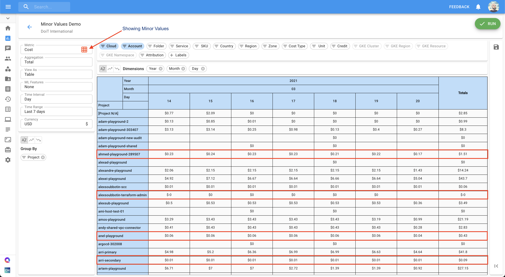

# Understanding "Minor Values"

To make reports more human-readable, very small values are removed by default from CMP Cloud Analytics reports.

While this is very useful for performing cloud cost analytics, it may cause reports not to match the invoices, though by a very small amount \(usually far less than US$1\).

To make Cloud Analytics reports show these "minor values", please enable "Minor Values" filter and run the report again.

