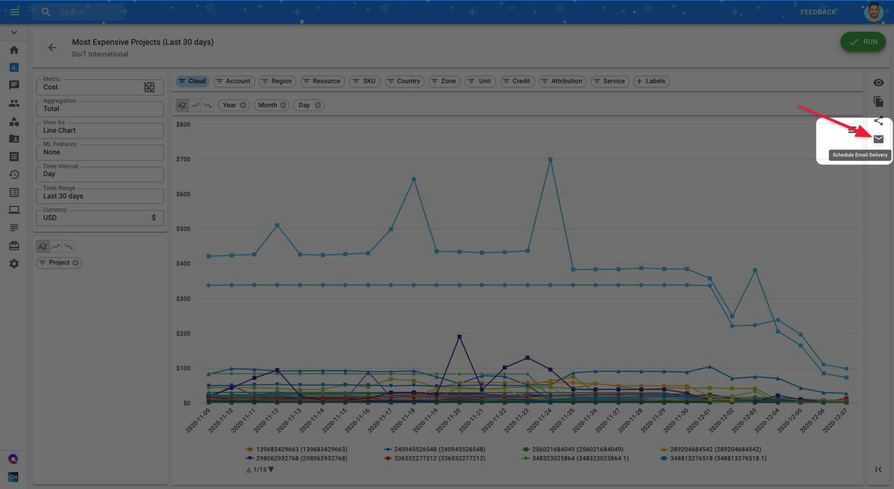
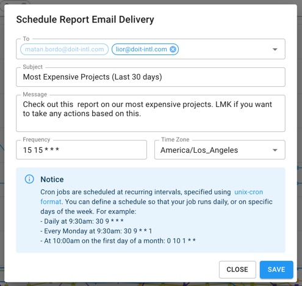
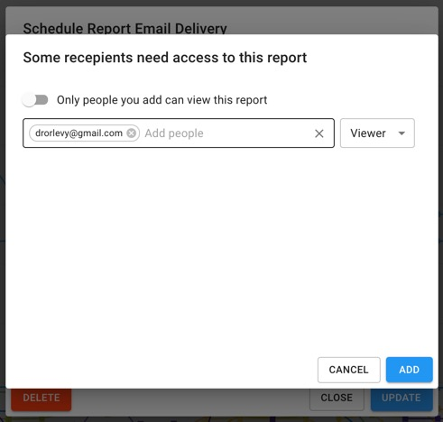
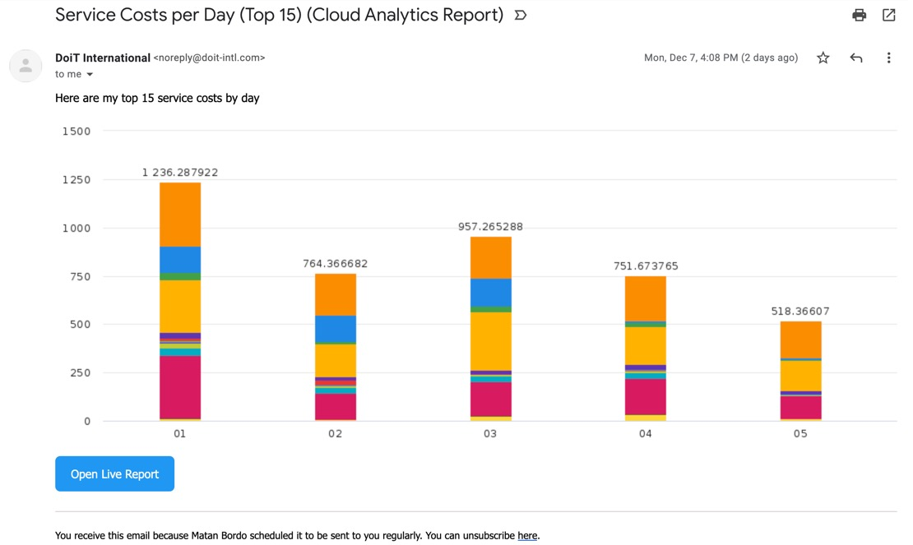
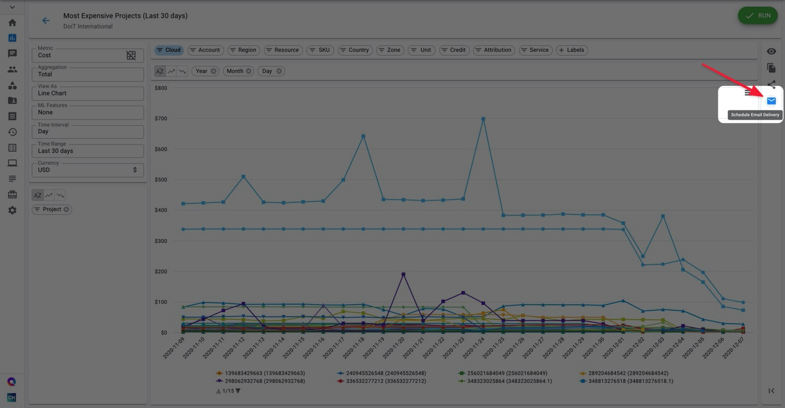
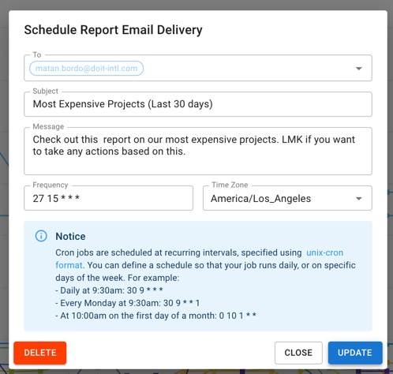

# Schedule Report Email Delivery

You can send a copy of your Data Studio report to yourself and your stakeholders on a regular basis by setting up an email delivery schedule.


Required Permissions: **Cloud Analytics**


### Create a Scheduled Email Delivery

Begin by opening a report that you have `Owner` or `Editor` access to. Then, click on the email ✉️ icon on the report actions toolbar.

 Then, configure the scheduled delivery:

* Set  other users, you'd like to be included on report's distribution
* Optionally, update email's subject and the message to provide more context for recipients
* Set up when you'd like to be delivered \(using [_cron expression_](https://crontab.guru/)\)

If you've included someone who doesn't have access to the report, you will be asked to add that user to the report. You can choose whether to grant the "Viewer" or "Editor" access.

### About Cron Expressions

The delivery time and recurrence of a Cloud Analytics Report can be configured by using a [cron expression](https://wikipedia.org/wiki/Cron#CRON_expression). Cron is a time-based job scheduler originally used in Unix-like computer operating systems. A cron expression is a string comprising of five or six fields separated by whitespace. The following table defines the fields of a cron expression and the possible values for each field.

| Minute | Hour | Day | Month | Day of the week |
| :--- | :--- | :--- | :--- | :--- |
| 0-59 | 0-23 | 1-31 | 1-12 \(Jan-Dec\)  `1`=`Jan`, `2`=`Feb`, ... `12`=`Dec` | 0-6 \(Sun-Sat\)  where `0`=`Sun`, `1`=`Mon`, ... `6`=`Sat` |

In addition to using these values, every field in a cron expression can also use special characters:

| Character | Meaning | Example |
| :--- | :--- | :--- |
| `*` | any | If the day of month field, day of the week field are each set to `*`, then the schedule starts every day. |
| `-` | range | If the day of week field is set to `1-5` or `Mon-Fri`, then the schedule starts every week Monday to Friday. |
| `,` | list | If the month field is set to `5,7,9` or `May,Jul,Sep`, then the schedule starts every May, July, and September. |
| `/` | step | If the month field is set to `*/3`, then the schedule starts during the first month and every 3 months after that: January, April, July, and October. |


Schedule intervals lower than daily are not permitted with Google Cloud Analytics, meaning the first 2 places must be numbers between \(0-59\) and \(0-23\)


To create a schedule that repeats, use special characters to describe when that schedule is to repeat. For example, the cron expression 30 8 \* \* Mon-Fri configures a schedule to start at 8:30 AM on every Monday, Tuesday, Wednesday, Thursday, and Friday.

**Example**

Your scheduled report will look something like in the example below. From the email, you'll be able to preview the report and open an interactive report in Cloud Analytics, by using the "Open Live Report" button.

### Updating Scheduled Delivery

To update the scheduled email delivery configuration, open a report that already has a configured schedule. Then, click on the blue envelope icon on the far-right side of your report's page. Then, make the changes then click on the Update button.

### Deleting Scheduled Delivery

If you need to delete the scheduled report, please use the Delete button on the "Schedule Report Email Delivery" dialog.

### Limitations

A few limitations exist for scheduled reports:

* Each report can only have a single email delivery schedule
* The person who scheduled the report is always included in the email
* The minimum interval for a scheduled report is 24 hours. In other words, you can't schedule a report to be delivered more than once a day.
* Only chart-based reports can be scheduled \(i.e. no tables or heatmaps\)

