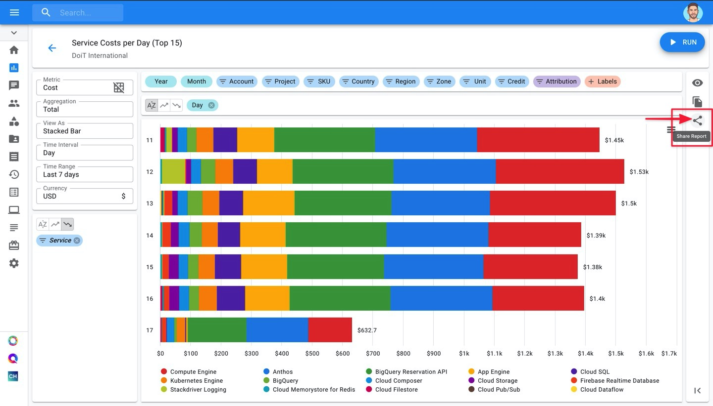
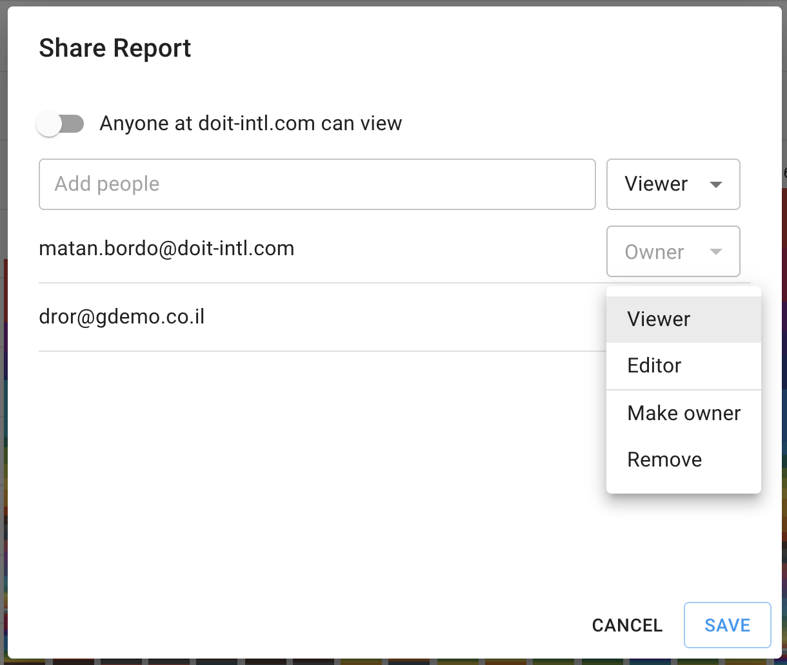

# Share and Download Cloud Analytics Reports

### _**1\) Sharing Cloud Analytics Reports**_

_**Note:** If you're new to Cloud Reports and/or haven't created a Cloud Report yet, we recommend reading our post on_ [_**Creating Cloud Reports**_](create-cloud-report.md) _before reading further._

Before discussing how to share a Cloud Report, let's briefly review roles and permissions. 

#### Available Sharing Permissions:

* **Viewer**: Sees the report in "read-only" mode. Can only modify "Metric" and the chart type. 
* **Editor**: Can modify all settings of a Cloud Report, and share the report with others.

#### How to share a report

To share a Cloud Report with your team, click the "Share" button on your report's page.

 This will open a pop-up that will give you two options when sharing:

* Give everyone on your team Viewer access.
* Explicitly give someone from your team Viewer or Editor Access.

Once you've entered the email\(s\) of who you're sharing your Cloud Report with, click "Add" and then hit "Save" to apply your changes.

Once a report is shared, the recipient\(s\) will receive an email that looks like this:

#### Editing a user's role

To change a user's role, make them the owner of the report, or remove them from the report, click on the dropdown next to their email in the Share Report pop-up. From there, make a selection and click "Save" to apply the changes.

### _**2\) Downloading Cloud Analytics Reports**_

In Cost Analytics &gt; Reports, once you have saved your report you can download it, following these steps:  
  
1\) Click on this icon on the side: 

2\) Choose between "Export to CSV" and "Export to Google Sheets"

