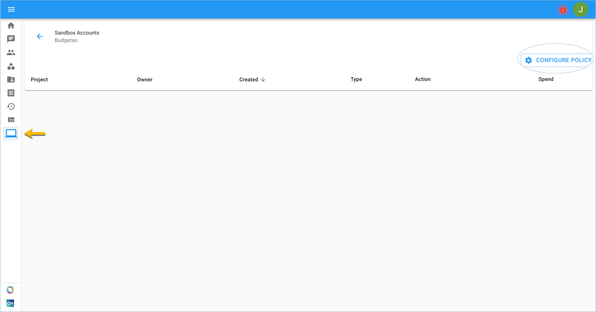
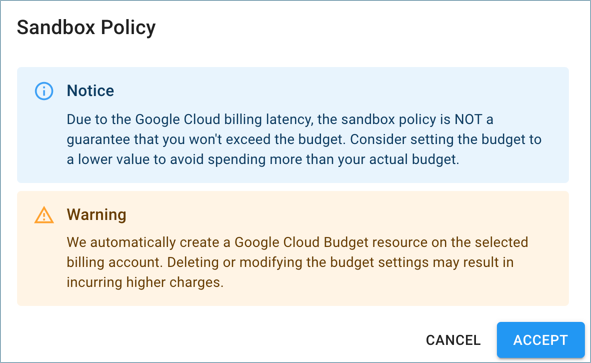
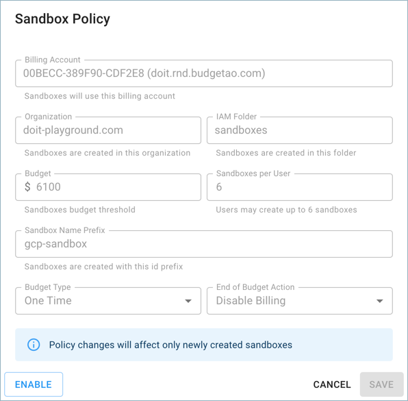

# Configuring a Policy for Sandbox Accounts

Google Cloud Sandbox for Organizations is the easiest way for companies to set up and manage Google Cloud sandboxes. Through the Cloud Management Platform, you’ll be able to enable your developers to create a sandbox, monitor sandboxes from a centralized hub, and have one-click access to sandbox projects for deeper dives.

Set up a Google Cloud Sandbox Policy to enforce rules which automate sandbox management. With a sandbox policy, you can set up sandbox budgets, get alerts when a budget is hit, or automatically disable the billing, limit the number of sandboxes per user, connect all sandboxes to your GCP billing account, organization, and IAM folder, and give all sandboxes a stable naming convention.

_To create Google Cloud Sandbox Accounts, you must verify that a Google Cloud service account was successfully configured. You can read more on how to configure your Google Cloud service account at_ [_Connect Your Google Cloud Organization._](https://help.doit-intl.com/hc/en-us/articles/360048197072-Connect-Google-Cloud-Service-Account)

**Required Permission:**

At a minimum, to configure a policy, you must be granted the following permission:

* Sandbox Admin 

Before users can create a sandbox account, the Sandbox Admin needs to configure a policy. Without a configured policy, users cannot create a sandbox, as the policy defines how a sandbox is created.

To begin, click the 'Sandbox Accounts' icon on the left-hand side of the page. Once you're at the Sandbox Accounts page, click on 'Configure Policy', located on the right-hand side of the page.

A notification will pop up informing you that the sandbox policy doesn't guarantee you won't exceed the budget. Click on 'Accept' to proceed.

Complete the Sandbox Management Policy form:

* GCP Billing Account
* Organization
* IAM folder
* Budget
* Sandboxes per User - 10 maximum
* Sandbox Name Prefix
* Budget Type - One Time or Monthly
* End of Budget Action -  Send Alert or Disable Billing

The Sandbox Admin can disable the policy to prevent the creation of additional sandboxes. This action will not disable any preexisting sandboxes. Click on 'Update Policy', and locate the disable/enable button. To finish, click 'Save'.

To learn more about how to create sandbox environments in the CMP, go [here](https://help.doit-intl.com/hc/en-us/articles/360042612671).  

