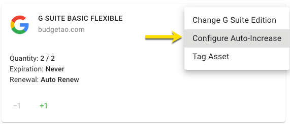
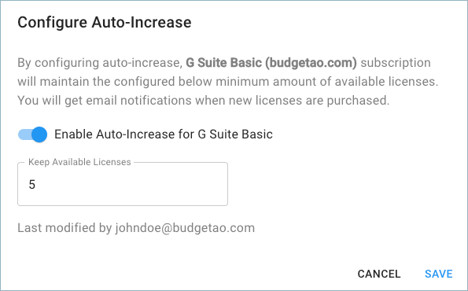
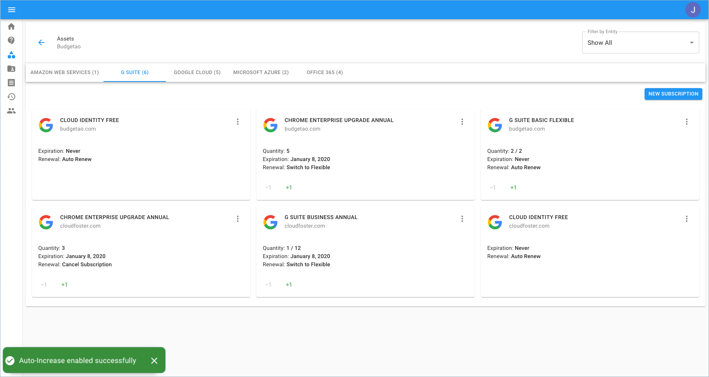
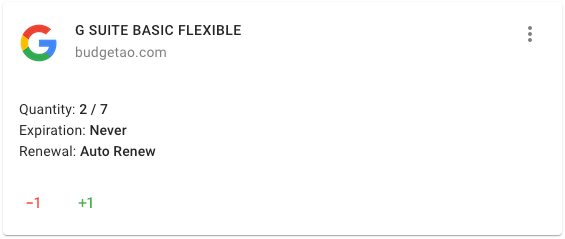

# Auto-Increase Subscriptions

As a customer, you are able to configure a G Suite subscription to increase automatically once the amount of licenses falls short of the configurable threshold.


Required Permission: **Licenses Manager**



Please note that you must be assigned access to the specific Billing Profile under which the domain is managed in order to configure auto-increase.


From the main dashboard please select '**Manage Licenses & Assets**'.

Once you're at the Assets page, switch to the G Suite tab.

Locate the subscription you'd like to configure auto-increase for, and click on the three-dots icon on the right-hand side of the widget. Then choose 'Configure Auto Increase'.

Configure the number of licenses you want to have available at all times. Once licenses get assigned to users in your organization, a new license/s will be added automatically.

Auto-Increase enabled successfully. Note; approximately every 30 minutes the system will check/add for available licenses.

There are now five available licenses.

The following video shows you how to Configure Auto-Increase for G Suite Subscriptions.



