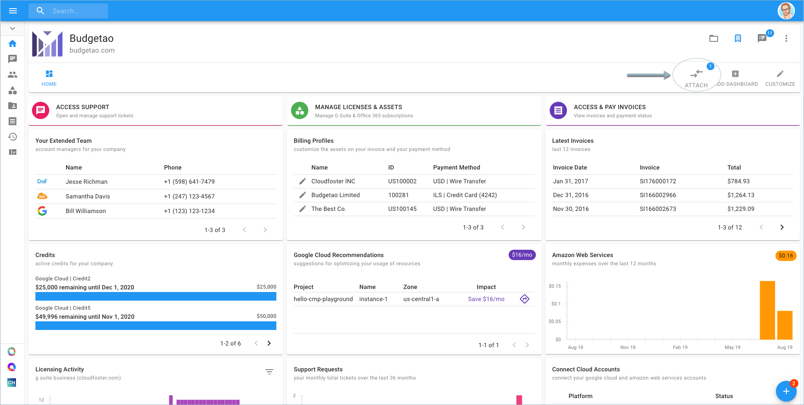
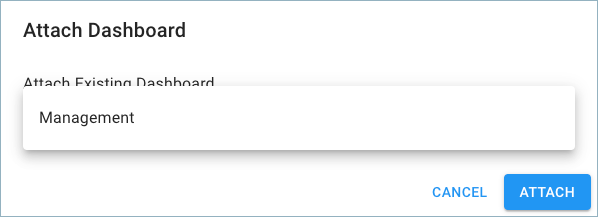
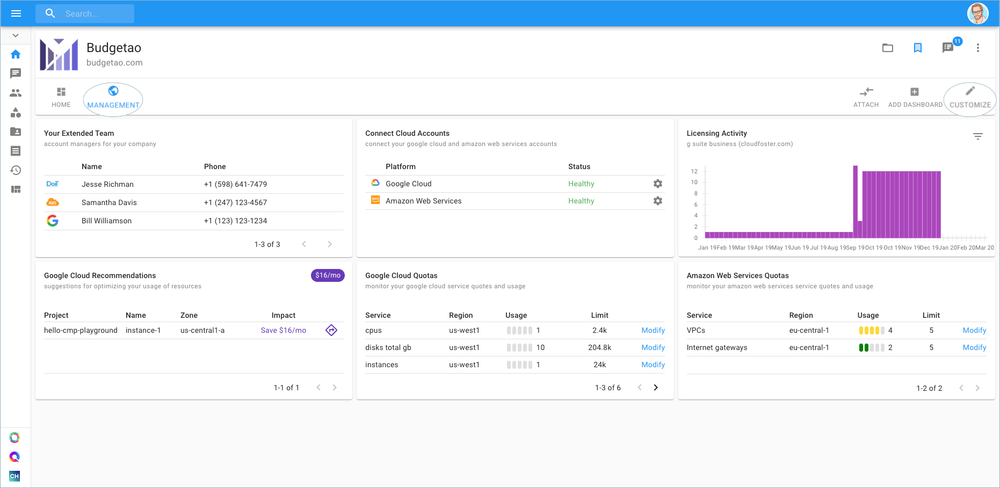
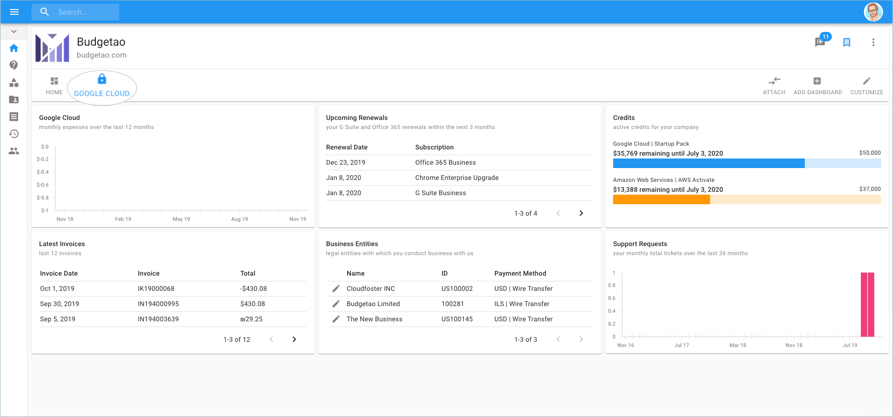

# Access Public Dashboard

In order to access a Public Dashboard that was created by another user in your organization, go to the right-hand side of the page, and click **'**Attach'.

Choose a dashboard from the dropdown list, and click 'Attach'.

Instantly, you'll see the dashboard appear in the exact format from which it was created. As a user, you have the ability to edit this dashboard by using the 'Customize' button. The 'Add Widgets' button on the bottom right is available as well.

However, now you can see that the dashboard owner changed the permission and is not allowing others to edit, as a lock icon appears in place of the globe icon.

