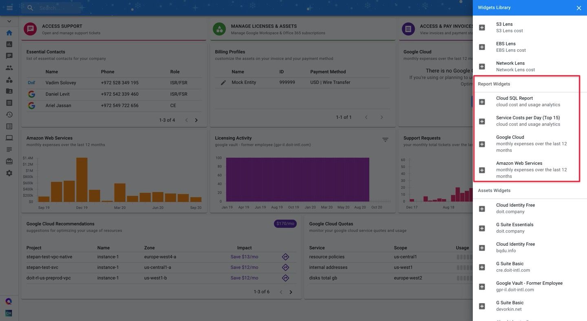

# Add Report-based Widgets

Transforming your Cloud Analytics Reports into widgets allows you to [customize dashboards](customizing-dashboards.md), or [create new](creating-a-new-dashboard.md) ones, that give you an at-a-glance view of your most important cloud infrastructure data points.


Required Permissions: **Cloud Analytics**



You can only add Preset Reports and public Custom reports for which you have Edit access into your Widgets Library. 


Enable your report as an addable widget by switching to Edit mode for the report, and clicking the toggle at the far-right of your screen.

This will make the report addable from your [Widgets Library](widgets-overview.md).

Next, access any of your dashboards and open your Widgets Library by clicking on the "+" in the lower-right corner of your screen.

Finally, scroll down a bit until you see the "**Report Widgets**", and click on the report\(s\) you'd like to add to your dashboard.

From there, you're free to [customize](customizing-dashboards.md) the size and arrangement of the widgets as you see fit. 

Note that report data displayed in the widget will refresh every four hours. Additionally, only reports with chart visualizations \(i.e. not tables\) can be added as widgets.

