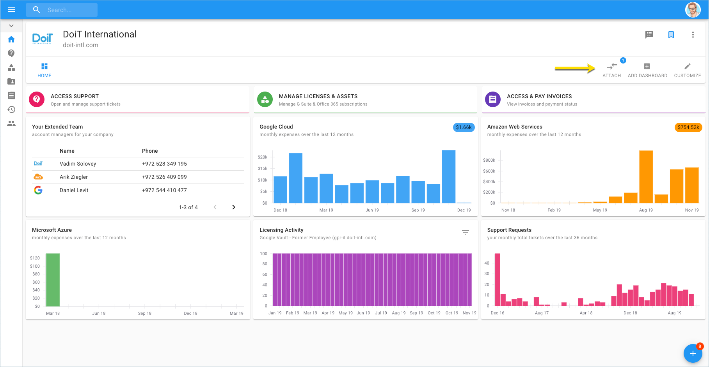
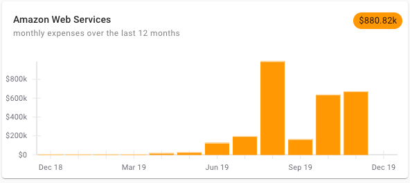
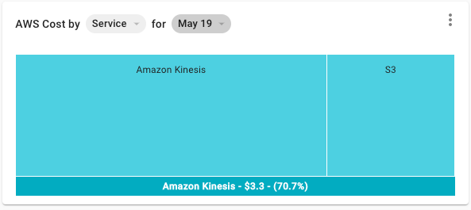
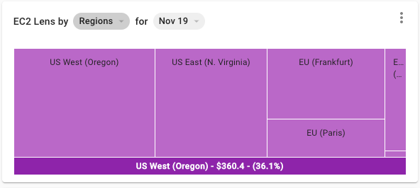
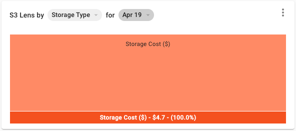
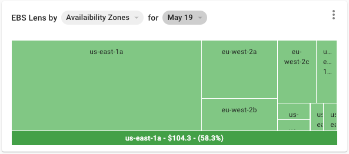
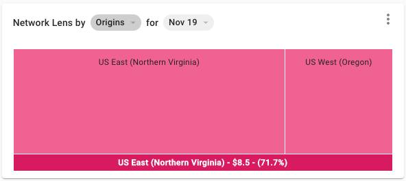

# AWS FinOps Dashboard

Having full visibility into your services' operations and being accountable for your cloud finances to fully manage costs is crucial, whether fixed or variable. Use this dashboard to decide how and when to optimize costs, monitor performance, and more. The AWS FinOps dashboard can only be attached if you have Amazon Web Services assets linked to DoiT International.

_Please note you must be assigned access to at least one Billing Profile with active AWS assets attached in order to access this dashboard._

Your first step would be attaching the AWS FinOps dashboard within your Cloud Management Platform.

Please navigate to the right-hand side of the page and click 'Attach Dashboard'.

From the list, select '**AWS FinOps**' and click 'Attach" to access the AWS FinOps dashboard.

The AWS FinOps dashboard is now available with an analysis of the AWS services you use.

Each of the six widgets serves its own purpose and will reflect the data filtered by month and year:

**Cost History** - Review your AWS expenses over the last 12 months, and get a look into next month's AI-assisted cost prediction, listed at the top right-hand part of the widget. 

\*\*\*\*

**AWS Cost** - Helps you to review AWS services your app/s is using including several preconfigured breakdowns such as; AWS Service, Component, AWS Account, and Region. Select the breakdown configuration from the first dropdown.

**EC2 Lens** - Focus on Amazon EC2 service for your compute based workloads with a breakdown by; Reservation, Accounts, Regions, Instance Type, and O/S. This will help you with identifying the major cost factors of Amazon Elastic Compute Cloud.

**S3 Lens** - Focus on how your application uses AWS Simple Storage System \(S3\), and monitor your costs with a breakdown by; Bucket, Storage Type, and AWS Account.

**EBS Lens** - Review your Amazon Elastic Block Store \(EBS\) costs to gain insights on what is driving the cost with a breakdown by; Volume Types, Accounts, Volumes, and Availability Zones.

\*\*\*\*

**Network Lens** - Gain insights on how your application uses the AWS network with a breakdown by; Traffic Type, Origins, Service, and Destinations.

