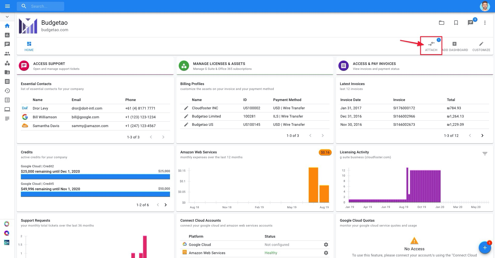
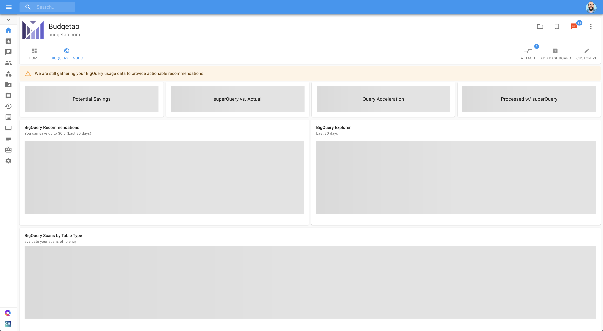

# BigQuery FinOps Dashboard

## Overview

BigQuery FinOps is your Swiss army knife for highlighting inefficiencies in your organization's BigQuery usage, and its insights are displayed in the **BigQuery FinOps Dashboard,** located in your [Cloud Management Platform](../). Without configuring anything, you'll have the most important BigQuery insights brought _to_ you. 


To access the BigQuery FinOps Dashboard, you must verify that your Google Cloud service account was successfully uploaded and granted the appropriate permissions. Read more on [linking your Google Cloud Organization](../google-cloud/connect-google-cloud-service-account.md).


If successfully uploaded, you will see:

* Either a Healthy or Partial ****value underneath the Status column in your Configured Accounts widget, and
* Healthy status next to "BigQuery FinOps" in the Features widget.
* **\[Optional\]** Healthy status next to "BigQuery FinOps Advanced" in the Features widget

## Setup

Once the Google Cloud Service Account setup is complete, click the **'**Attach' button and choose the BigQuery FinOps dashboard from the list.

Cloud Management Platform will now start gathering the information on your usage patterns. While this information is being collected, your BigQuery FinOps would have the following state:


Your BigQuery data isn't backfilled, so the data you'll see will be based on activity from the moment your service account key is processed. As more time passes, you'll get more information about your team's BigQuery information.


Once available, you'll see the dashboard appear with the statistics of your organization's BigQuery usage.

## Understanding the BigQuery FinOps Dashboard

The BigQuery FinOps dashboard \(reference image below\) is compiled of widgets that will provide you more insight into your organization's statistics.

### Elements of the Dashboard

Below is a list of the elements that make up your BigQuery FinOps dashboard, with an understanding of their purpose:

**1. Timeframe** - all insights displayed are from the last 30 days.

**2. Potential Savings**  -  **your potential cost savings resulting from completing all suggested tasks listed in the** _**BigQuery**_ ****_**Recommendations**_ widget, expressed in absolute US dollars.

**3. superQuery vs. Actual** - compares your potential BigQuery spend accounting for potential savings incurred as a result of query optimization via superQuery, versus your total BigQuery costs during the time period specified in the Time Filter. The difference between the two numbers represent your maximum potential savings assuming 100% of your BigQuery traffic runs through superQuery.

**4. Query Acceleration** - ****your improvement in query runtime within the time period specified in the 'Simulation Length' widget. It is expressed in absolute hour terms, as a result of query optimization via superQuery.

**5. Processed with superQuery** - a breakdown of how much query traffic goes through superQuery, compared with the total query traffic that runs through BigQuery \(including the superQuery traffic\). Use this as a rough gauge for understanding how much in terms of actual savings your team can take advantage of.

**6. BigQuery Recommendations** - comprehensive recommendations with further details on how to act on each recommendation.

**7. BigQuery Explorer** - get more granular information as far as your team's BigQuery usage, completely modifiable by the user in the following format:

Top 10 \(**Project, Billing Project, Dataset, Table, User**\) by \(**Scan Price, Scan TB, Storage Price, Storage TB**\).

Clicking on one of the results in the BigQuery Usage Explorer widget will open a pop-up where you can get even more granular with your usage insights.

**8. BigQuery Scans by Table Type** - see how much data you are scanning from various types of tables, broken down between unpartitioned tables and various types of partitioned tables, along with external sources such as Google Sheets.   
  
Click on a specific table type to see what are the most frequently-scanned tables within that type.

Note on the BigQuery FinOps Advanced 

### BigQuery Recommendation Types

Below is a list of the recommendation categories you'll see in the BigQuery Recommendations widget, and how to use the information contained within each recommendation.

**Backup and Remove Unused Tables** - Backup and remove the unused tables listed under the "Table" column. If the table has multiple partitions, click on the number listed under "Partition\(s\) to Remove" to see precisely which partitions should be removed.

**Cluster your tables** - Cluster the tables listed under the "Table" column by the field\(s\) suggested under the "Cluster By" column.

**Enforce Partition Fields** - Use the suggested partitioned fields\(s\) under the "Partition Field" column for the corresponding queries listed under the "Query ID" column.

**Partition your tables** - Partition the tables listed under the "Table" column by the suggested field\(s\) listed under the "Partition Fields" column.

**Query Optimization via superQuery** - Follow the steps listed inside the recommendation to ensure that 100%, or close to 100% of your BigQuery traffic is running through superQuery and you can realize the maximum amount of savings.

**Limit query jobs** - Reduce job execution frequency of the listed jobs under the "Query ID" column by the percentage you choose on the slider, and view the associated savings of each reduced job under the "Savings by Reducing Jobs" column.


The BigQuery Finops Dashboard does not currently reflects reservations and your job costs are displayed as on-demand. If you use reservations, please disregard the BigQuery Finops Dashboard's recommendations until we include reservations in our future release.


## BigQuery FinOps Frequently Asked Questions \(FAQ\)

Oftentimes we get asked what the non-read-only permissions are for, and so we'd like to share more about how it plays into the process of creating your BigQuery FinOps Dashboard. 

### **What are the permissions we are referring to?**

bigquery.datasets.create, logging.sinks.create, bigquery.jobs.create, and bigquery.tables.getData

### **Why do you separate between BigQuery FinOps and BigQuery FinOps Advanced permissions?**

We require bigquery.tables.getData in order to provide clustering recommendations, and this is separated from the permissions required under the BigQuery FinOps feature.

This allows us to query your BigQuery tables and determine your top 20 non-clustered tables, which field\(s\) are the best candidates to cluster those tables by, and in what order.

More specifically, this helps us identify the cardinality of the columns in your top 20 non-clustered tables which get referenced in the WHERE clause and are possible to cluster on. Knowing how many distinct elements exist in each column enables us to compute the average chunk size and see what the best candidates in terms of savings would be.**\*\***

However, you can still use and benefit from the BigQuery FinOps Dashboard without receiving clustering recommendations. That's why we separate the two.


**\*\***Given that you execute **similar queries** as you did during the previous 30 days, and reference fields **in the order we recommend**.


### **What datasets are you creating, where and for what purpose?** 

A dataset called **doitintl-cmp-bq** is created in the billing project attached to the service account you add to the CMP. 

### **What log sinks are you creating, where and for what purpose?** 

A sink for query jobs is created in the same project as \(1\). This sink pushes all your bigquery jobs into a table under &lt;PROJECTID&gt;.doitintl-cmp-bq. **cl oudaudit\_googleapis\_com\_data\_ access** 

### **What queries will you be running, where, and for what purpose?**

We have two main processes, once of which runs queries and the other not: 1\) Enrichment process: We take the data from doitintl-cmp-bq. **cloudaudit\_ googleapis\_com\_data\_access**  and create a new table doitintl-cmp-bq.**enrichedJobs**. This is done at no cost to you, but rather an algorithmic and API based enrichment from our side to have a clean dataset to work with in the processes that follow. 2\) BigQuery Finops process: We create a few UDF's under the doitintl-cmp-bq dataset, as well as two more derived tables called **pegUtilsT2** and **queries.**  These support the FinOps in running over aggregated data, rather than raw data.  The following queries are executed as part of the process \(2\) above:

* Aggregations into pegUtilsT2 and queries tables
* Daily run of cost simulation queries to provide the cost savings information, superQuery usage estimation, and potential savings.
* Daily run of FinOps calculation queries to provide the richly detailed information you see in the CMP on your BigQuery usage.

View the bite-sized video below for a quick tutorial on the BigQuery FinOps Dashboard.

### What does it mean when I see "Not yet allocated" in the Cost Explorer?

You will see "not yet allocated" when analyzing dimensions like Projects in the BigQuery Explorer when we aren't able to detect which table a query is scanning.

This could be because of queries like "SELECT 1" or queries we aren't able to parse due to complexity \(parser times out\), or it uses a function/statement which we don't support yet.



