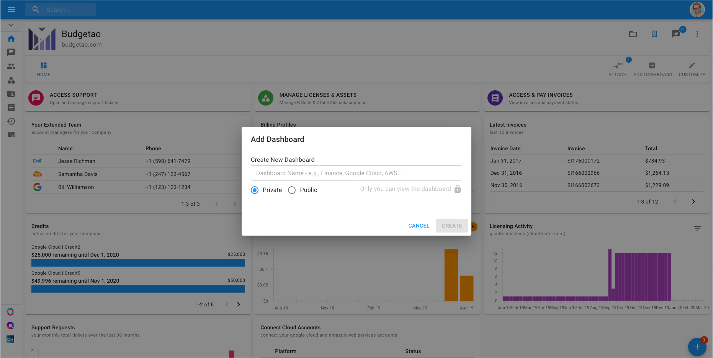
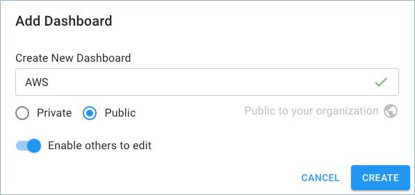
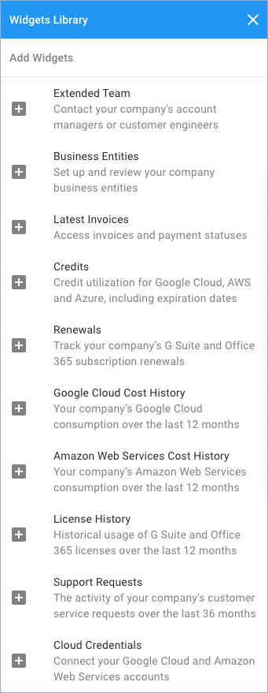
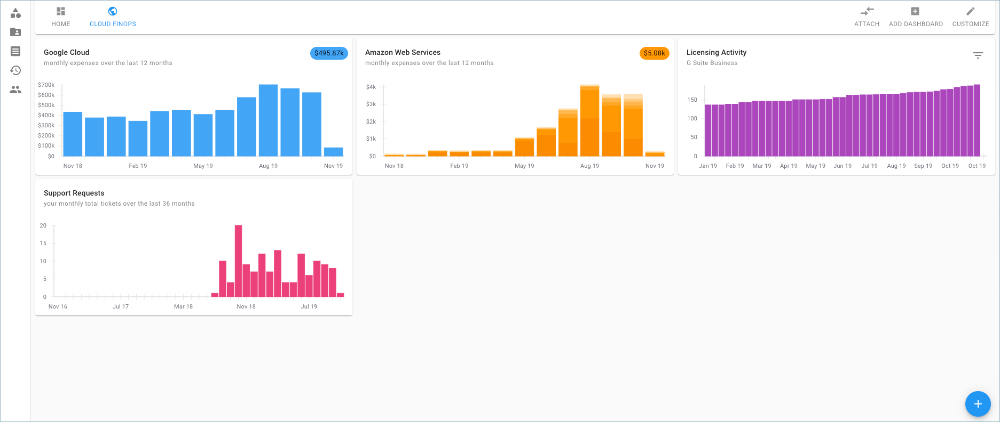

# Create New Dashboard

You can maintain multiple dashboards in your Cloud Management Platform to visualize metrics, manage licenses, and access important data for your organization. 

In order to create a new dashboard, go to the right-hand side of the page and click 'Add Dashboard'. 

Create the 'New Dashboard' and choose a name, for example, 'AWS', 'Google Cloud', 'Finance', 'Ops', or anything else that suits your use case.

Every dashboard can be 'Private', or 'Public'. 

* Private - only you can view the dashboard
* Public - any user in your organization can access this dashboard

When creating a new public dashboard, choose whether or not to grant other users permission to edit the dashboard by switching on the 'Enable others to edit' toggle.

Once a dashboard has been created, adding widgets is the next step in the dashboard customization process. Go to the bottom right-hand corner and click 'Add Widgets'.

Select widgets from the Widgets Library you'd like to add to your dashboard.

In the following example, I created a customized dashboard named "Cloud FinOps".

Considering that a user can have multiple dashboards which can be either 'Private' and 'Public', notice the globe icon next to a dashboard title; the globe icon represents a 'Public' dashboard. There are a few dependencies for recognizing a dashboard as Private or Public :

1. Globe icon **+** 'Customize' button disabled **+** 'Add Widgets' button doesn't appear - public, non-editable dashboard
2. Lock icon - your own private dashboard
3. Dashboard title text is highlighted blue - currently viewing dashboard

For more info on accessing a Public Dashboard, go [here](accessing-a-public-dashboard.md).

