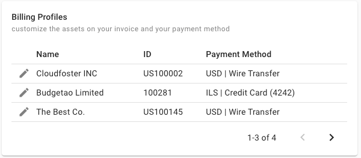
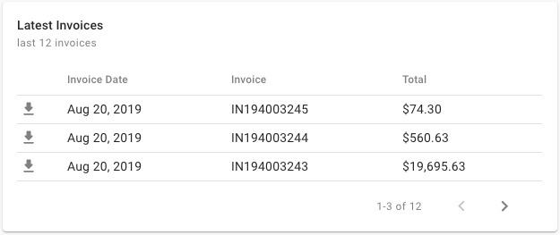
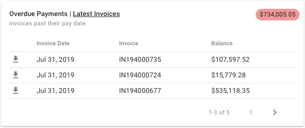
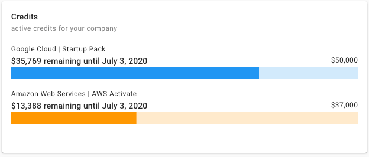
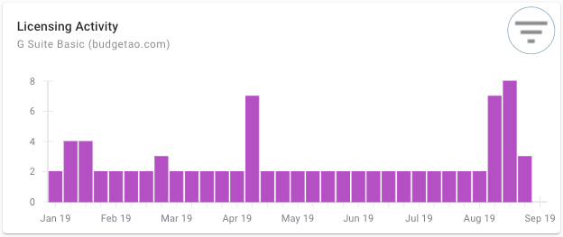
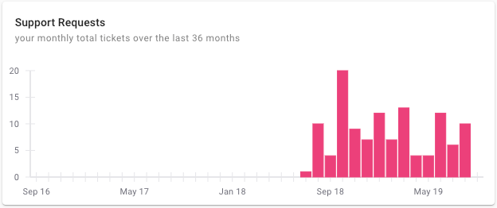
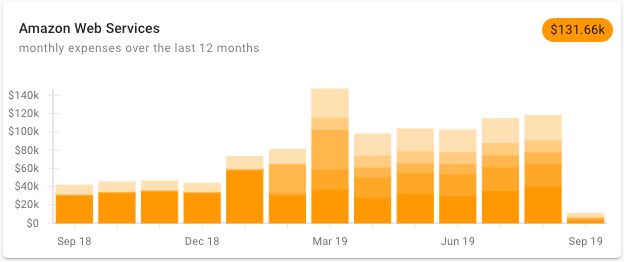
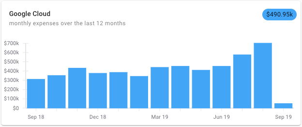
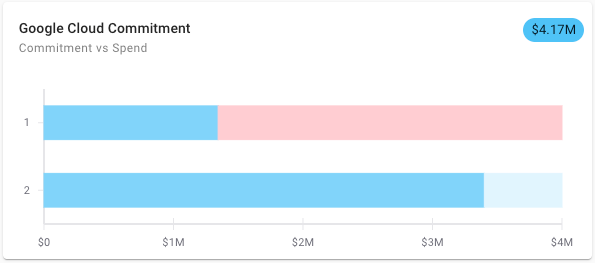

# Widgets Overview

Widgets are an essential aspect of the home dashboard in the Cloud Management Platform's \(i.e., [https://hello.doit-intl.com](https://hello.doit-intl.com/)\) customization. You can change the location of the widgets by clicking the 'Customize' button and reordering the widgets on your dashboard, as well as remove them altogether if you wish.  

**Manage Licenses & Assets** opens the assets page which you can use to purchase additional licenses and subscriptions for G Suite and Office 365.

**Access & Pay Invoices** provides a list of your company's invoices from DoiT International, including their amounts, payment status, and invoice details.

**Access Support** is used to create new customer service requests or access existing requests previously opened by you or someone on your team.

_Please note that if one of the items on that list is disabled \(grayed out\), it means your user doesn't have the appropriate credentials required to perform this action._

**Essential Contacts**

There are several people involved in making sure your cloud assets are managed to the best possible extent and you're enjoying the best service. Usually, it's the group of your DoiT International and Google/Amazon/Microsoft account managers, depending on which cloud platforms your company uses.

Using this widget you can see who is your account manager at DoiT International as well as at Google, Amazon, and Microsoft. You can use this information to send an email to your Account Manager by clicking on their email address. When using a mobile device, click on the phone number and to dial.

_Please note that when you open a new service request, your account manager will be copied to the correspondence. Depending on the chosen cloud platform of the service request, Google, Amazon and Microsoft account managers will be included as well._

**Billing Profiles**

This widget lists all of your company's billing profiles, including some basic information such as your billing profile's ID, currency and payment method. You can use this widget to update your billing profile by clicking the edit icon. 

**Latest Invoices**

By clicking on the invoice number, you can quickly access the specific invoice. 

**Overdue Payments**

View the overdue payments and see the total amount due in the top right-hand corner. 

**Credits**

Subject to the available credits your company has for AWS and/or Google Cloud products, you're able to get a glance at the remaining/used credits, sum, and expiration dates.

**Licensing Activity**

Increase and decrease of licenses in the represented subscription \(i.e., G Suite Basic\) for the last 12 months. In addition, you can filter the license activity by subscription by clicking the filter button and selecting the subscription you'd like to inspect.

**Support Requests**

The activity of your company's customer service requests over the last 36 months. Each bar represents how many support requests your company has made with DoiT International per month.

\*\*\*\*

**Monthly Expenses**

Review your AWS consumption over the last 12 months. The bars represent AWS services consumption per month and the different gradients show the amount that each product consumed. Please note that the chart contains only the top 10 AWS services consumed by your accounts. 

On the top right-hand corner is the machine learning prediction for the current month.

Review your Google Cloud consumption over the last 12 months. The bars represent Google Cloud services consumption per month.

On the top right-hand corner is the machine learning prediction for the current month.

\*\*\*\*

**Cloud Commitment**

Analyze your Google Cloud or AWS attainment to your contractual commitments, including forecasts of your future expenses towards the commitment. Using this widget, you can track your actual spending, the remainder of the contract, and managing the rollover for the following period. Also, if you fall short of your commitment for a specific period, you can identify the shortfall.

The chip on the top right-hand corner of the widget displays the forecast of estimated spending for the current period. 

The dark blue section of the bar displays the actual spend, and you will be able to see an even darker shade of blue if/when you have a rollover to the next period.

The light blue section of the bar displays the remaining commitment. The pink section of the bar displays the shortfall, i.e., your actual consumption is less than the commitment.

