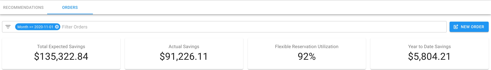

# FlexRI FAQ

## How much can I save every month?

You would save as much as 80% of the discount granted by the applicable AWS Reserved Instance 1-year Full Upfront.

For example, AWS grants a 19.5 discount on reserved instances for instances from the m5 instance family in the us-west-1 region. FlexRI for this machine/region combination will provide you with a 15.6% \(19.5 \* 0.8\) discount but without the risk of committing to the entire year. 

## Can I buy FlexRI for 3 months?

Yes. Flexible Reservation orders can be configured as "recurring" for any number of months. Recurring orders will be automatically recreated every month. 

## Can I send a report to the CFO with the actual saving

We display actual savings on our FlexRI dashboard. Your CFO would have access to this dashboard and would be able to monitor the utilization as well as the actual savings yielded by the Flexible Reservations.

## Do you send an expiration reminder before the end of the month?

About 5 days before the existing Flexible Reservation/s would expire \(unless there is a "recurring" setting enabled\), we will send you an email with a summary of all expiring flexible reservations.

## How the discount is calculated exactly?

The discount is calculated by applying 80% on the applicable AWS Reserved Instances 1-year Full-Upfront "Savings over On-Demand". You can access AWS RI Pricing [here](https://aws.amazon.com/ec2/pricing/reserved-instances/pricing/).

## Can you make recommendations on which FlexRI, should I buy?

We are actively working on providing recommendations based on your EC2 usage pattern for all consumption not covered already by the AWS Reserved Instances. Until this feature will become available, please contact our [support](https://support.doit-intl.com) and we'll work with you on providing recommendations. 

## Can you find a way to provide a discount based on consumption?

Our team is working on a FlexRI Auto-Pilot. Once available, Auto-Pilot will automatically implement recommendations, always optimizing for cost. Under this model, you won't need to think what Flexible Reservations to purchase or to what hourly spend you're willing to commit. 

