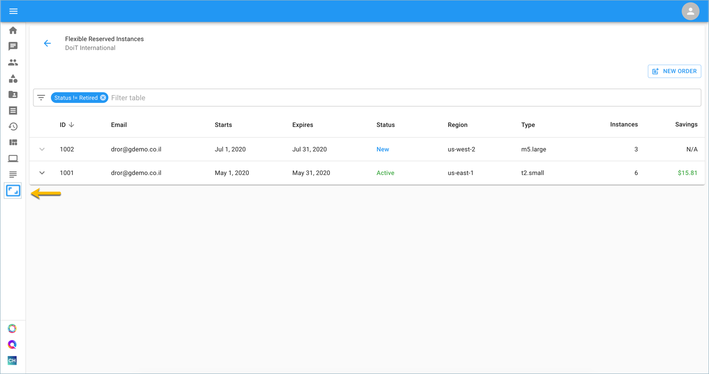
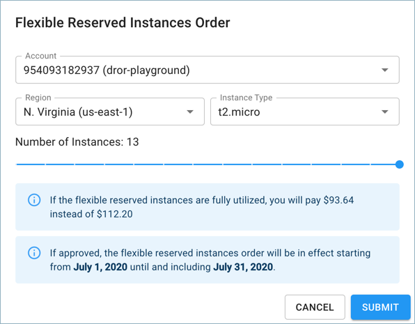
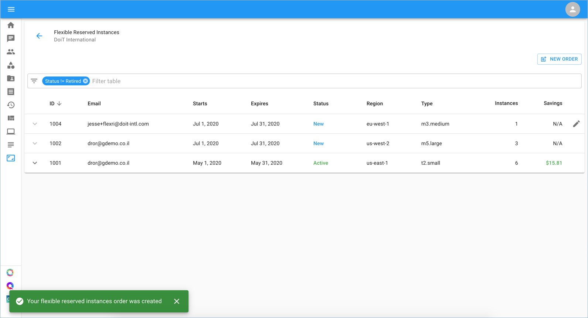
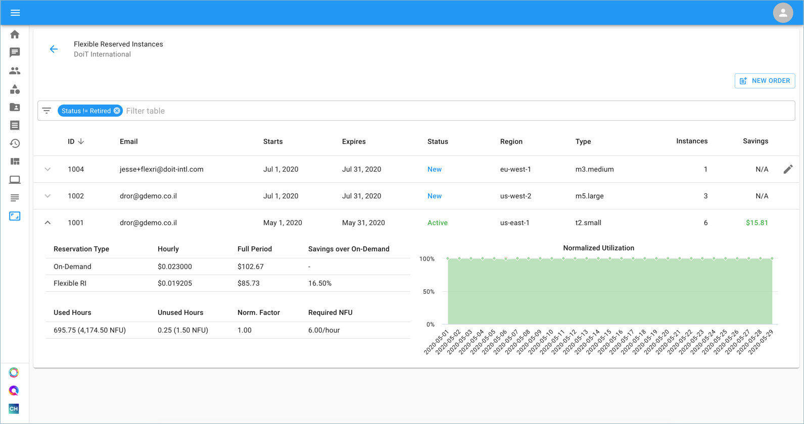

# Purchase Flex RIs

Flexible Reserved Instances provide you with a 22% discount over on-demand EC2 pricing while allowing you to commit to instances in one-month intervals.

DoiT International has developed a proprietary technology to provide our customers with month-to-month discounts based on the reserved instances in your AWS environment. In order to get the benefits of Flexible RIs, your AWS account/s should be consolidated with DoiT International as your channel reseller.

_Please note that new orders and editing previous orders can only be generated up to the 25th day of the month. After this timeframe, each order will become **Pending** for internal review and processing by our team._


Required Permissions: **Flexible RI Admin**


To begin, click the 'Flexible RIs' icon on the left-hand side of the page. Once you're at the Flexible Reserved Instances page, click on 'New Order', located on the right-hand side of the page.

Complete the Flexible Reserved Instances order by providing the following information: 

* AWS Account
* Region
* Instance Type - on-demand instances which are not associated with an existing RI 
* Number of Instances

You can now see a new order visible in the list:

Click on the arrow to expand your order and view details further. You can see the difference between the on-demand prices per hour vs. the Flex RI, and by further inspecting the utilization graph for additional details of your Flexible RI reservation.

For each order of Flexible Reservations, you'll see one or both of the following lines on your monthly invoice:

* Flexible RI \#ID Savings
* Flexible RI \#ID Underutilization

The "Flexible RI Savings" will state the amount you have saved due to the purchase of Flexible Reservation/s for a given month.

The optional "Flexible RI Underutilization" will state the amount deducted from the cost of the reservation if the underlying instance wasn't utilized 100% of the time during the month.

View the bite-sized video below for a closer look at purchasing and viewing your Flex RIs.



