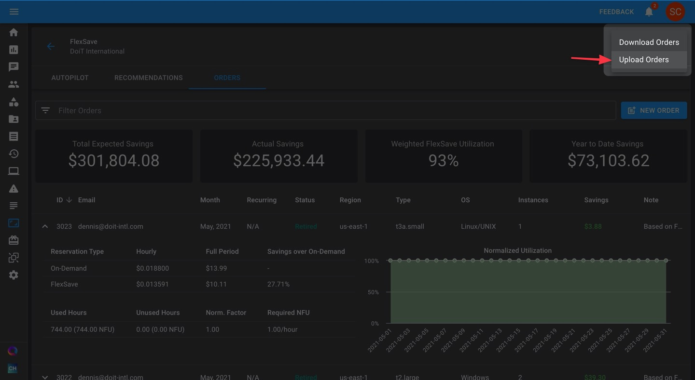

# Bulk Upload FlexSave Orders

When you have a lot of FlexSave orders to place for the coming month, bulk uploading your orders may save you lots of time. From within the CMP, you can make as many orders as you want by uploading a CSV file.


This capability is for [FlexSave Manual Mode](overview.md#manual-mode) only.


Begin by navigating to the FlexSave page, and click on the vertical ellipsis \(**⋮**\) at the top-right of your screen.

Then, select "Upload Orders" and upload the CSV file with your order information.

The following fields are optional and don't need to be filled for your CSV file to be processed:

* Note
* Recurring

To ensure your CSV file is structured properly, we recommend downloading the template below and using it to format your orders.



