# FlexSave for AWS Overview

## Overview

FlexSave helps you maximize EC2 discounts with minimal-to-no commitments.

In order to use FlexSave, your AWS account/s must be consolidated with DoiT International billing organization. DoiT International is a global [AWS Advanced Channel Reseller](https://partners.amazonaws.com/partners/001E000001HPlIAIA1/).

There are two modes when managing your EC2 compute with FlexSave: **Autopilot** and **Manual**. 

Let's go over how to use FlexSave in both modes.


Required Permissions: **FlexSave Admin**


## FlexSave Autopilot 

FlexSave Autopilot automates the management of AWS Reserved Instances and Saving Plans so that you realize the largest possible savings without having to make any commitments.


FlexSave Autopilot works by performing a sophisticated, AI-based analysis of your AWS workloads and identifies the ideal blend of Reserved Instances, automatically applying it to your account/s.


Navigate to FlexSave by clicking its icon on the left-hand navigation panel.

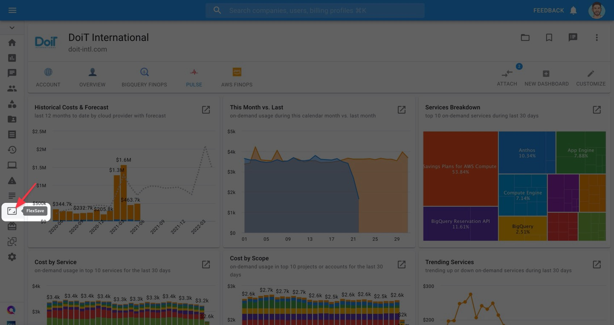

You will land on the **AUTOPILOT** tab. From there, you'll see a preview of your team's potential savings for the following month if you enable FlexSave Autopilot.

Click "**ENABLE AUTOPILOT**" 

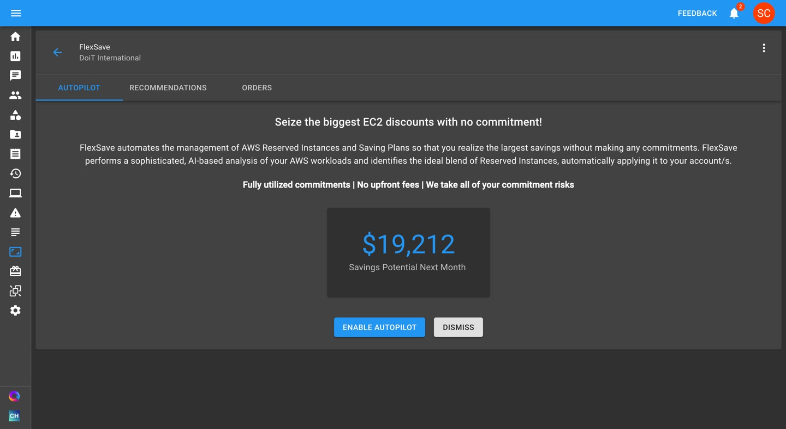

After enabling Autopilot mode, you'll see your FlexSave Dashboard which displays important insights into your FlexSave savings. 

Let's go over the elements of your FlexSave Dashboard

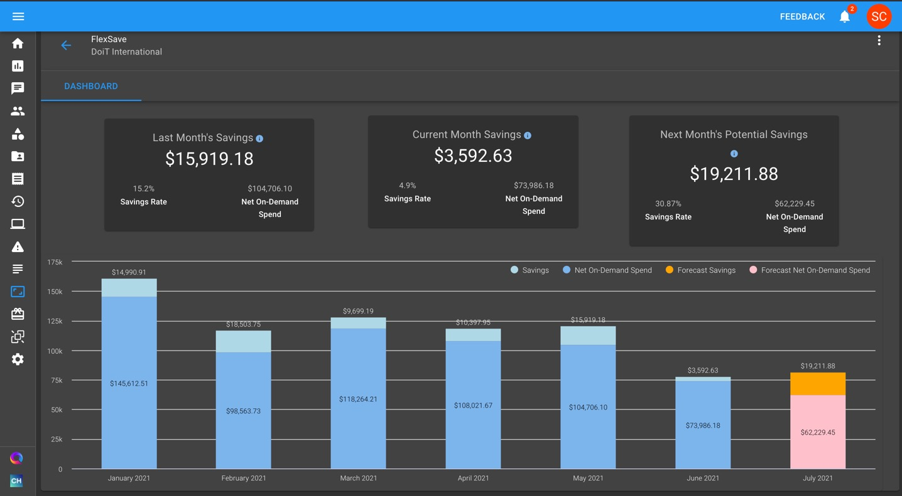

### FlexSave Dashboard

Your FlexSave Dashboard has three widgets, which displays $ savings resulting from using FlexSave Autopilot:

* **Last month's savings**
* **Current month's savings**
* **Next month's potential savings**


If you've never previously used FlexSave or purchased Flexible Reserved Instances through the DoiT CMP,  the "Last month's savings" widget will not appear during the first month you use FlexSave.


In addition, each widget contains two statistics that give more context around your realized savings:

* **Savings rate**: The % difference of what you spent on EC2 compute with FlexSave vs. what you would've spent on on-demand instances without it.
* **Net on-demand spend**: Your EC2, net of savings realized from FlexSave

Finally, your FlexSave Dashboard contains a stacked-column chart displaying FlexSave Autopilot savings and net EC2 spend from previous months, your current month, and a forecast for the next month.

Columns displaying data for the current and previous months contain two parts:

* **Savings**: Your $ savings realized from using FlexSave
* **Net on-demand spend**: Your EC2 spend, net of savings realized from using FlexSave


Historical data will only show up if you've previously used FlexSave, or if you purchased Flexible Reserved Instances through the DoiT CMP in the past.


The column displaying data for the next month contains two parts as well:

* **Forecasted savings**: Anticipated savings assuming you continue to use FlexSave Autopilot, based on AI analysis of your AWS workloads.
* **Forecasted net on-demand spend**: Anticipated EC2 spend, net of the forecasted savings from using FlexSave

### **Disabling FlexSave Autopilot**

If you prefer to switch to FlexSave Manual Mode, click on the vertical ellipsis in the top-right corner of the FlexSave page. Then select "Disable Autopilot"

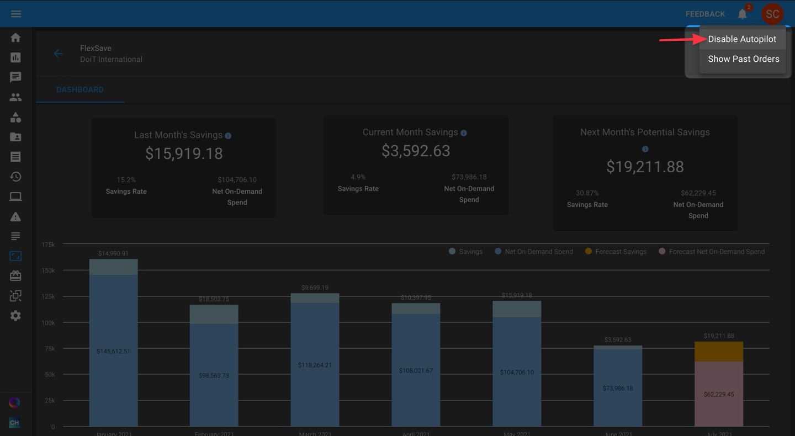

A confirmation pop-up will appear, explaining that FlexSave Autopilot will continue to generate savings until the end of the month.

Click "Disable" to revert to FlexSave Manual Mode.

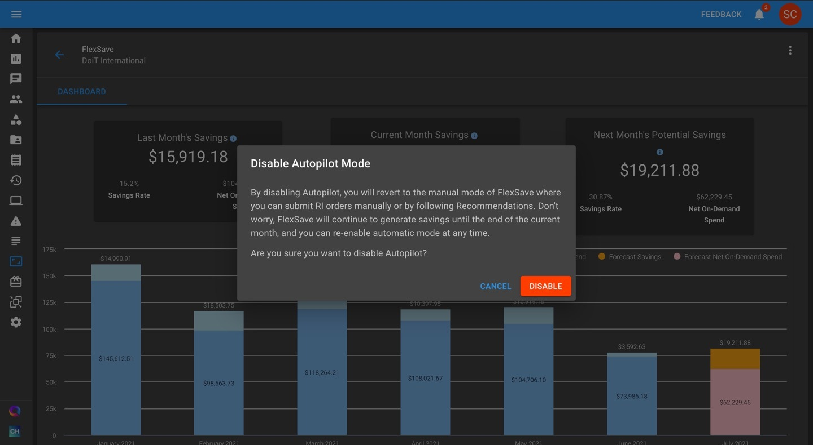

### View past orders

If you previously made reservations in FlexSave Manual Mode or its previous incarnation, Flexible Reserved Instances, you can still view your previous order history and usage stats while in Autopilot mode.

See your past orders by clicking on the vertical ellipsis in the top-right part of your screen, and select "**Show Past Orders**".

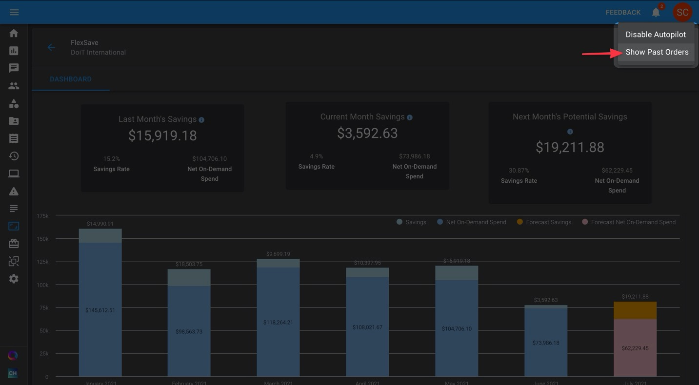

A new tab will appear, named "**PAST ORDERS**", displaying various statistics around previous orders you made in Manual Mode or with Flexible Reserved Instances.

Click on the "V" next to any of the orders to explore that order's utilization statistics and savings/spend further.

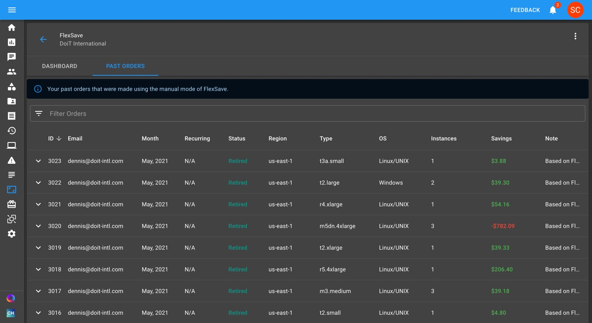

## FlexSave Manual Mode 

FlexSave Manual Mode helps you commit to ****EC2 Reserved Instances in one-month intervals while sharing in &gt;=80% of the AWS-listed discount for the equivalent 1-year RI commitment.  With FlexSave Manual Mode, you'll eliminate RI lock-in risk for your less predictable workloads.

To begin, click the 'FlexSave' icon on the left-hand side of the page. 

You have two options in FlexSave Manual Mode when ordering FlexSave reservations:

1. Utilizing [FlexSave Recommendations](www.help.doit-intl.com/flexsave/recommendations) to make orders
2. Making custom orders yourself

### Utilizing FlexSave Recommendations

FlexSave Recommendations identifies your AWS EC2 instances that aren't covered by a billing discount mechanism \(RIs, Savings Plans, etc.\), and calculates the ideal number of FlexSave reservations recommended to optimize your spend.  
  
[**Read more about making orders via FlexSave Recommendations here.**](https://www.help.doit-intl.com/flexsave/recommendations)\*\*\*\*

### Making Custom Orders

To purchase a custom FlexSave reservation, navigate to the "Orders" tab, then click on "**NEW ORDER**", located on the right-hand side of the page.

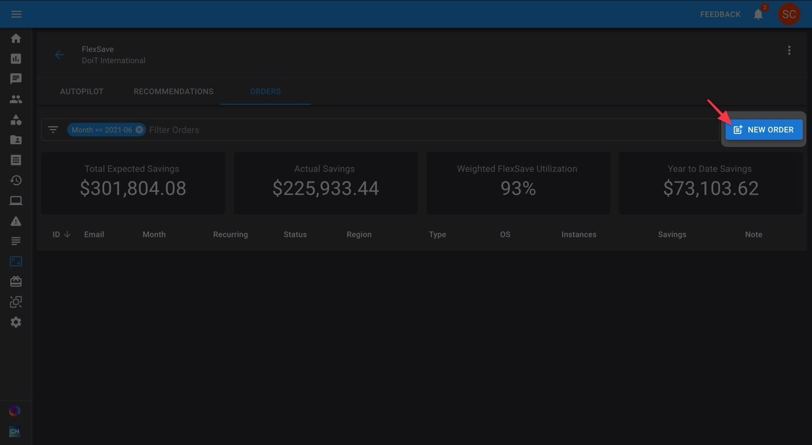

Complete your FlexSave order by providing the following information: 

| Field | Description |
| :--- | :--- |
| Account | AWS account for this order |
| Region | AWS region for this order |
| Instance Type | note, only instances not associated with existing reservations or saving plans are shown |
| Operating System | **Options include:** Linux/UNIX, Windows, Windows/SQL.Std, Windows BYOL, Windows/SQL.Ent, Windows/SQL.Web |
| Qty | how many instances of the selected "Instance Type" the order should include |
| Recurring | For orders with a recurring basis, select the last month you want this order to renew until |
| Notes | Use notes to give more context to your order such as PO numbers, workload names, etc. |

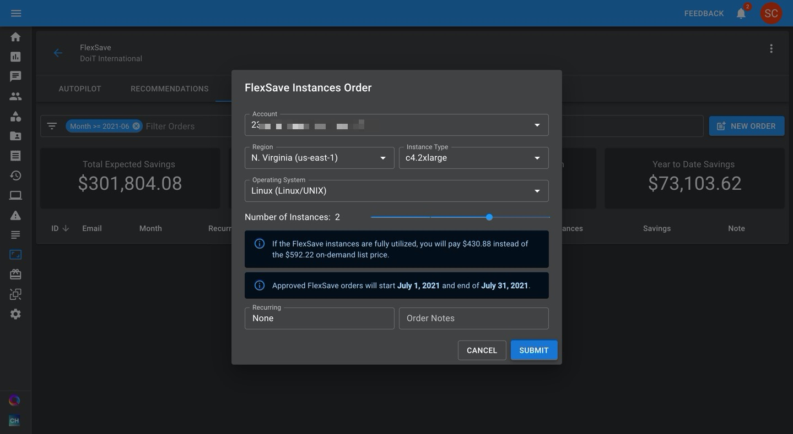

Click "Submit" and your order will be created and become visible in your orders list:

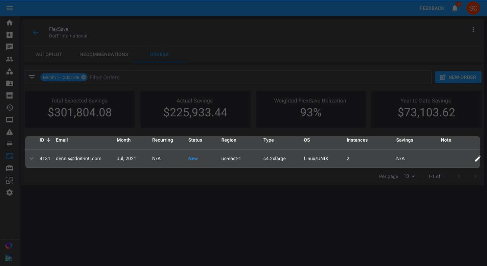


Please note that new orders and editing previous orders can only be submitted up until the last 24 hours of the current month. After that date, orders will become **Pending** while we conduct an internal review before activating your reservation\(s\).


### Setting Up Recurring Orders

To set up a recurring FlexSave order, click on "**NEW ORDER**". Then, click into the "**Recurring**" box and select the year and month you want your order to recur until.

### Monitoring FlexSave Orders

At the top of the FlexSave page, you'll see four reporting metrics that give you a high-level overview of your past and existing FlexSave purchases:

* **Total Expected Savings** - the maximum amount you could have saved, given 100% utilization
* **Actual Savings** - the amount you actually saved
* **Weighted FlexSave Utilization** - utilization rate for instances purchased with FlexSave 
* **YTD Savings** - the total saving across all your reservations, from the beginning of the current year.


Note: The first three metrics are based on what is shown in the table, meaning taking into account any filters you've set on your orders. The last metric takes _every_ FlexSave order into account when calculating the number.


#### FlexSave Order Statuses

Under the "Status" column, FlexSave orders can have four possible values:

* **New**: the order was made, but goes into effect in the following month or beyond \(if a recurring purchase is set up\). New orders can be modified until the third-to-last business day of the month prior to when they go into effect.
* **Active**: the FlexSave order is currently being applied to the instance\(s\) specified
* **Retired**: the order is past its expiration date
* **Canceled**: the order was cancelled and never applied

To view usage statistics on a specific order, click on the arrow next to an active or retired order to expand your order and view more details.

You can see the difference between the price per hour with a regular on-demand instance vs. with FlexSave, and further inspect the utilization graph for additional details on your flexible reservation.

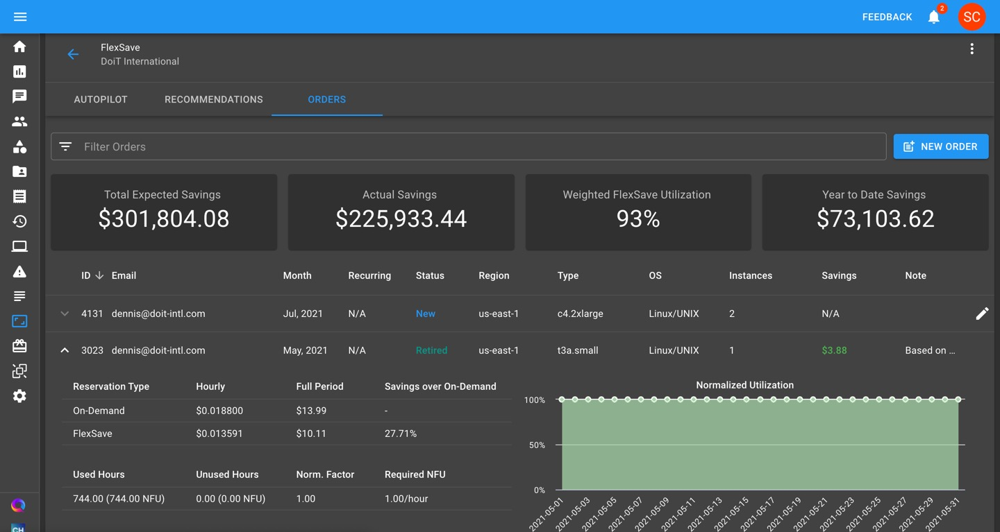

### FlexSave Invoices

For each order of FlexSave reservations, you'll see one or both of the following lines on your monthly invoice:

* FlexSave \#ID Savings
* FlexSave \#ID Underutilization

The "FlexSave Savings" will state the amount you have saved due to the purchase of FlexSave reservation/s for a given month.

The optional "FlexSave Underutilization" will state the amount deducted from the cost of the reservation if the underlying instance wasn't utilized 100% of the time during the month.

