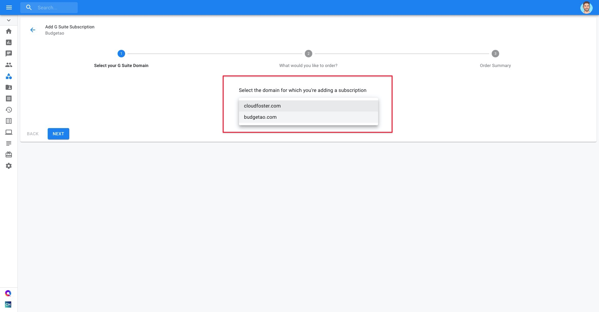
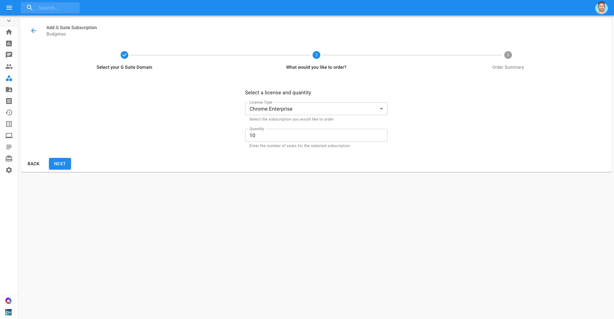
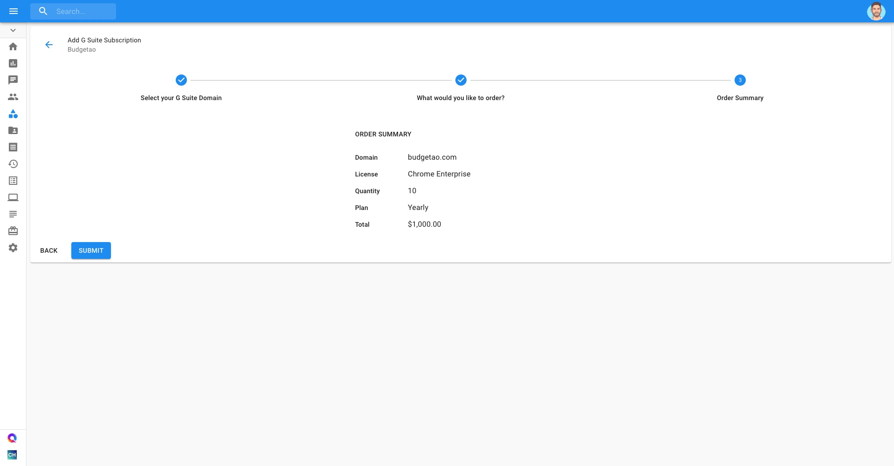

# Add a New G Suite Subscription

If you would like to purchase a new G Suite subscription, you can do so through the Cloud Management Platform.


Required Permission: **Licenses Manager**


_Please note that you must be assigned access to the specific Billing Profile under which the domain is managed in order to purchase a new subscription._

From the main dashboard please select '**Manage Licenses & Assets**'.

Another way to access the G Suite based Assets is via the menu on the left-hand side of the page and clicking on Assets.

Once you're at the Assets page, switch to the G Suite tab and click on '**New Subscription**'.

Select the domain for which you're adding a subscription and click 'Next'.

Select the Subscription/License and quantity you'd like to order.

Lastly, review your order summary and, if you approve, click 'Submit'

