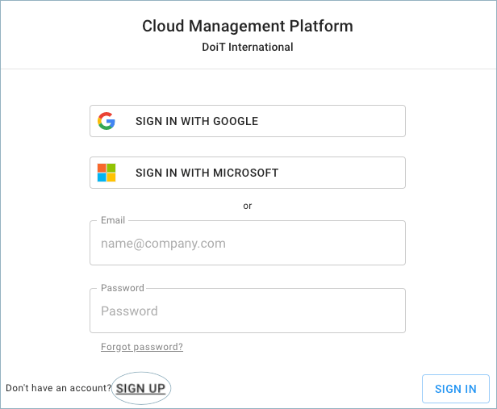

# Login to CMP

In order to access the Cloud Management Platform, you have to sign in with your Google, Microsoft, or email account. If your company uses Google G Suite \(now Workspace\) or Microsoft Office 365, we recommend signing in with your Google or Microsoft identity.

Otherwise, if you don't have a Google or Microsoft account and this is your first time signing in, please click the 'SIGN UP' button and fill in your email and a password of your choice. Once you verify your email account, you will be able to sign in with your email and the selected password.

When using signing with Microsoft for the first time, the organization admin must sign in himself to CMP and grant admin consent for CMP to read user info \(emails, etc.\) for their org. Eg shown below:

Start at [https://app.doit-intl.com](https://app.doit-intl.com)

Click on the 'Forgot password?' button if you need it, and you will be prompted to follow the instructions.

 

