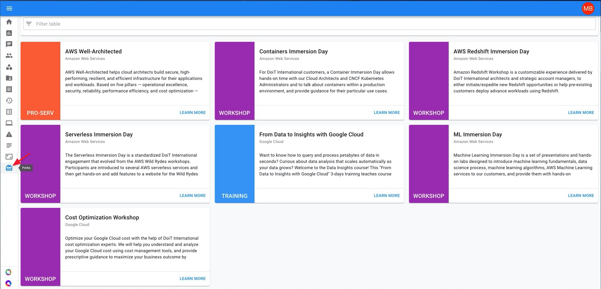
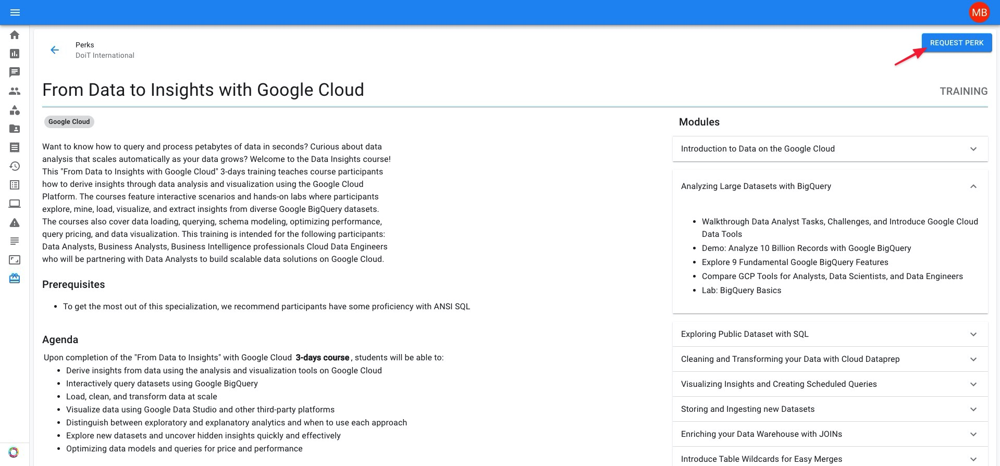

# Perks

Perks are service-based benefits available to DoiT International customers at no extra cost, including workshops, training, cost optimization sessions, case studies, and co-produced webinars. They can easily be browsed and requested on-demand from within the CMP. Let's go over how that is done.

## Accessing Perks

Access your Perks library via the Perks icon on the left-hand navigation panel.

 In the Perks library, you will find a list of all of the available Perks your team can request. For each Perk, you will see the:

* Name of the perk
* Platform\(s\) the perk is applicable to \(AWS, Google Cloud, etc.\)
* Perk type
* Perk description
* "Learn More" link

## Requesting a Perk

To request a Perk, first, click on the "Learn More" link associated with the selected perk's card. Following that, you will see the following information associated with the selected perk:

* Full Perk description
* Prerequisites \(if any exist\)
* Agenda
* Modules that make up the perk with accompanying description\(s\)

To request the perk for your team, click on the "Request Perk" button at the top-right corner of the Perks page.

After a few seconds, you will see the following message on the lower-left corner of your screen if the request is successful:

Additionally, you will receive an email confirming that your request has been received.

Once requested, a ticket will be automatically created in Zendesk and assigned to the DoiT International engineer\(s\) that will administer the Perk.

In the ticket, you and the engineers will arrange a suitable time for the workshop, training, or pro-serv to take place. Finally, any questions you have prior to the start date can be asked here.

View the bite-sized video below for a closer look at viewing and requesting Perks.



