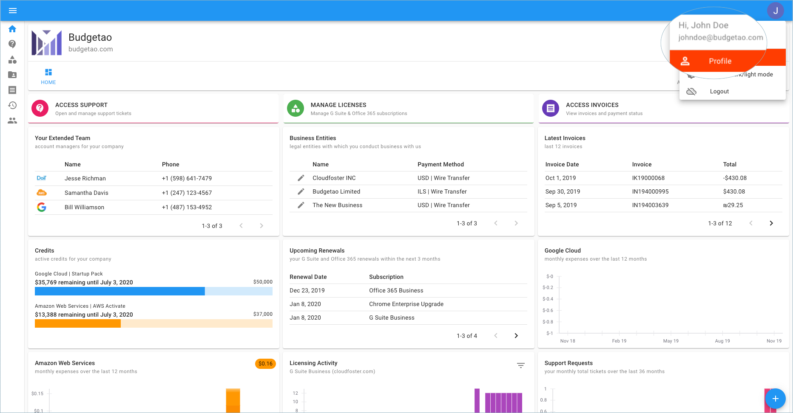
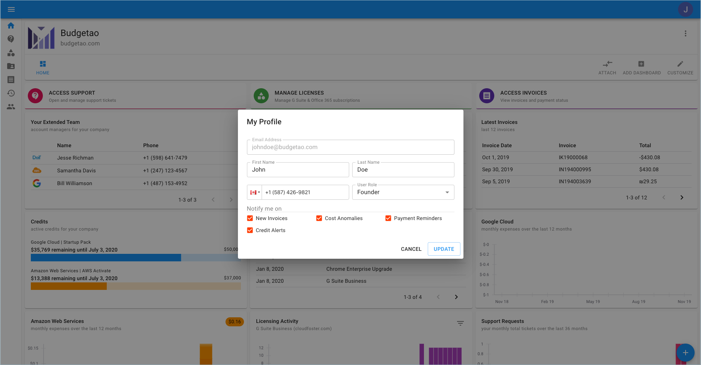

# Your Profile

You can access and edit your user profile to adjust your personal details and/or notifications settings. 

**To Access your Profile** 

Click your profile icon in the upper-right corner of the page header, then select **Profile.**

In the Profile dialog, you will find the following fields which can all be edited.

### **Email Address**

You can update your email address. This email is used for login, sending email notifications \(see Notification Settings\).

### **First Name** and **Last Name**

Update your first and last name

### **Phone Number**

Your phone number. You can either type the country code or use the country drop-down menu to select your country.

### **Job Function**

Please select your job function at the organization. This helps us personalize the dashboard according to your part of the organization. 

### **Notification Settings**

You can request to be notified on the following events:

**New Invoices** - an email will be sent when a new invoice is uploaded to the Cloud Management Platform

**Payment Reminders** - an email will be sent reminding the user to pay the invoice. There are three different instances of when notifications are sent:

1. [ ] The first reminder is sent seven days before an invoice is due.
2. [ ] The second reminder is sent four days after the invoice's due date.
3. [ ] The third reminder is sent 10 days after the invoice's due date.

**Cost Anomalies** - request to be notified when our system detects abnormal usage of your cloud platform \(i.e., AWS or Google Cloud\).

**Credit Alerts** - request to be notified when your credits are nearly exhausted and have been exhausted.

