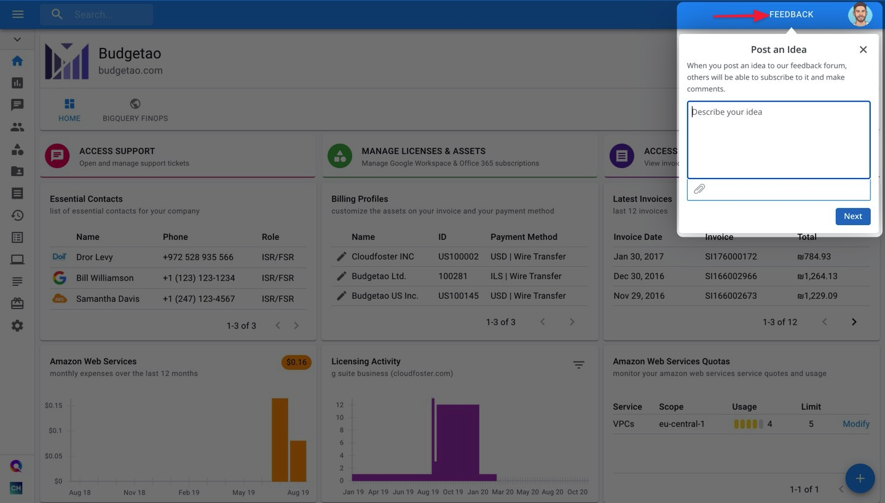
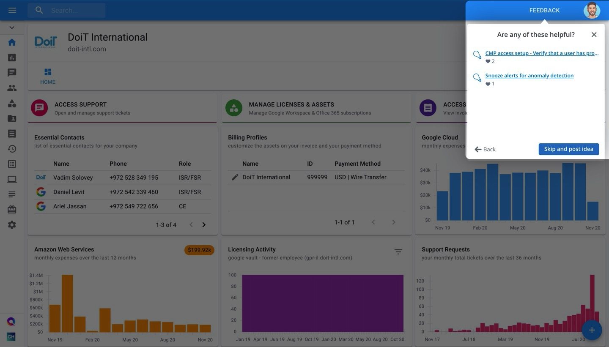
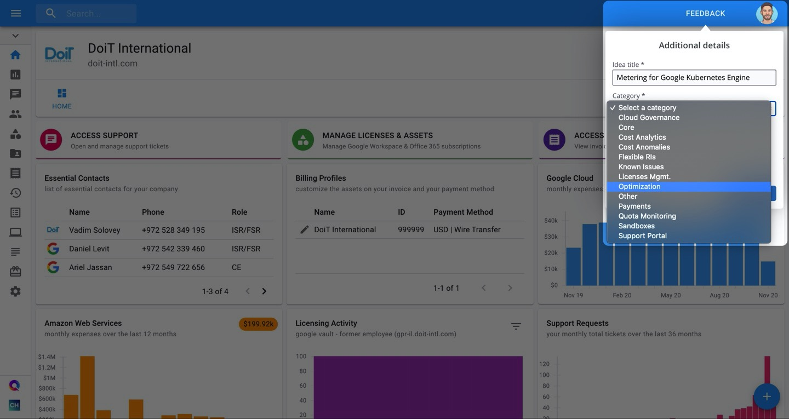

# Sharing Feedback and Feature Requests

When it comes to building a better Cloud Management Platform for you and all customers, your feedback plays a key role. It helps determine what our roadmap should look like, and helps us ensure we're building what our customers actually want!

Now you can share product feedback and feature requests with us directly from the CMP. Read on to see how.

Check out our [**Feedback Hub**](https://feedback.doit-intl.com/) to view the ideas that have already been shared and upvote them.

## How to share ideas within the CMP

To share your feedback with us, click on the **FEEDBACK** button at the top-right of your screen. Then describe your feature request or general feedback, providing screenshots or images to give more context as needed.

Once finished, click **Next**. If there are similar requests or suggestions to the one you wrote, we will display them for you to [upvote in our Feedback Hub](upvoting-existing-ideas-in-the-feedback-hub.md) instead of submitting a new request.

If your request doesn't already exist, click "**Skip and post idea**".

Finally, give your idea a title and select the best category it fits under, as shown in the example below. Once you click Submit, it will appear in our Feedback Hub for others to upvote and the product team will be notified.

