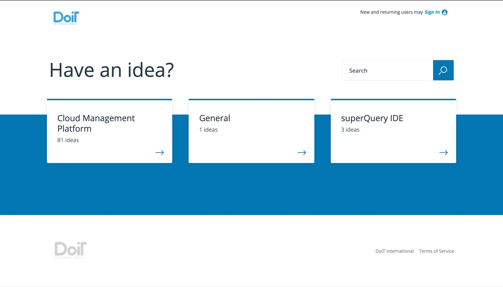
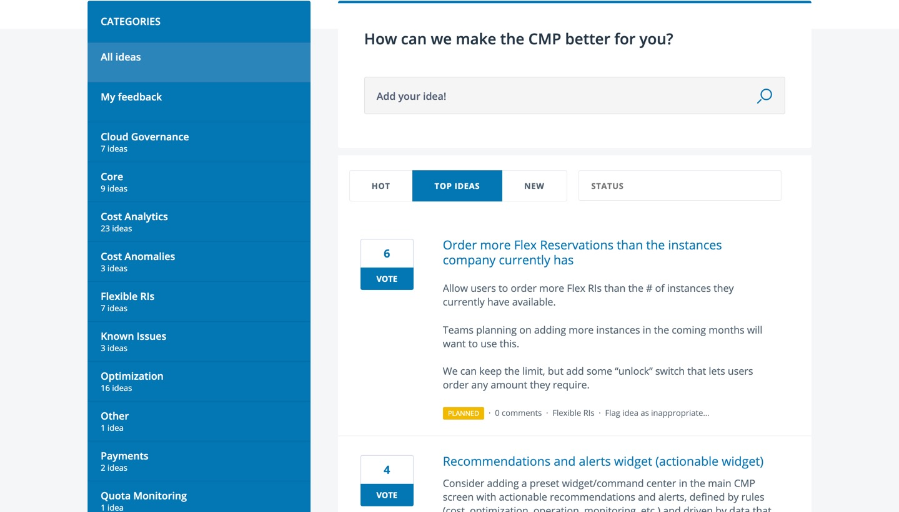
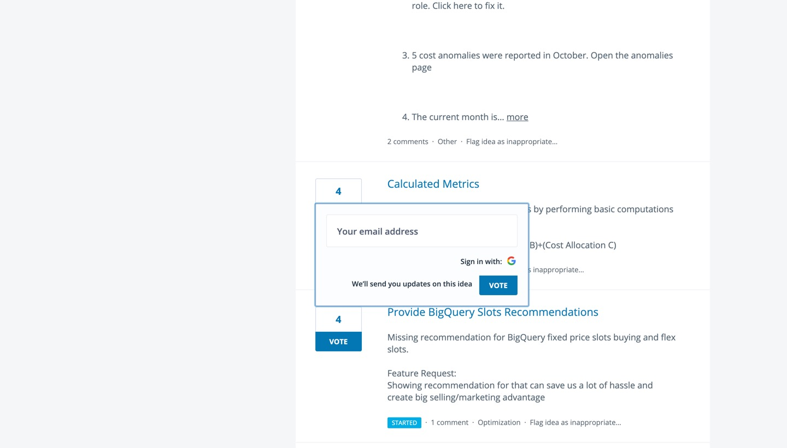

# Upvoting Existing Ideas in the Feedback Hub

When you [share feedback and/or feature requests](sharing-feedback-and-feature-requests.md) with us, they get submitted to our [**Feedback Hub**](www.feedback.doit-intl.com). There, all users can see and upvote any ideas they like so they can get notified when the idea

Let's go over how to navigate the Feedback Hub and upvote ideas.

From the home page, select a category whose ideas you'd like to take a look at. Alternatively, you can search for them directly in the search box.

After clicking on a category, you can search for ideas by their sub-categories on the left-hand side. Additionally, you can sort through them via categories such as "Hot", "Top Ideas", "New", or "Status".

If an idea has been added to the roadmap or development has begun, you will see a colored status icon similar to the yellow "Planned" rectangle in the screenshot below.

Upvote an idea that interests you by clicking on the "Vote" button next to the idea. Finally — if you aren't signed in already — enter your email or sign in with Google to submit your vote.

You will be notified as the status of the idea changes and ultimately gets released in the product it corresponds to.

