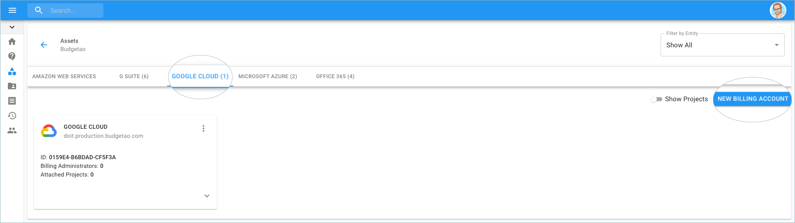
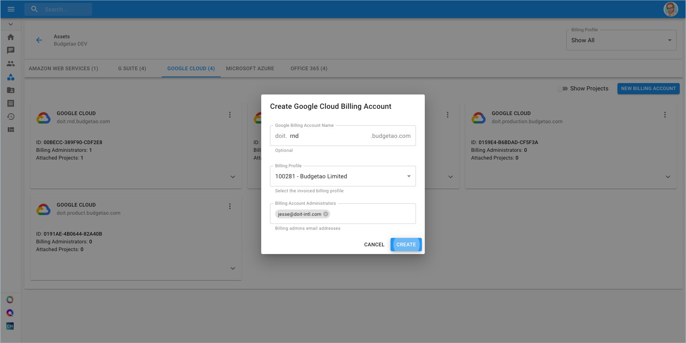
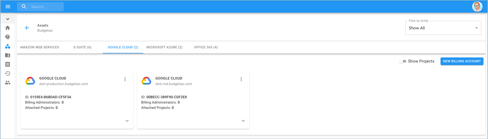

# New Google Cloud Billing Account

As a customer, you are able to create a Google Cloud Billing Account directly from the Cloud Management Platform.

**Required Permission:**

At a minimum, to create a Google Cloud Billing Account, you must be granted the following permission:

* Licenses Manager

_Please note that you must be assigned access to the specific Billing Profile under which the domain is managed in order to purchase a new subscription._

From the main dashboard please select '**Manage Licenses & Assets**'.

Another way to access the Google Cloud Billing Account is via the menu on the left-hand side of the page and clicking on Assets.

Once you're at the Assets page, switch to the Google Cloud tab and click on 'New Billing Account', located on the right-hand side of the page. 

You will be prompted with a pop-up requesting you to enter your Google Billing Account Name, Billing Profile, and the Billing Account Administrators. Once you fill in the details, click 'Create'.

You can now see the new billing account within the Google Cloud tab.

The following video shows you how to create a Google Cloud Billing Account.



