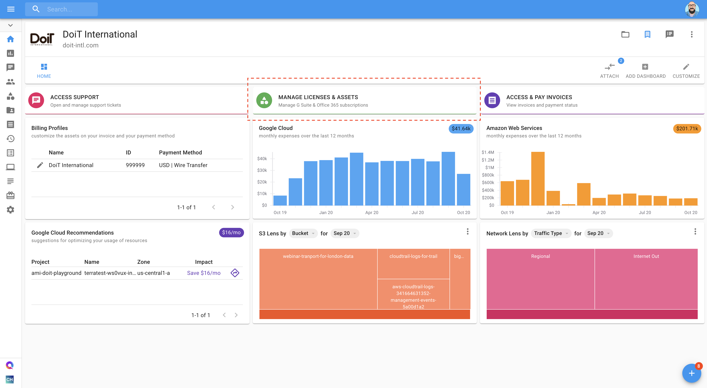
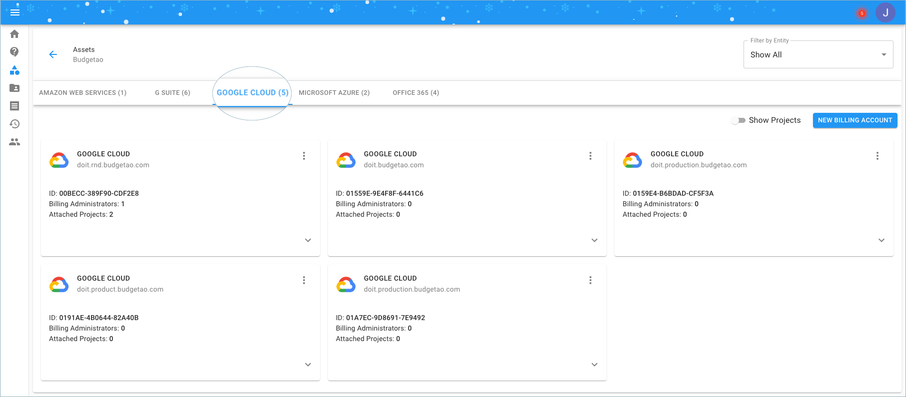
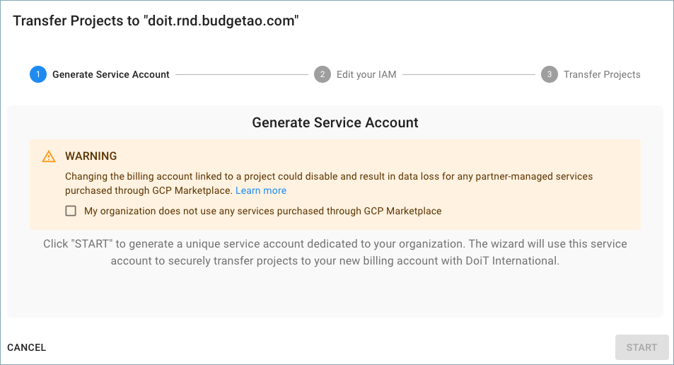
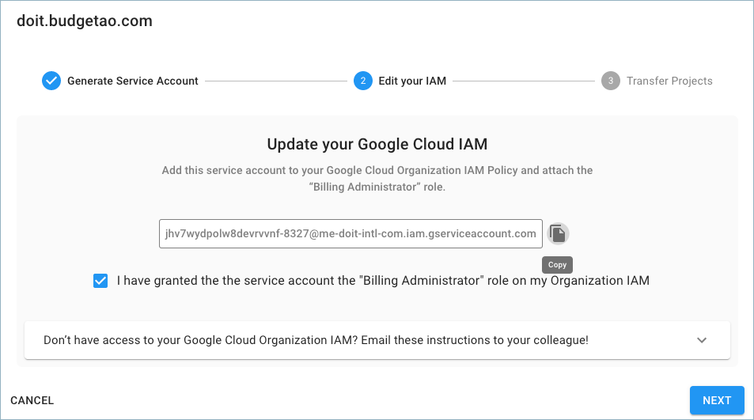
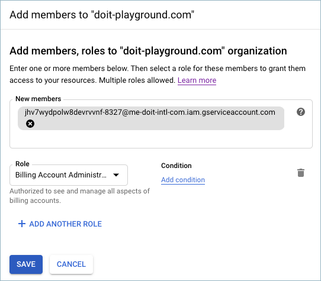
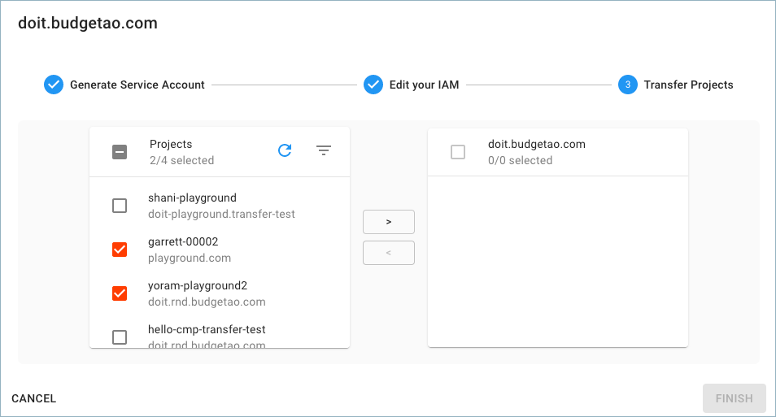
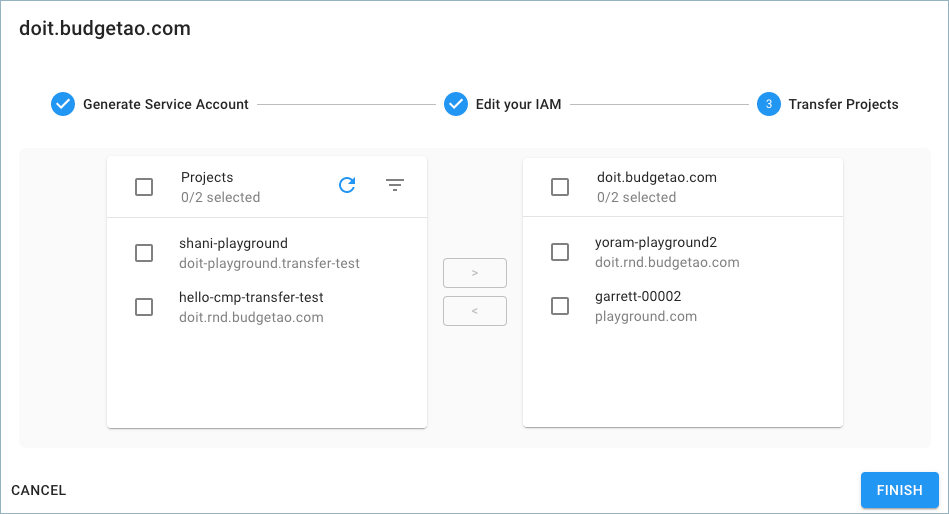
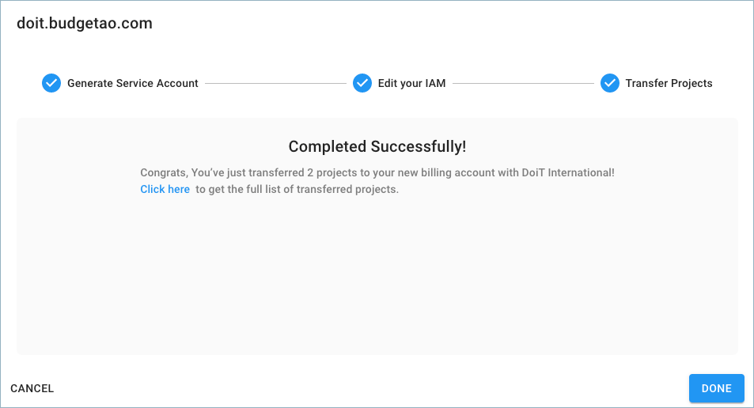
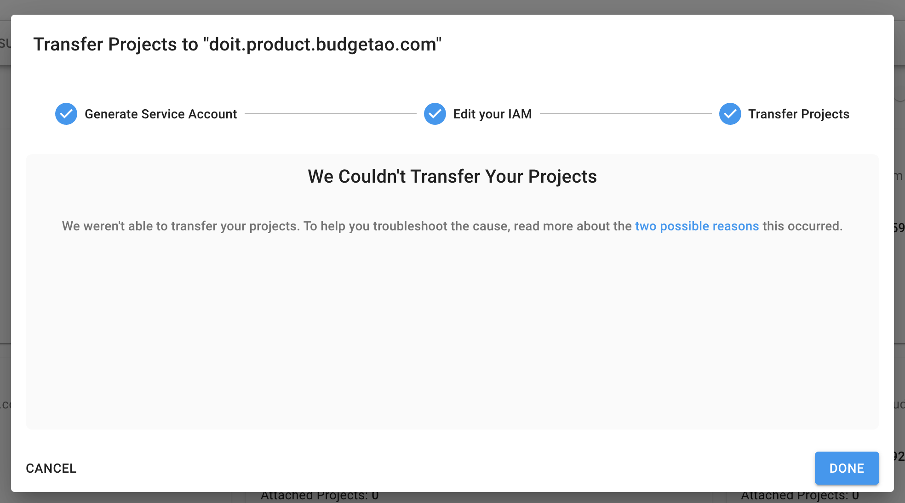
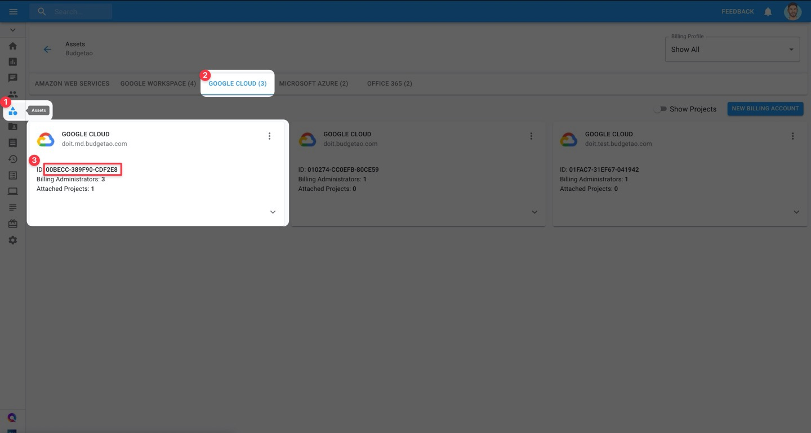

# Transfer Google Cloud Projects

### Overview

To change the Cloud Billing account for a project, you need to be able to move a project from your existing Cloud Billing account to another Cloud Billing account provided by DoiT International. To accomplish this task, you need permissions adequate to unlink the project from the existing Cloud Billing account AND to link the project to the target Cloud Billing account. Unfortunately, it is a manual process and requires a repetitive, one-by-one, transfer operation for each project. [Learn more.](https://cloud.google.com/billing/docs/how-to/modify-project#change_the_billing_account_for_a_project) 

As part of the Cloud Management Platform, DoiT International has developed a Project Transfer Tool, to assist you with bulk transferring all of your existing Google Cloud projects to the billing account assigned to you by DoiT International.


Changing the billing account linked to a project could disable and result in data loss for any partner-managed services purchased through Google Cloud Marketplace. [Learn more](https://cloud.google.com/marketplace/docs/understanding-billing#changing_a_projects_billing_account)


### Instructions

Start with you logging into the [Cloud Management Platform](https://app.doit-intl.com), and select '**Manage Licenses & Assets**' from the main dashboard:



Once you're at the **Assets** page, please switch to the Google Cloud tab.



To transfer your projects, locate your new Google Cloud billing account with DoiT International \(doit.budgetao.com in this example\), and click on the three-dots menu on the right-hand side of the widget. Choose 'Transfer Projects' to start the wizard.


Acknowledge the Marketplace Apps consent and click "Start":



After you begin the transfer process, a dedicated Google Cloud service account will be generated to facilitate the transfer process. _Please note the service account name, you will need it for the next step._



Please add the email address of the generated service account to your Google Cloud Organization IAM Policy and attach the Billing Administrator role. You can do so by copying the service account and entering it as a new member of your organization in the Google Cloud Console.



If you do not add the service account to your Google Cloud Organization IAM, the following error will appear. 


If you incorrectly add the service account to one of your Google Project IAM and not the Organization IAM, the following error will appear: _**Service Account Not Found in Organization IAM.**_



If you don't have access to your Google Cloud Organization IAM, the Transfer Tool will provide you with a command you can send to your colleague who has the Organization IAM permission.


Select the projects you want to transfer to your new Google Cloud Billing Account with DoiT International.



By clicking the **&gt;** button, the selected projects are designated to be transferred. Review the list of projects you intend to transfer, validate it and click 'Finish'. 



The confirmation page informs you of how many projects were transferred, and by selecting the 'Click here' button you can retrieve the full list of transferred projects as they will be copied to your clipboard.  



Congrats! You have successfully reassigned your existing Google Cloud projects to your new billing account with DoiT International! Well done! 

### Partial Transfers

If some or all of your projects don't transfer successfully, you will see a discrepancy when you complete your transfer process between the number of projects successfully transferred and the total number of projects you attempted to transfer.

If _some_ of your projects transferred, this is the message you will see.


If none of your projects were successfully transferred, you will see this message.



### **Troubleshooting**

#### All / Some Projects Don't Transfer Successfully

There are a few "edge case" situations in which some or all of your Google Cloud projects won't transfer successfully:

1. The project\(s\) is associated with another Google Organization that the service account doesn’t have an access to.
2. The origin billing account is not under the Organization the service account has permissions to.

To identify which project\(s\) didn't transfer successfully, click on the hyperlinked "Click here" in the pop-up shown above. This will copy to clipboard all of the projects you attempted to transfer, as well as their statuses. 

Here is an example output:

```text
project-id-1, success
project-id-2, success
project-id-3, error-code
```

From here you can troubleshoot the project\(s\) that have "error-code" for one of the two "edge case" situations we described above.

#### Accidentally Added Service Account at the Project Level

As mentioned above, you will get an error if you add your service account to at the Project level and not the Organization level. The error will look something like: _**"Service Account Not Found in Organization IAM"**_

To fix this, first make sure the person doing this is an Organization Billing Admin, and that they are a Project Owner in Cloud Console.

Next, have them copy the DoiT Billing ID for their Google Cloud asset in the CMP. To do so, **\[1\]** click on Assets in the left-hand navigation bar. 

Then click on the **\[2\]** "Google Cloud" tab. Finally, copy the string that follows **\[3\]** "ID:" in the Google Cloud asset.



Finally, have them perform the following in [Cloud Shell](https://cloud.google.com/shell):

```text
gcloud auth list # confirm the correct user
export BILLING="<paste DoiT billing ID here in quotes>"
export PROJECT_ID=$(gcloud config get-value project)
gcloud beta billing projects link --billing-account=$BILLING $PROJECT_ID
```

### Video

The following video shows you how to Transfer Google Cloud Projects.




