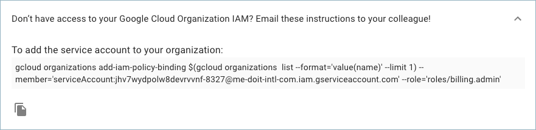

# Transfer Google Cloud Projects

As a new customer who has recently onboarded with DoiT International, you have the ability to transfer all your existing Google Cloud projects to the billing account assigned to you by DoiT International.


Changing the billing account linked to a project could disable and result in data loss for any partner-managed services purchased through Google Cloud Marketplace. [Learn more](https://cloud.google.com/marketplace/docs/understanding-billing#changing_a_projects_billing_account)


### Instructions

Start with you logging into the [Cloud Management Platform](https://app.doit-intl.com), and select '**Manage Licenses & Assets**' from the main dashboard:

Once you're at the **Assets** page, please switch to the Google Cloud tab.

To transfer your projects, locate your new Google Cloud billing account with DoiT International, and click on the three-dots menu on the right-hand side of the widget. Choose 'Transfer Projects' to start the wizard.

To begin the transfer process, a dedicated Google Cloud service account will be generated once you click the 'Start' wizard.

Once the service account has been generated, you will need to add it to your Google Cloud Organization's IAM Policy and attach the Billing Administrator role. You can do so by copying the service account and entering it as a new member of your organization in the Google Cloud Console.

Copy the service account name.

Add it to your Google Cloud Organization IAM.

If you do not add the service account to your Google Cloud Organization IAM, the following error will appear. 

If you don't have access to your Google Cloud Organization IAM, you can copy the command from the following section and send it to your colleague who the permission.

Select the projects you want to transfer to your new Google Cloud Billing Account with DoiT International.

By clicking the **&gt;** button, the selected projects will be assigned to your new billing account. Review the list of projects you intend to transfer and click 'Finish'. 

The confirmation page informs you of how many projects were transferred, and by selecting the 'Click here' button you can retrieve the full list of transferred projects as they will be copied to your clipboard.  

Congrats! You have successfully reassigned your existing Google Cloud projects to your new billing account with DoiT International! Well done! 

### Partial Transfers

If some or all of your projects don't transfer successfully, you will see a discrepancy when you complete your transfer process between the number of projects successfully transferred and the total number of projects you attempted to transfer.

If _some_ of your projects transferred, this is the message you will see.

If none of your projects were successfully transferred, you will see this message.

### **Common Problems**

There are a few "edge case" situations in which some or all of your Google Cloud Projects won't transfer successfully:

1. The project\(s\) is associated with an Organization that the service account doesn’t have access to.
2. The billing account doesn’t fall under the Organization your service account has permissions to.

To identify which project\(s\) didn't transfer successfully, click on the hyperlinked "Click here" in the pop-up shown above. This will copy to clipboard all of the projects you attempted to transfer, as well as their statuses. 

Here is an example output:

* project-id-1, success
* project-id-2, success
* project-id-3, error-code

From here you can troubleshoot the project\(s\) that have "error-code" for one of the two "edge case" situations we described above.

The following video shows you how to Transfer Google Cloud Projects.



