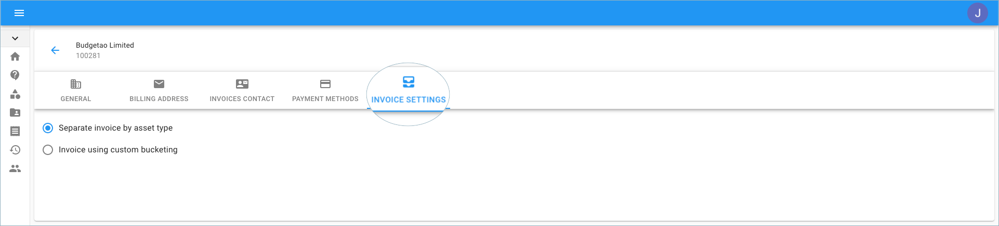
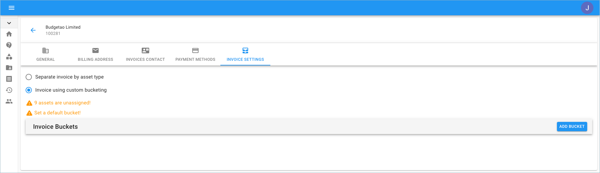
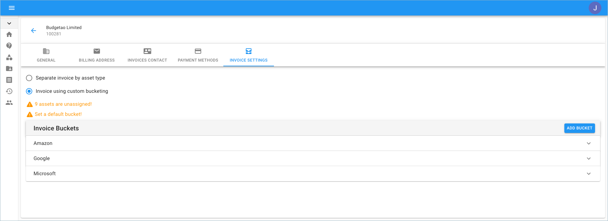
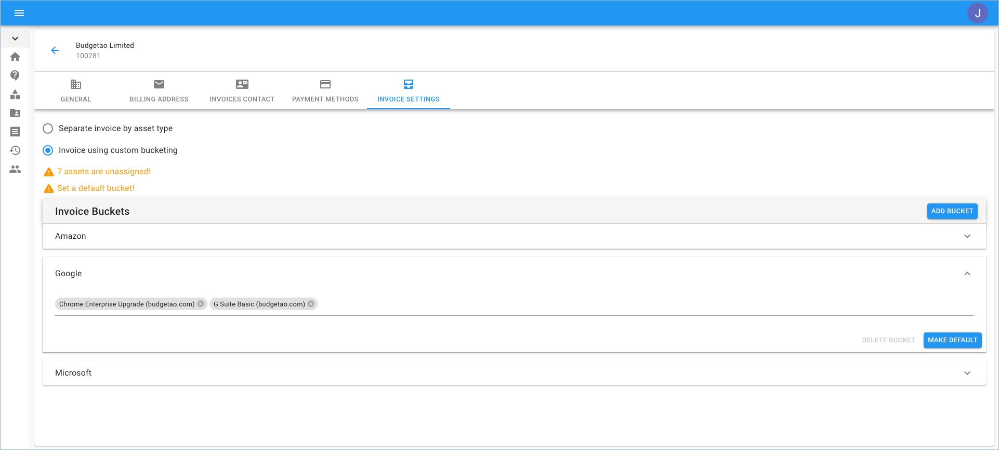
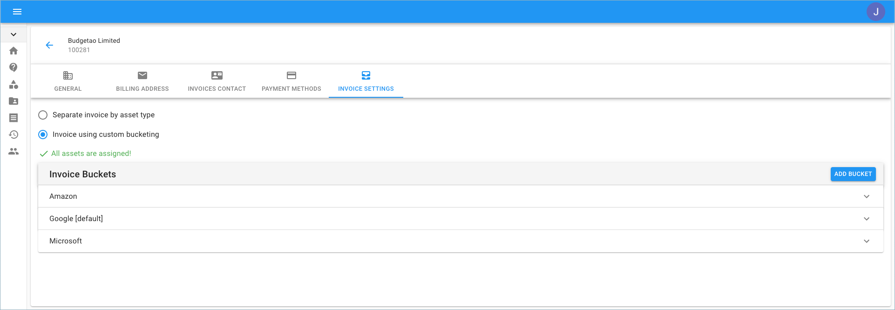

# Change Invoice Settings

### Overview

You can configure how you would like to be billed for your cloud assets managed by DoiT International using the Cloud Management Platform**.** For example, you might want to split your _Production_ related accounts to be billed separately from _R&D_ accounts.  


Required Permissions: **Billing Profile Admin**



Please note that you must be assigned access to the specific Billing Profile under which the domain is managed in order to purchase a license.


From the main dashboard, click on the edit icon next to the Billing Profile of which you want to update.

Once you're at the Billing Profile Settings page, switch to the 'Invoice Settings' tab.

### Invoice Bucketing

As a customer, you have two options for each one of your billing profiles:

**Separate the invoice by asset type** - individual invoices for each of your products. If you have four asset types, \(e.g., G Suite, Google Cloud, AWS, and Office 365\), you will have four invoices.

**Invoice using custom bucketing** - buckets allow you to combine assets into a group. If you have 16 assets and group them into two buckets, then two invoices will be generated, with eight assets per invoice. 

You can create as many buckets as you want, and separate your assets into various buckets.

Choose a bucket to make it the default. Any asset that isn't assigned to a specific bucket will be automatically placed in the default bucket.

You can always revert back to separating your invoices by asset type if the custom bucketing isn't suitable for you anymore.

Watch the bite-sized video below for a closer look at Billing Profiles, Invoices, and Invoice Buckets.



