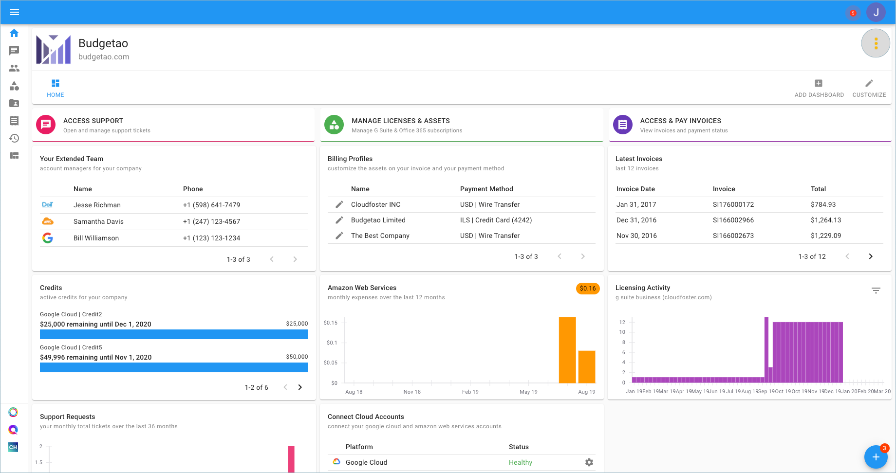
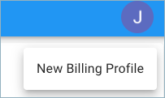
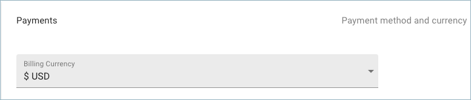

# Change Billing Currency

If you need to change your company's Billing Currency, a new Billing Profile must be registered using the Cloud Management Platform. The currency of existing billing profiles cannot be changed.

From the main dashboard, locate the three-dots icon on the right-hand side of the page and click 'New Billing Profile'.

Once there you will be prompted to 'New Billing Profile' and start filling out the information about your company.

After completing all the required fields in each section, you will be asked what Billing Currency you'd like to use.

You may choose between the following payment methods and currencies; ILS, USD, EUR, GBP, or AUD & Wire Transfer, Credit Card, Bill.com, or ACH Payment.

Click Submit once you've completed the entire registration form.

