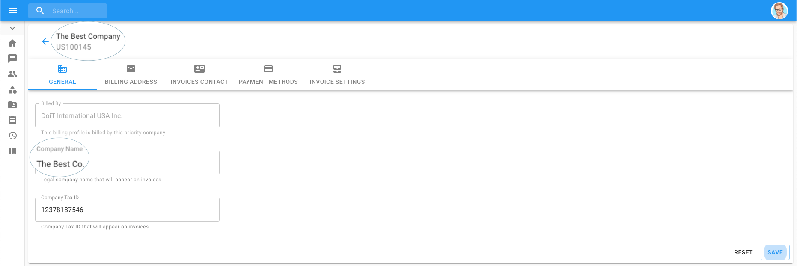
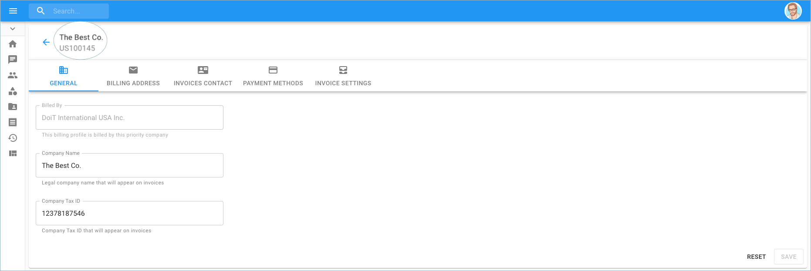

# Changing your Company Name

A customer can edit the name of their company if they choose to do so.

**Required Permissions:**

At a minimum, to change the name of the company, you must be granted the following permissions:

* Billing Profile Admin

_Please note you must be assigned access to the specific Billing Profile under which the domain is managed in order to change the company name._

From the main dashboard, click on the edit icon next to the Billing Profile of which you want to update.

The next page brings you to the 'General' tab where you can change the name of your company.

Once you have made the necessary changes, click on 'Save' at the bottom right-hand side of the page. Notice the change of the company name at the top of the page.

