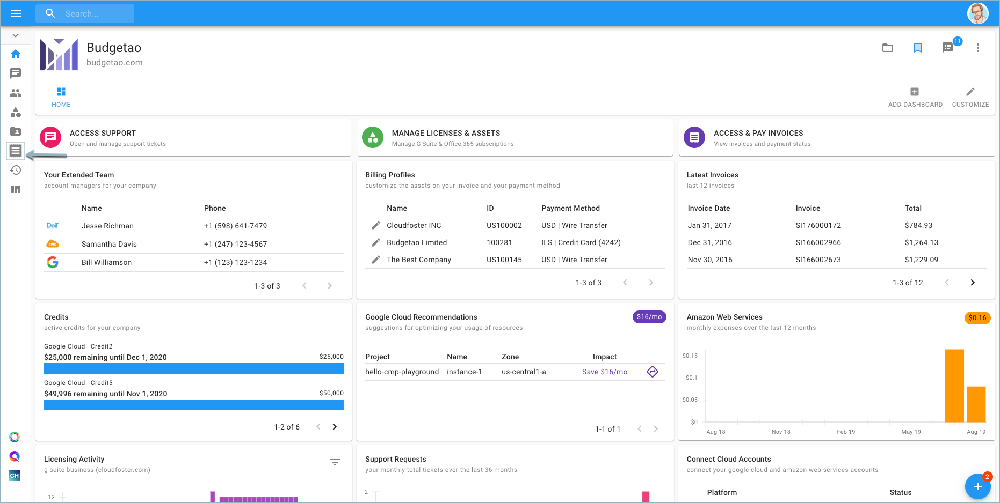

# Downloading your Invoice Reconciliation File

As a customer, you can access your company invoices as well as download the invoice summary as a CSV file.

**Required Permission:**

At a minimum, to download the invoice summary, you must be granted the following permission:

* Invoice Viewer

From the main dashboard please select '**Access Invoices**'.

Another way to access Invoices is via the menu on the left-hand side of the page and click on Invoices.

To download the invoice summary as a CSV file, click the download icon in the top-right corner of the page.

