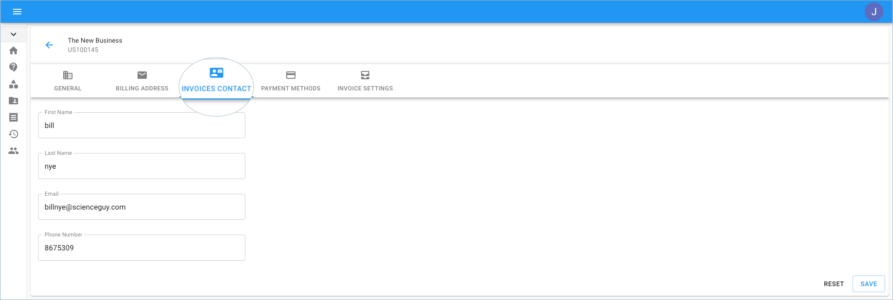

# Updating your Accounts Payable \(AP\) Information

You can update the Accounts Payable information for your organization using the Cloud Management Platform \(i.e., [hello.doit-intl.com](https://hello.doit-intl.com/)\). The information is used for billing and invoicing purposes.  

**Required Permission:**

At a minimum, to update the Accounts Payable, you must be granted the following permission:

* Billing Profile Admin

_Please note that you must be assigned access to the specific Billing Profile under which the domain is managed in order to update the Accounts Payable information._

From the main dashboard, click on the edit icon next to the Billing Profile of which you want to update.

Once you're at the Billing Profile Settings page, switch to the 'Invoices Contact' tab.

Once you're finished updating your details, go to the bottom right-hand corner of the page and click Save.

The following video shows you how to update the AP information for a billing profile.



