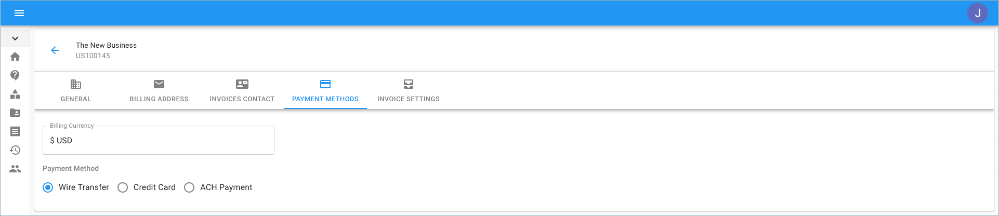
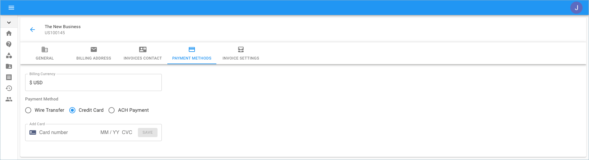
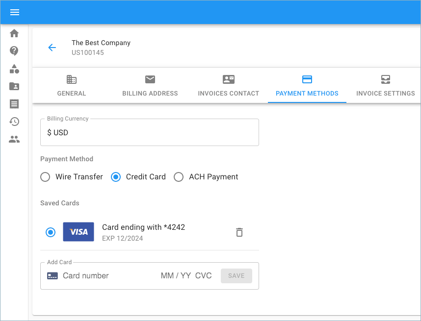
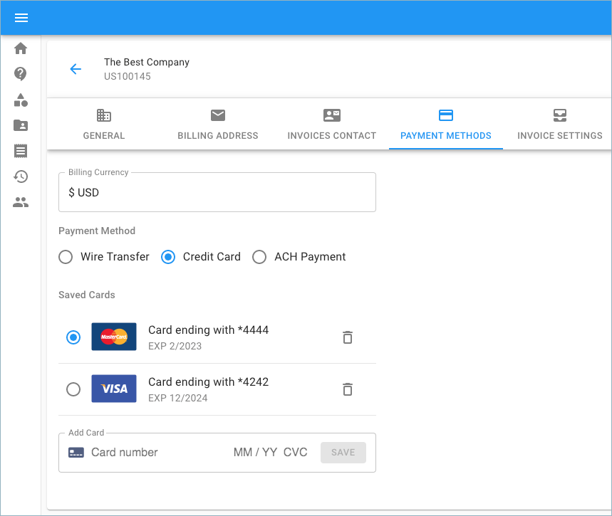
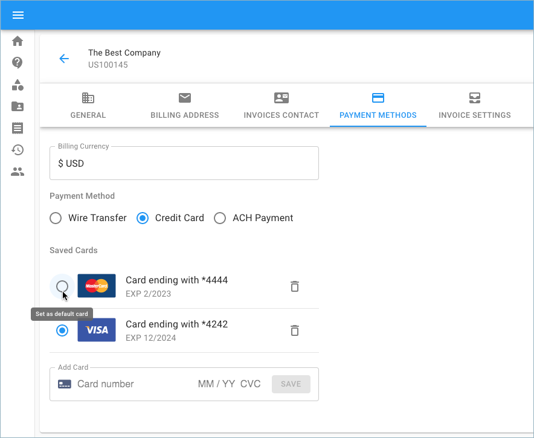

# Update Payment Method

You can configure the Payment Method for your organization using the Cloud Management Platform.

The payment methods available depend on your currency and country. In many countries, you can set up a credit card, debit card, or bank account as a primary payment method.


Required Permissions: **Billing Profile Admin**



Please note that you must be assigned access to the specific Billing Profile under which the domain is managed in order to purchase a license.


From the main dashboard, click on the edit icon next to the Billing Profile of which you want to update.

Once you're at the Billing Profile Settings page, switch to the 'Payment Methods' tab.

Assuming that the 'Wire Transfer' setting is enabled and you'd like to switch to paying by credit card, enter the relevant details for your card of choice.

By setting up a credit/debit card, your payments are processed automatically, so you don't have to worry that your service will stop running if you forget to make a payment.

You can also set up a backup credit or debit card as a safety net. That way, if your primary payment method fails, we'll charge your costs to your backup payment method. This ensures that your cloud services keep running.

_Please note that if the enable button to the right of the card is switched on, it means this card becomes the default for payments._ 

If you prefer to set the alternative card to be the default for payments, simply click the enable button next to the card of your choice.

If no card is enabled as the default for payments, we will not automatically charge you. This means you will have to manually pay your invoices. 

For further instructions on how to pay for an invoice, please proceed to the '[Pay Invoice](paying-invoices-with-credit-card-or-ach.md)' article.

The following video shows you how to update a billing profile's payment method:



