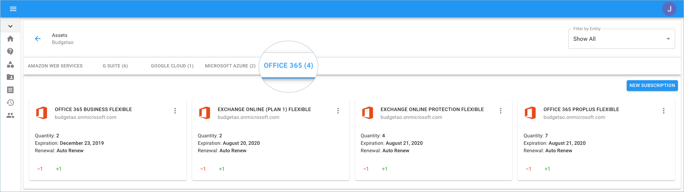
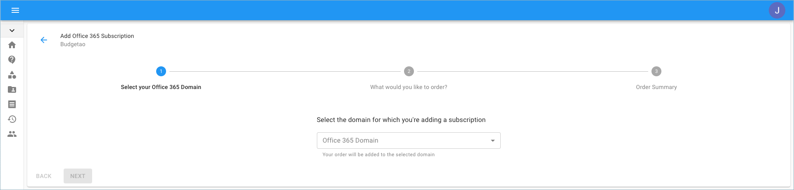
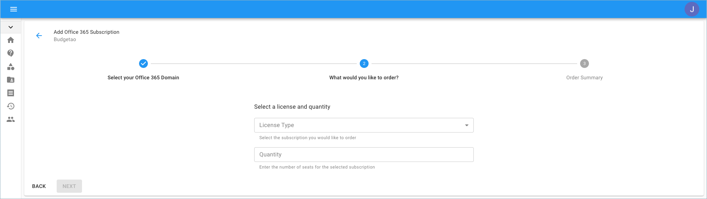
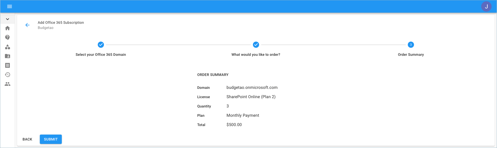

# Create Office 365 Subscriptions

You can add a new Microsoft Office 365 subscription to your existing tenant, using the Cloud Management Platform.


Required Permission: **Assets Manager**



Please note that you must be assigned access to the specific Billing Profile under which the domain is managed in order to purchase a new subscription.


Start with accessing Office 365 based Assets from the menu on the left-hand side of the page and clicking the 'Assets' icon.

Once you're at the Assets page, switch to the Office 365 tab.

Go to the right-hand side of the page and click on 'New Subscription'.

Select the Subscription/License and quantity you'd like to order.

Lastly, review your order summary, and if you approve click 'Submit'.

