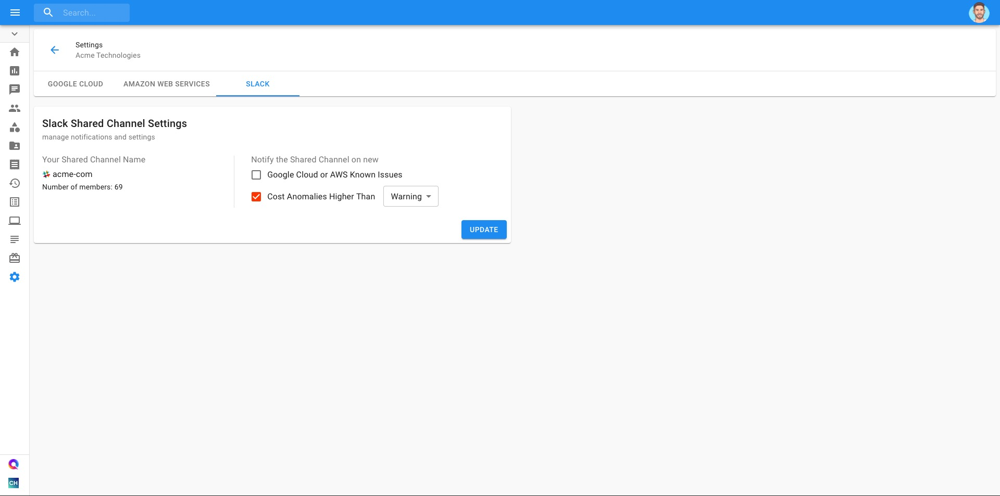

# Managing Alerts in Shared Slack Channels

If you have a shared Slack channel with DoiT International, you may now opt-in to receive alerts for:

* Detected [cost anomalies](../anomaly-detection/viewing-your-google-cloud-cost-anomalies.md)
* [Known Issues](../tickets/cloud-infrastructure-known-issues.md) in Google Cloud and AWS

To set up notifications, navigate to the Settings page from your lefthand navigation panel. Then click on the "Slack" tab.

We will automatically detect whether your team has a shared Slack channel with us, so all you need to do is select which notifications you'd like to opt-in. When you're done, click on "Update"

Note that for Cost Anomalies, there is an additional step of selecting the minimum threshold \(Information, Warning, or Critical\) of anomalies you'd like to be notified on.  

