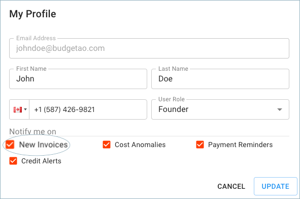
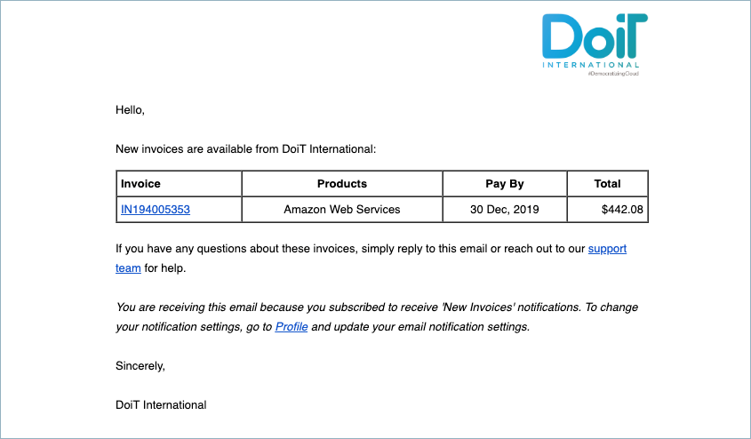

# New Invoices

Customers can be notified when a new invoice has been created by enabling the alerts for 'New Invoices' in the profile section of the Cloud Management Platform \(i.e., [hello.doit-intl.com](https://hello.doit-intl.com/)\). The email will include a link to the invoice which will allow online payments. 

In order to enable or disable the notification itself, click your profile icon in the upper-right corner of the page header, then select **Profile.**

In the Profile dialog, you will find the '**New Invoices**' notification setting.

Below is an example of the new invoice email notification we will send out.

\*\*\*\*

