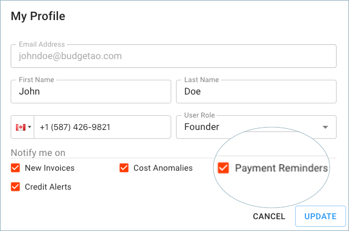
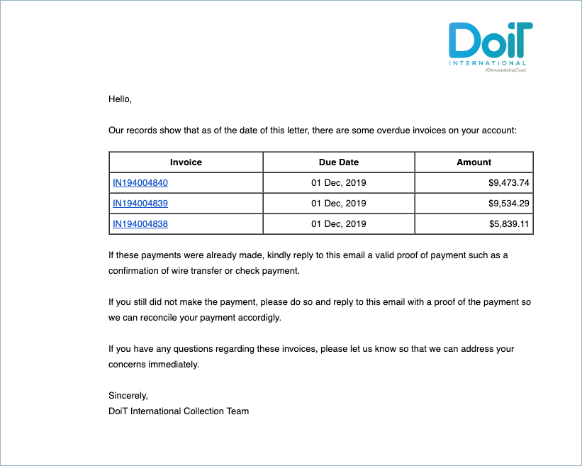
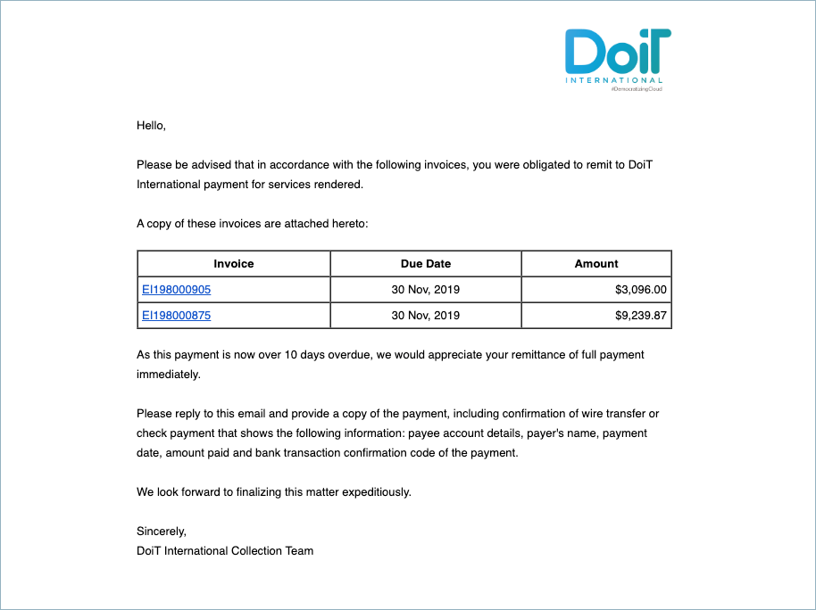

# Payments Notifications

Customers can be notified when charges on upcoming invoices are soon to be due \(as well as overdue invoices\), by enabling the alerts for 'Payment Reminders' in the profile section of the Cloud Management Platform.

In order to enable or disable the notification itself, click your profile icon in the upper-right corner of the page header, then select **Profile.**

In the Profile dialog, you will find the '**Payment Reminders**' notification setting.

Below are three examples of payment reminder email notifications we will send out: 

1. Seven days _before_ the invoice is due.

2. Four days _after_ the overdue is due.

3. 10 days _after_ the overdue is due.

