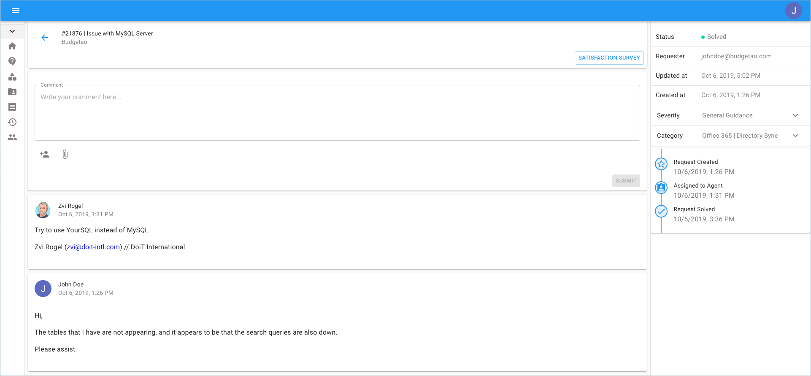

# Working with Support Requests

If you would like to access and review previously submitted support requests, you can easily do so through the Cloud Management Platform \(i.e., [https://hello.doit-intl.com](https://hello.doit-intl.com/)\). 

From the main dashboard please select '**Access Support**'.

Another way to access the 'Support' page is by clicking on the icon on the left-hand side of the page.

You can locate tickets that are currently 'In Progress', and by enabling the 'Show Closed Tickets' finder, see the archived tickets. 

By clicking on 'View Ticket', you are brought to a new page which includes the full description and in-depth details where you are able to comment, escalate, solve, and more. 

