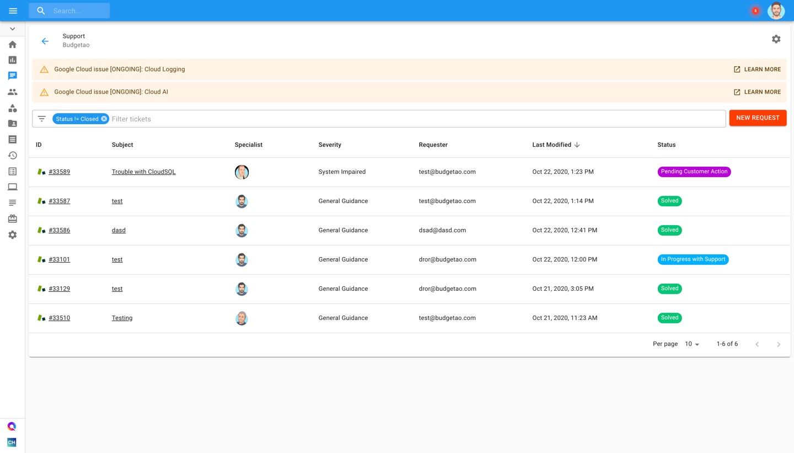
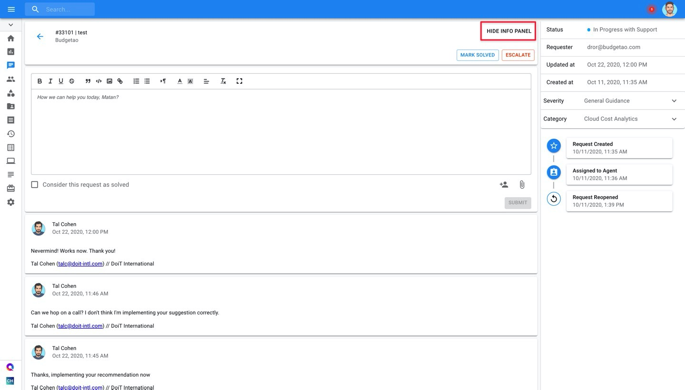

# Escalating Support Requests

If you would like to access and review previously submitted support requests, you can easily do so through the Cloud Management Platform.

From the main dashboard please select '**Access Support**'.

You can locate tickets that are currently 'In Progress', and by enabling the 'Show Closed Tickets' finder, see the archived tickets.

By clicking on the ticket's subject or ID, you are brought to a new page which includes the ticket's full description and in-depth details displayed in a collapsible Info Panel. 

Click on the 'Escalate' button to escalate the ticket and specify the reason for escalation.

Available Escalation Reasoning:

* Long Resolution Time
* Business Impact
* Technical Expertise
* Other

Once you select the reason for escalation, you can also add comments further explaining and justifying the escalation. 

Finally, if your issue is solved, click on the "Mark Solved" button.

