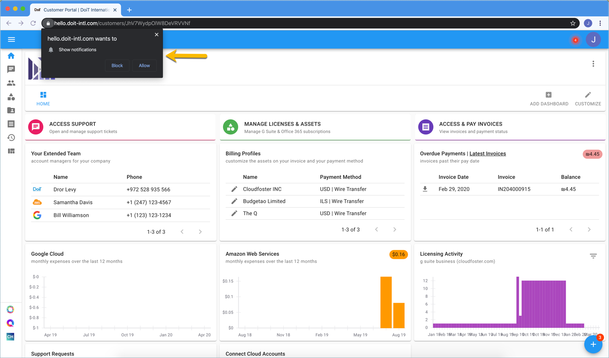
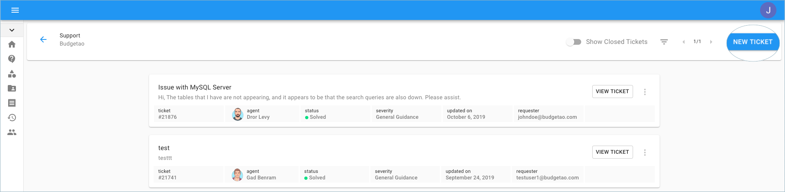
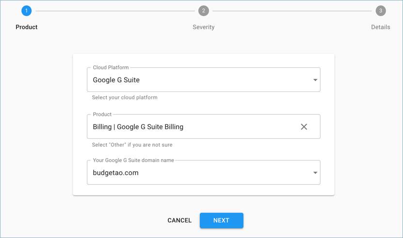

# Open A New Support Request

DoiT International provides premium consulting and support services for cloud platforms such as AWS, Google Cloud and Microsoft Azure to its clients at no extra cost. As a customer, you are not limited to any number of support requests or how much time DoiT International invests in supporting you as a client. To open a support request with us, please file a ticket as instructed in this article.

_Helpful Tip: By clicking on 'Allow'_ _to show you notifications, the Cloud Management Platform will notify the requester \(and anyone that is cc'd\) each time an update is made to your support request._

A new support request can be filed by clicking on the 'Access Support' from the home page, or from the menu on the left-hand side of the page.

Once there, go to the right side of the page and click 'New Ticket'.

You're now on the creation page of the ticket. Choose your Cloud Platform, Product, and according to your selections, please choose the appropriate field \(_AWS Account/Google Project ID/G Suite Domain/Office 365 Domain/Azure Tenant_\) so we could route the ticket to the most appropriate engineer.

It is essential to be specific when choosing the Severity of your request, as each issue has a dedicated response time for the support team:

1. General Guidance = 3 hours
2. System Impaired = 1 hour
3. Production System Impaired = 30 minutes
4. Production System Down = 15 minutes

Fill in the details of the issue with a clear Subject, CC others, a full description and Submit.

Additional Information:

_Please note that in some cases, your cloud vendor representative such as an account manager or customer engineer can be automatically copied on your request. If you do not wish to copy the vendor representative, please remove the vendor's email address from the "Additional CCs" list._

